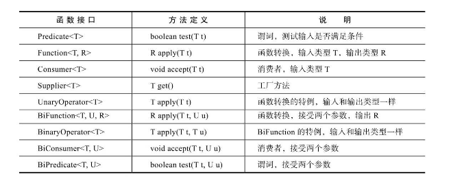

#### Lamada表达式

Java 8提供了函数式编程的方式(lamada表达式).

Java会为每个匿名内部类生成一个类，但Lambda表达式不会，因此lamada表达式执行的性能不会受到影响。

表达类似如下的方式:

```java
List<String> names=new ArrayList();

names.forEach(name -> {System.out.println(name);});
```

是一个简单的循环打印逻辑.


#### 常用的函数式接口

Java 8中，为了更好的支持函数式编程，提供了一些常用的函数式接口。



