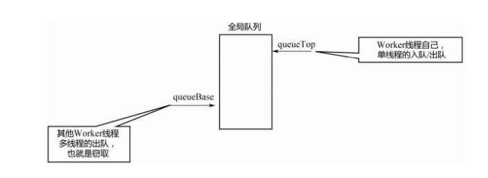

JDK 7开始, 提供了ForkJoinPool的分治算法进行多线程的并行运算。Fork意思为分叉，Join的意思为合并。可以看成单机版的MapReduce.

相比于ThreadPoolExecutor，ForkJoinPool可以更好地实现计算的负载均衡，提高资源利用率. 利用ForkJoinPool，可以把大的任务拆分成很多小任务，然后这些小任务被所有的线程执行，从而实现任务计算的负载均衡.

#### 核心数据结构

ForkJoinPool 除了一个全局的任务队列之外，每个线程还有一个自己的局部队列。

#### 工作窃取队列

在ForkJoinPool 中，全局队列不是采用阻塞队列实现的，而是基于一个普通数组实现的。这个队列又叫做工作窃取队列，为ForkJoinPool的工作窃取算法提供服务。

> 工作窃取算法:
>
> 指一个Worker 线程在执行完毕自己队列中的任务之后，可以窃取其他线程队列中的任务来执行，从而实现负载均衡。

​	上图为工作窃取队列的结构, 工作流程如下:

1. Worker自己在队列头部，通过对queueTop的加减实现出队和入队操作，这个操作是单线程的。
2. 其他Worker在线程尾部，通过queueBase进行累加，实现出队操作，也就是窃取，这个操作是多线程的，需要通过CAS来进行，所以queueBase是volatile类型的。

> 整个队列是个环形队列，并且queueBase会一直增大，不会减小，而queueTop会增大和减小，当这两个值相等的时候，表示队列为空。

#### 状态控制

在ForkJoinPool中有一个ctl变量负责表达ForkJoinPool的整个生命周期和相关的各种状态。

ctl变量是一个64位的数据，其中分为下面五个部分:

>AC：最高的16个比特位，表示Active线程数-parallelism
>
>TC：次高的16个比特位，表示Total线程数-parallelism
>
>ST：1个比特位，如果是1，表示整个ForkJoinPool正在关闭
>
>EC：15个比特位，表示阻塞栈的栈顶线程的wait count
>
>ID：16个比特位，表示阻塞栈的栈顶线程对应的poolIndex

#### 阻塞栈

实现阻塞栈需要如下两个步骤:

1. 要实现多个线程的阻塞、唤醒，除了park/unpark这一对操作原语
2. 需要一个无锁链表实现的阻塞队列，把所有阻塞的线程串在一起

在ForkJoinPool中，没有使用阻塞队列，而是使用了阻塞栈。把所有空闲的Worker线程放在一个栈里面，这个栈同样通过链表来实现，名为Treiber Stack.

ForkJoinWorkerThread有一个poolIndex变量，记录了自己在ForkJoinWorkerThread[]数组中的下标位置，poolIndex变量就相当于每个ForkJoinPoolWorkerThread对象的地址. 

ForkJoinWorkerThread还有一个nextWait变量，记录了前一个阻塞线程的poolIndex，这个nextWait变量就相当于链表的next指针，把所有的阻塞线程串联在一起.

#### ForkJoinWorkThread 线程状态与个数

在ThreadPoolExecutor中，有corePoolSize和maxmiumPoolSize 两个参数联合控制总的线程数，而在ForkJoinPool中只传入了一个parallelism参数.

ForkJoinPool 线程状态有如下三种:

1. 空闲状态
2. 活跃状态
3. 阻塞状态

当一个新任务到来时，发现既没有空闲线程，也没有活跃线程，所有线程都阻塞着，在等待任务返回，此时便会开新线程来执行任务。

#### Worker线程的阻塞唤醒机制

ForkerJoinPool 没有使用BlockingQueue，也就不曾利用其阻塞—唤醒机制，而是利用了park/unpark原语，并自行实现了Treiber Stack

#### 任务提交过程

关于任务的提交，ForkJoinPool提供了`submit()`以及`forkOrSubmit()`两个方法，fork表示分叉，即生成内部任务。submit是外部提交的任务。

如果线程类型是ForkJoinWorkerThread，说明是线程池内部的某个线程在调用该函数，则把该任务放入该线程的局部队列；否则，是外部线程在调用该函数，则将该任务加入全局队列。

内部提交任务，即上面的w.pushTask（task），会放入该线程的工作窃取队列中。由于工作窃取队列的特性，其对queueTop的操作是单线程的，所以此处不需要执行CAS操作。

外部多个线程会调用该函数，所以要加锁，入队列和扩容的逻辑和线程内部的队列基本相同。

##### 顺序锁

顺序锁有点类似于JDK 8引入的StampedLock，也是乐观读的思想。通过一个sequence number来控制对共享数据的访问

1. 读线程在读取共享数据之前先读取sequence number，在读取数据之后再读一次sequence number，如果两次的值不同，说明在此期间有其他线程修改了数据，此次读取数据无效，重新读取
2. 写线程，在写入数据之前，累加一次sequence number，在写入数据之后，再累加一次sequence number

也就是使用版本号控制数据的读写，类似于解决CAS的ABA问题情景

#### ForkJoinTask 的fork / join

对于分治算法来说，分解出来的一个个任务并不是独立的，而是相互依赖，一个任务的完成要依赖另一个前置任务的完成。这种依赖关系是通过ForkJoinTask中的join（）来体现的。

线程在执行当前ForkJoinTask的时候，产生了left、right 两个子Task。所谓fork，是指把这两个子Task放入队列里面，join（）则是要等待2个子Task完成。而子Task在执行过程中，会再次产生两个子Task。如此层层嵌套，类似于递归调用，直到最底层的Task计算完成，再一级级返回。

通过ForkJoinTask的fork/join操作可以实现有向无环图的调度过程。

#### ForkJoinPool的关闭

1. shutdown（）只拒绝新提交的任务；

2. shutdownNow（）会取消现有的全局队列和局部队列中的任务，同时唤醒所有空闲的线程，让这些线程自动退出。