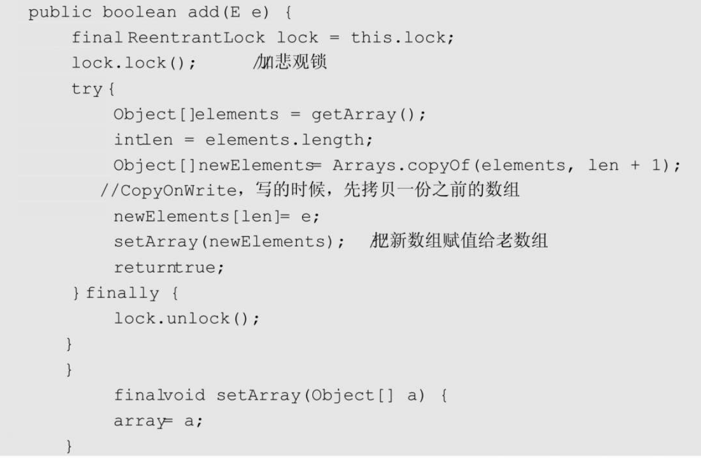

#### 阻塞队列

##### 单端队列BlockingQueue

BlockingQueue是最常见的一种。BlockingQueue是一个带阻塞功能的队列，当入队列时，若队列已满，则阻塞调用者；当出队列时，若队列为空，则阻塞调用者。

1. ArrayBlockingQueue

   ArrayBlockingQueue是一个用数组实现的环形队列

2. LinkedBlockingQueue

   基于单向链表的阻塞队列，队头和队尾两个指针分开操作，同时使用一个原子变量进行计数

3. PriorityBlockingQueue

   优先阻塞队列，队列中的元素需要实现Comparable接口

4. DelayQueue

   延迟队列，用于实现线程池的定时调度，在当前时刻大于等于栈顶元素的调度时间时候，会弹出栈顶元素，否则会阻塞线程。

5. SynchronousQueue

   这是一个容量为0的队列，调用put就会被阻塞，直到有调用者调用take才会解锁。

   > 例如:
   >
   > 3个线程，调用3次put（..），3个线程都会阻塞；直到另外的线程调用3次take（），6个线程才同时解锁，反之亦然。

##### 双端队列BlockingDeque

1. LinkedBlockingDeque

   底层是采用双向链表结构的双端阻塞队列。

#### CopyOnWrite

CopyOnWrite指在“写”的时候，不是直接“写”源数据，而是把数据拷贝一份进行修改，再通过悲观锁或者乐观锁的方式写回。主要目的是实现读写分类，这样读请求就不用加锁控制了，在读多写少的情境下很实用。

1. CopyOnWriteArrayList

   和ArrayList一样，CopyOnWriteArrayList的核心数据结构也是一个数组，既然读操作不需要加锁，那么写操作就需要保证数据的一致性问题。

   

2. CopyOnWriteArraySet

   CopyOnWriteArraySet 就是用Array 实现的一个Set，保证所有元素都不重复。其内部是封装的一个CopyOnWriteArrayList。

#### ConcurrentHashMap

##### JDK 7实现

为了提高并发度，在JDK7中，一个HashMap被拆分为多个子HashMap。每一个子HashMap称作一个Segment，多个线程操作多个Segment相互独立。

每个Segment都继承自ReentrantLock，Segment的数量等于锁的数量，这些锁彼此之间相互独立，即所谓的“分段锁”。

##### JDK 8实现

JDK 8的实现有很大变化，首先是没有了分段锁，所有数据都放在一个大的HashMap中；其次是引入了红黑树。

如果头节点是Node类型，则尾随它的就是一个普通的链表；如果头节点是TreeNode类型，它的后面就是一颗红黑树，TreeNode是Node的子类。

> 初始的时候是链表，当链表中的元素超过某个阈值时，把链表转换成红黑树；反之，当红黑树中的元素个数小于某个阈值时，再转换为链表。

使用红黑树带来的优势:

1. 使用红黑树，当一个槽里有很多元素时，其查询和更新速度会比链表快很多，Hash冲突的问题由此得到较好的解决。
2. 加锁的粒度，并非整个ConcurrentHashMap，而是对每个头节点分别加锁，即并发度，就是Node数组的长度
3. 并发扩容比较复杂

##### 扩容原理

1. 首先建一个新的HashMap，其数组长度是旧数组长度的2倍，然后把旧的元素逐个迁移过来。
2. 旧数组的长度是N，每个线程扩容一段，一段的长度用变量stride（步长）来表示，transferIndex表示了整个数组扩容的进度。初始值为n，从大到小扩容，每次减stride个位置，最终减至n＜=0，表示整个扩容完成。
3. 在扩容未完成之前，有的数组下标对应的槽已经迁移到了新的HashMap里面，有的还在旧的HashMap 里面。使用ForwardingNode，即转发节点，在这个节点里面记录的是新的ConcurrentHashMap 的引用。用于重定向已经转移过的数据，类似于Redis的渐进式Rehash过程.

#### ConcurrentSkipListMap

ConcurrentHashMap 是一种key 无序的HashMap, 而ConcurrentSkipListMap是并发安全状态下有序的HashMap，底层实现是跳表。