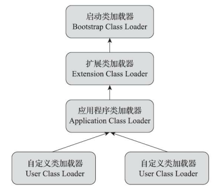

#### 类加载时机

一个类型从虚拟机加载到被卸载位置，需要经历加载，验证，准备，解析，初始化，使用和卸载的过程。

其中验证，准备，解析的过程也称作连接。

#### 类加载过程

1. 加载

   加载过程注意包括如下几个部分组成：

   + 通过一个类的全限定名称获取类的二进制字节流
   + 将这个字节流所代表的静态存储转换为方法区的运行时数据结构
   + 在堆中开辟一块内存空间，用于存储这个类的Class对象，作为方法该类方法区的入口地址

   对于数组类的引用，是由虚拟机动态加载出来的，数组中的引用类型元素最终还是依靠类加载器进行加载，如果是基本数据类型元素，则会与引导类加载器关联。

2. 验证

   验证阶段作为连接过程的第一阶段，用于检查当前类的字节流是否符合虚拟机规范，如果不符合则会直接拒绝编译。主要检查的内容有：

   + 文件格式校验

     校验魔数，版本号信息，常量池中是否存在有指向不存在对象的引用。

   + 元数据校验

     校验该类是否存在父类，且是否正确的继承了父类。

   + 字节码校验

     通过数据流和控制流分析，检查程序语义是否合法，且不会危害虚拟机安全。

   + 符号引用校验

     校验符号引用对应的直接引用是否存在，且对于的字段和方法是否存在。

3. 准备

   为类中存在的静态变量分配内存，并进行初始化工作。（仅仅对类变量进行初始化）

4. 解析

   将符号引用解析为直接引用，注意通过常量池中的类信息进行查找，通过全限定名称找到对应类的入口地址。

   对于同一个符号的多次解析，在非动态分派的情况下，每次找到的直接引用都是相同的，且如果一次寻址失败，则后面寻址也会失败。

   解析动作主要面向类，字段，方法，接口，类方法，接口方法，方法类型，方法句柄，动态调用点等设计的。且在方法区常量池中都存在对应的表，以供查找。

5. 初始化

   类加载的最后一个步骤，完成之后执行类的构造器方法逻辑。这个阶段会根据用户的行为去初始化实例变量的初始值。

#### 双亲委派机制

##### 类加载器的分类

Java把以类的全限定名称去加载二进制字节流放在虚拟机外部实现，给与用户更多的实现自由。自JDK 1.2以来，Java保有三层类加载器，双亲委派机制的模式，主要包含以下三层：

1. 启动类加载器

   启动类加载器置于lib目录下，按照文件名称进行加载，不合法的不会加载

   启动类加载器Java程序无法直接引用，如果用户程序需要委派启动类加载器去加载，直接写null即可

2. 扩展类加载器

   扩展类加载器置于lib/ext目录下，允许用户将有通用性类库放置在ext目录下，用于扩展Java SE功能

3. 应用类加载器

   应用类加载器通过`ClassLoader`类中的`getSystemClassLoader`进行加载, 负责加载用户类路径下的类库，同样也可以在程序中直接指定。

##### 双亲委派机制模型

双亲委派机制处理启动类加载器外，其他类加载器都需要优先使用父类加载器去加载，如果父类加载器无法加载该类，那么才会轮到子类加载器来加载。

> 优势:
>
> 对于某个基类，如果使用子类加载器来加载，会有多个实现，导致了基类的功能无法保证。

#### 模块化

JDK 9中引入的新概念，支持在权限修饰符以上更加细粒度的权限控制。

启用类模块化功能，可以声明对其他模块的显式依赖，这样Java虚拟机在启动的时候就可以直接定位到依赖不存在的问题，而不需要像之前那样通过在类加载过程中去验证。