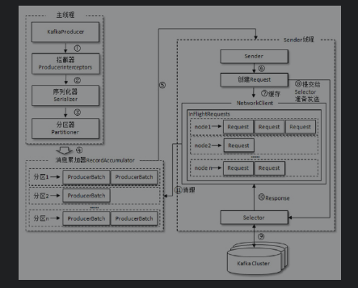

#### 生产者记录结构设计

生产者的消息格式为`ProducerRecord`,实际上这个是消息内容的包装，如果真的要生产者能够成功发送消息，还需要指定主题名称，分区信息，以及一些头部信息，此外如果需要做版本控制，过期处理，则需要加上时间戳信息。所以Kafka对生产者的消息封装如下。

```java
public class ProducerRecord<K,V>{
    private final String topic;
    private final Integer partition;
    private final Headers headers;
    private final Key key;
    private final Value value;
    private Long timestamp;
}
```

可以看到成员变量都使用了final关键字进行修饰，所以`ProducerRecord`在多线程的环境下是安全的。

此外，`ProducerRecord`支持不同种类型的构造器，所以用户可以选择自己指定分区，或者交由生产者中的分区器去选择分区，也可以自己指定key值的方式选择分区。 但是无论如果主题信息和消息主体是需要自己指定的。

消息的发送可以分为发后即忘，同步发送，异步发送。为了更方便的同时支持这三种功能，发送方法`send`的返回值设计为Future，如果需要同步发送，只需要获取调用`get`函数同步获取执行结果即可。如果需要异步发送，那么可以设计一个发送完的回调函数即可。

同步发送获取的执行结果是一个记录的元数据信息`RecordMetadata`, 包括发送消息的主题信息，分区信息，分区内偏移量，时间戳信息等。

#### 拦截器

拦截器是消息发送经历的第一个步骤，用于对消息进行预处理，包括过滤，设计统计信息等。主要通过调用拦截器的`onAcknowledgement`方法执行拦截器逻辑。

#### 分区器

分区器通过获取序列化器生成的字节流，通过分区函数生成对应的分区号。 常见分区器实现有 哈希取余，范围分区。此外用户也可以自定义分区。

#### 序列化

生产者的消息在发送到网络之前都需要进行序列化工作，从网络上获取的字节流也需要进行反序列化。这里需要注意的是发送的序列化器与获取的反序列化器类型要匹配。

常用的序列化方式有`Avro`,`JSON`,`Thrift`,`ProtoBuf`和`Protostuff`.

#### 生产者客户端的架构设计

生产者客户端架构如下:



一条消息会经过拦截器的预处理，将其通过序列化器成字节流，通过分区函数得到其分区信息。再到对应主题对应分区下，找到消息批次信息，将消息追加到批次中。

然后消息发送线程根据当前主题的分区与消息批次信息，将其转化为传输信息，即目标节点信息与消息数据信息，然后向目标节点发送请求，当成功获得与目标节点的通信时，将消息数据批次数据发送过去。


这里需要对架构中的部分设计进行阐述:

1. 消息批次`ProducerBatch`

   消息批次是一个定长的数据存储结构，主要是用于支持数据块的读取(数据块读取减小IO开销). 当一条消息选择了分区之后，发现当前分区中队列尾部消息批次已经满了，则会新建消息批次并插入。否则，直接将消息插入到尾部的消息批次中。

2. Sender线程对于转发表的获取

   在消息累加器的结构中，定义了分区与消息批次的关系，我们需要发送的是消息批次到指定节点。那么我们需要通过分区获取对应的broker节点信息，通过系统的元数据信息可以清晰的得到分区的broker信息。这样就可以与给定的broker节点建立TCP连接了。

3. 节点负载均衡与拥塞控制

   Sender线程通过维护发送请求的中间结果(发送过去但是没有成功执行完毕). 通过限制这个中间结果的大小，达到拥塞控制的效果，实现起来比起TCP拥塞控制要简单许多。当积压了足够的连接之后，就会对这个节点的新连接进行拒绝操作。

   同时Sender线程可以在InFlightRequests信息中，获取当前节点中负载最轻的节点，使用这个节点来进行请求响应，从而达到负载均衡的效果。

4. 元数据信息的更新

   Kafka的元数据信息包括主题信息，副本信息，控制器信息等。

#### 常用的生产参数

1. acks 信息

   用于指示生产者发送消息的方式

   当acks=0的时候，消息时异步发送，不会考虑结果是否写入副本

   当acks=1的时候，消息只会考虑leader副本数据最新

   当acks=-1的时候，消息会考虑主从副本的一致性

2. linger.ms

   消息发送的时间上限，达到这个时间，无论`ProducerBatch`是否填满，都会被发送

3. compression.type

   数据压缩类型

