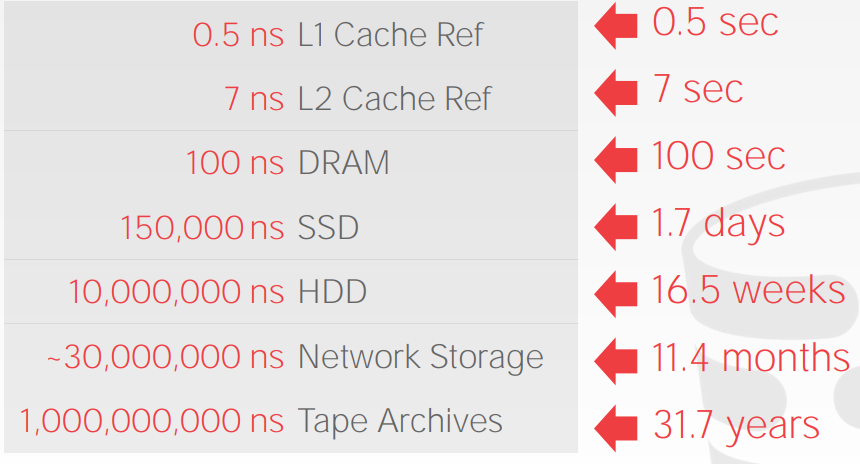
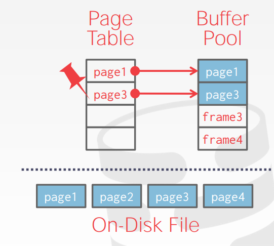

#### 缓冲池设计

##### 缓冲区设计的目的

如果不设计缓冲区，每次读取数据都得从磁盘上读取，磁盘的IO要比从主存读取数据慢很多，所以会导致查询性能非常的低。当然，如果可以使用CPU基本的缓存，查询的性能会进一步的提升，不过这种操作比较昂贵罢了。具体的性能插件如下图所示:

> 可以看到属于CPU级别缓存的 `L1` , `L2` Cache是最快的。其次是主存基本缓存DRAM, 再其次是使用了固态硬盘的SSD存储， 然后是普通磁盘存储`HDD`. 然后是网络传输的数据块，所以分布式环境下，一般提倡数据就地获取。最后就是磁带了，当然这个是最慢的。

##### 缓冲区的结构

众所周知，无论是在操作系统中或者是在数据库系统中，系统从磁盘调取的基本单位为数据页(Page)。有时也称作数据块。大小各个系统不一，有的是4 KB, 有的是8 KB。这个与不同系统的设计有关。缓冲区中维护这一个数据页的链表，但是缓冲区中 基本单位不是 数据页 而是页框。 

页框 可以看做是 数据页的一个包装， 相当于书皮 包装 书本一样。 同样一个书皮 可以包装不同的 书本。也就是说，当一个数据页被从缓冲区中淘汰的时候，我们只需要将其从页框中抽出即可。 在代码实现上也很简单， 只需要将页框中存储的数据页编号 重置为默认即可。

结构图如下所示:

> 首先缓冲池维护一个页框的链表, 这个链表通常是定长的，因为缓冲池大小通常是固定的。
>
> 此外需要维护一个 **页表映射** 的数据结构，这个主要是一个页框号 <- 数据页页号的映射，如果数据页存在与缓冲池中，则可以直接获取页框号并访问。如果不存在，则需要从磁盘中获取，并将其置于缓冲池中，再访问。
>
> 这个结构在Lab 1的缓冲池实现中，是一个重要的数据结构，详情参考Lab 代码中的解释。

#### 缓冲区管理器

当应用程序需要访问 一个数据页的时候，需要将请求路由给**缓冲区管理器**，缓冲区管理器会查看当前缓冲区的页表，检查当前数据页是否在缓冲区中，如果存在，则将数据页的首地址信息(地址信息) 返回给应用程序以供访问。如果不存在，则会从磁盘中调取相关数据页到缓冲区中。

如果这个时候，缓冲区空间不足，则需要淘汰掉最近最少使用的数据页，并将新的数据页置入。称作缓存替换策略，常用的替换策略有LRU替换策略和CLOCK替换策略。Lab 1中实现的是LRU缓存替换策略。具体实现参考Lab 1的实现文档。

##### 关于被钉住的数据块

为了数据库在从崩溃中恢复，数据具有一致性，需要限制数据页写回磁盘的时机。这个时候就需要使用pin这个参数。

如果当有一个线程正在操作的时候，不允许将数据块写回磁盘。即pin count = 0 的时候才可以将数据页写回磁盘。其他情况刷入磁盘会导致数据不一致的情况。在Lab 1， Lab 2的实现中，理解Pin的概念是非常重要的，如果不及时的将数据块unpin，会造成缓冲区资源不足的情况，抛出一些奇怪的bug。

所以这里我们规定，一旦数据操作完毕，一定要调用unpin方法释放线程的操作资源。