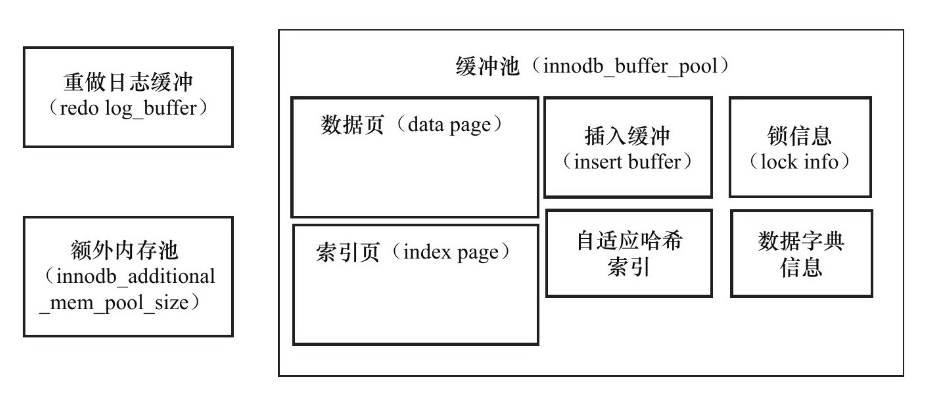
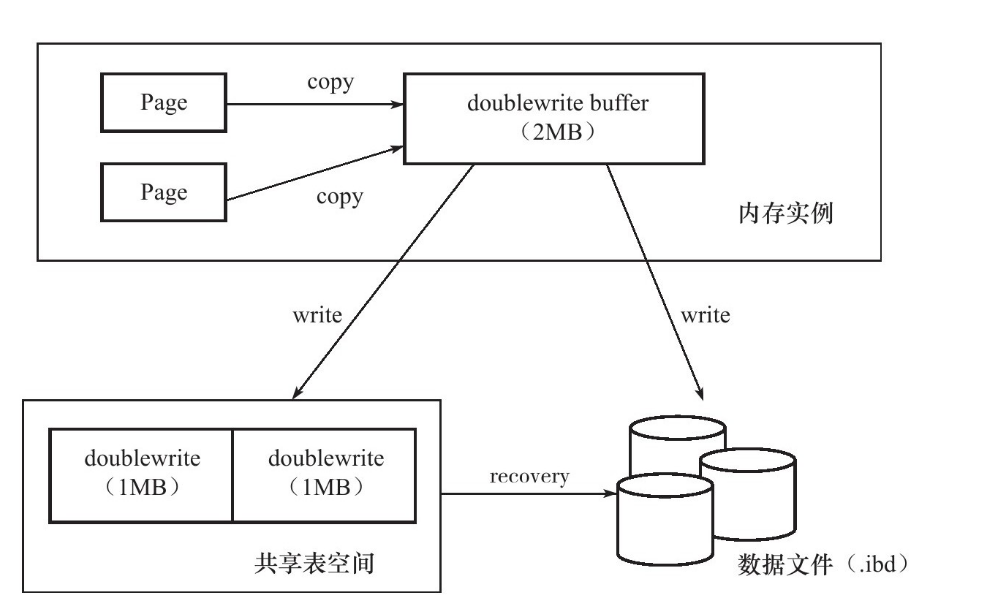

#### 存储架构

InnoDB有多个内存块组成，这些内存块组成了一个大的内存池。内存池的工作主要如下：

1. 维护进程/线程所需要访问的内部数据结构
2. 缓存磁盘上的数据，以便快速获取
3. 重做日志缓冲

后台线程的主要作用是负责刷新内存池中的数据，保证缓冲池中的内存缓存是最近的数据，此外将已经修改的数据页定期的刷写到磁盘上，这个工作由操作系统完成。

InnoDB  存储引擎是多线程模型，因此后台有多个不同的后台线程，负责处理不同的任务。

1. 主线程

   核心后台线程，负责将缓冲池的数据异步刷写到磁盘中，保证数据的一致性。包括脏页的刷新，合并插入缓冲区，undo页的回收

2. IO线程

   InnoDB存储引擎中大量使用`AIO`处理IO请求, 这样可以大幅提供数据库性能。IO线程主要负责这些IO请求的回调。

3. 清除线程

   事务提交之后，所使用的的undo日志可能不会再需要，因此需要请求线程来回收已经使用并且分配的undo页。

##### 内存

1. 缓冲池

   InnoDB是基于磁盘的数据库系统，由于CPU与磁盘之间速度差距太大，通常使用缓冲池技术来解决CPU与磁盘性能之间差距的问题。读取数据页的时候，首先会检查当前页是否在缓冲池中，如果在，则读取数据页，如果不在，则将数据页从磁盘中调到缓冲池中处理。

   对于数据库的修改操作，首先修改缓冲池中的页，按照一定频率刷新到磁盘上。主要是通过checkpoint机制，将脏页数据刷写到磁盘。

   通常情况下来说，缓冲池可以划分为多个部分。

   

2. `LRU` list, Free List和Flush List

   数据库缓冲池是利用`LRU`算法来进行维护的。

   > `LRU` 算法抖动问题的解决方案:
   >
   > 由于某些SQL操作，例如索引扫描，会将热点数据从`LRU`缓存中移除，然后下次访问又需要调取页面。
   >
   > 所以，MySQL为热点数据设置了一个存储范围，新读取的数据会插入到尾部37%的位置处。位于这个位置前面的称作热点表，后面的称作冷门表。
   >
   > InnoDB引入了一个参数`innodb_old_blocks_time`, 表示读取到mid位置后需要等待多久才会被加入到`LRU`列表的热端. 热端的数据不容易被刷出内存。

   LRU中页表被修改之后称作为脏页，即缓冲池中数据和磁盘数据产生了不一致，会通过checkpoint机制将数据刷写到磁盘上。这个脏页列表就叫做`FlushList`.

   `FreeList`表示当前处于空闲状态的页框.

3. 重做日志缓冲

   用于存储重做日志信息，InnoDB引擎定期的会将重做缓冲区的日志刷写到磁盘中。

4. 额外的内存池

#### checkpoint 机制

checkpoint机制主要是解决如下几个问题的:

1. 缩短数据库恢复时间
2. 缓冲池不够用，将脏页刷写到磁盘上
3. 重做日志不可用，刷新脏页

##### checkpoint类型

1. Sharp CheckPoint

   数据库关闭的时候，将所有脏页刷写到磁盘上。默认的工作方式。

2. Fuzzy CheckPoint

   只刷写部分脏页，在InnoDB引擎运行期间执行。

#### master线程工作方式

主线程具有最高的优先级，分别在多个循环中进行切换。包括主循环，后台循环，刷新循环，暂停循环。Master线程会在几个状态中进行切换。

1. 主循环

   每秒操作

   + 刷写日志缓冲区中的数据到磁盘
   + 合并插入缓冲
   + 至多刷新100个InnoDB缓冲池中的脏页到磁盘
   + 没有用户活动的时候，切换到后台循环

   每10秒操作

   + 刷新100个脏页到磁盘
   + 合并至多5个插入缓冲
   + 将日志缓冲刷新到磁盘
   + 删除无用的undo页面
   + 刷新100个或者10个脏页到磁盘

2. 后台循环

   当前用户空闲或者数据库关闭时候，会执行这个逻辑。

   + 删除无用的undo页
   + 合并20个插入缓冲
   + 跳到主循环
   + 不断刷新100个页直到满足条件

3. 刷新循环

4. 暂停循环

#### InnoDB关键特性

##### 插入缓冲

是物理页的一个组成部分，对于非聚集索引叶子节点的插入不是顺序的，而是随机的，由于随机IO比较耗时，所以采用插入缓冲区，如果索引在缓冲区中，则直接插入，否则插入到插入缓冲区中。

按照一定频率和情况，进行插入缓冲和辅助叶子节点进行合并，通常会将多个插入缓冲合并成一个插入缓冲区。大大地提高了非聚集索引插入的性能。

插入缓冲区使用需要满足两个条件：

1. 索引是辅助索引
2. 索引不是唯一的

###### Change Buffer的使用

支持对Insert,Delete,Update操作的缓冲动作，适用的对象是非唯一索引。

##### 两次写

两次写提供了InnoDB存储引擎数据页的可靠性。

对一个页进行副本操作，当一个页失效的时候，先通过副本恢复该页，然后再进行重做。这两个步骤称作`doublewrite`.

doublewriter分为两个部分, 一部分是内存中的doublewriter buffer。另一部分是物理磁盘上共享表空间的连续128个页。（即2个区）

对缓冲池脏页进行刷新的时候不会直接刷写到磁盘中，首先会通过`memcpy`函数将脏页复制当doublewriter buffer中，之后doublewriter buffer分两次，每次1 MB顺序写入到共享表空间中，然后马上调用`fsync`函数，同步到磁盘中。

由于doublewriter页是连续的，所以写入过程是顺序IO。

##### 自适应哈希

InnoDB会监视表上索引页的查询，如果监视到哈希索引可以带来速度提升，则建立哈希索引。称为自适应哈希索引。`AHI`是通过缓冲区B+树建立的，建立速度很快，而且不需要对整张表构建哈希索引。 

##### 异步IO

InnoDB采样`AIO`的方式处理磁盘操作。同时`AIO`还可以进行IO 合并的操作，将多个IO合并成一个IO，可以提示`IOPS`的性能。

##### 刷新临近页

当刷写一个脏页的时候，会检查该页所在区的所有页，如果是脏页，则一并进行刷写。这样可以通过`AIO`将多个IO请进行合并。

