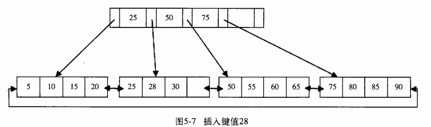
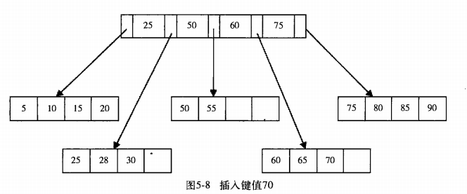

**索引与算法**

---

#### B+ 树

B+ 树是多路平衡的树结构，支持从根节点的查询和叶子节点的顺序查询。其中叶子节点包含所有的键值，这是B-树所不具有的特征。

+ B+ 树插入操作

  每次当一个元素插入的时候，需要保证元素依然排序。同时需要考虑插入B+树的三种情况，每种情况的插入算法不同。

  下面演示插入键值28的过程:

  

  当前Leaf Page和Index Page都没有满,直接插入即可.

  再来插入70这个值,发现Leaf Page已经满了,但是Indexpage还没有满,这个时候插入70,B+树的结构为:

  

  再次插入值95.满足leaf Page和Index Page都满了,需要进行两次拆分,无论如何B+数总会保持平衡,为了保持平衡,键值可能需要大量的拆分页操作.为了保持平衡,B+数提供了**旋转功能**.

+ B+ 树删除操作

  B+ 树使用**填充因子**控制树的删除变化,50%是填充因子的最小值,B+树的删除操作必须保证删除后叶子节点中记录依然排序,于插入类似,B+树删除的时候依然需要考虑B+树的平衡问题,但是于插入不同的是,删除根结填充因子的变化来衡量.

#### B+树索引

B+ 树索引就是在B+树在数据库中的实现,但是B+索引在数据库中有一个特点就是高扇出性,因此数据库中B+树一般高度为2-3层,也就是对于某一个键值的查询最多涉及到2-3次查询.

数据库中B+树索引可以分为**聚集索引**和**辅助聚集索引**,

+ **聚集索引**

  InnoDB存储引擎是索引组织表,即表中数据按照主键的属性存放,而聚集索引就是每张表主键构建的B+树.叶子节点存放着整张表的行记录数据,因此聚集索引的叶子节点就是数据页.聚集索引的这个特性巨大了索引组织表中数据也是索引的一部分.

  由于数据页只能按照一颗B+树进行排序,因此每张表只能拥有一个聚集索引.一般情况下,查询优化器,倾向于使用聚集索引,因为聚集索引可以让我们在索引的叶子节点上直接查找到数据.另外由于定义了逻辑顺序,所有可以快速的范围查询.(叶子节点的顺序查找)

+ **B+ 树索引的管理**

  创建索引可以通过`alter table`和`create index`来创建索引.

  现在的MySQL索引创建或者删除的时候,都需要新建临时表,并将其数据导入到临时表,删除原本,再将临时表重命名为原来的表.这导致索引的创建/删除花费大量时间.

  自从InnoDB plugin开始,使用一种称作**快速索引**的创建方法,这种方式只适合辅助索引,对主机创建索引还是需要使用临时表,对于辅助索引来说,innoDB会对表加上一个S锁.创建过程中,不需要创建表,因此速度极快.

+ **B+ 树索引使用的时机**

  访问表中很少一部分行的时候,使用B+树索引才有意义.

  例如:

  ```sql
  select * from student where sex='M'
  ```

  对于性别来说可选择的只有两个值,上述语句命中50%的数据,这时候使用B+树索引是没有必要的.相反的,如果某个字段范围很广,几乎没有重复,具有高选择性,使用B+树索引是合适的.比如姓名字段.

+ **顺序读,随机读,预读取**

  顺序读取指的是顺序的读取磁盘上的块,随机度值得是访问的块不是连续的,需要不停移动磁头.

  磁盘的随机读取性能要远远低于顺序读取的性能,主要的瓶颈是机械磁盘的磁头移动.

  数据库中,顺序读取指的是根据叶子节点顺序读取行数据,这个指的是逻辑上的顺序读取,但是磁盘上可能还是随机读取.

  相对的来说,物理磁盘上数据还是相对比较顺序的,原因时磁盘上根据区来管理,区是64个连续的页.

  随机读取,一般指的是访问辅助索引叶节点不能完全得到结果的,需要根据辅助索引叶子节点中的主键去寻找实际的行数据.

  为了提升读取性能,InnoDB采取**预读取技术**,预读取指的是通过一次IO请求,将多个页读取到缓冲池中,并估计读取多少个页马上会被访问.

  InnoDB支持两种预读取的方法,称作**随机预读取**和**线性预读取**.随机预读取指的是一个区中13个页在缓冲区中,且在LRU前面(经常被访问的),则引擎将这个区中剩余所有页预读取到缓冲区中.

+ **辅助索引的优化使用**

  辅助索引叶子节点包含主键,但是不包含完整的行信息.

+ **联合索引**

  联合索引指的是在表上进行多个列的索引。如果堆多个列进行索引，那么就是对内部B+树建立多个键值的索引。

  对于`select * from table where a=xxx and b=xxx`是合适的,对于单个条件`select * from table a=xxx`也合适这样的设置.`select * from table b=xxx`.不适合使用.

  联合索引的好处就是可以对第二个键值进行排序,这样查询的时候可以避免多一次的排序,因为索引本身就排序好了. 使用覆盖索引的时候可以考虑这种使用方法，可以优化SQL查询性能。

#### 哈希

+ **哈希表**

  直接寻址法的改进方案,当范围足够大的时候,不会出现碰撞,但是需要很大的存储空间,缩小空间可能导致hash碰撞.

  解决碰撞的方式有链地址法和线性探测法,平方探测法,再次哈希法.

+ **InnoDB引擎中的hash算法**

  InnoDB采取的是链地址法,解决hash冲突.

