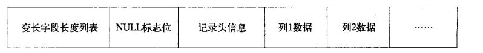

#### 逻辑存储结构

数据在逻辑层面上存储在表空间中，表空间中有数据段组成，数据段中包含区，区中又数据页组成。页也称作数据块。是`InnodDB`存储的基本单位.

##### 表空间

表空间是InnoDB存储引擎的最高层，所有数据都是存储在表空间中。每张表有自己的表空间，存储数据，索引，插入缓冲等等与自己数据表相关的数据。其他类型的数据，例如，系统数据，Undo数据，事务数据等等会存储在共享缓冲区中，因为这些数据不是某个数据表特有的。

##### 段

表空间的组成单元，常见的有数据段，索引段，回滚段等等。InnoDB自己管理着自己的段信息。

##### 区

区是由连续的64个数据页组成的，对于大的数据段，可以分配连续的数据区来进行填充。

##### 页

数据页是InnoDB存储引擎管理的最小单位, InnoDB默认16 KB.

常见数据页类型有:

+ 数据页
+ Undo页
+ 系统页
+ 事务数据页
+ 插入缓冲位图页
+ 插入缓冲空闲列表页
+ BLOB页

##### 行

InnoDB是面向行进行存储的，一个数据页中包含有若干个数据行记录，由于数据页大小的限制，一个数据页中的数据行数量是有限制的。

#### 物理存储结构

从物理存储上来看，InnoDB由共享表空间，日志文件组，表结构定义文件组成。

#### 行记录格式

InnoDB提供了Compact和Redundant两种格式存放行记录信息.

##### Compact存储格式

+ 变长字段长度列表: 按照顺序逆序存储, 即第一个长度标识最后一个字段的长度
+ NULL标志位: 记录行数据中是否有空值，如果某一列为空，则标记为1
+ 记录头信息：固定占用5字节
+ 列数据存储: 存储数据的实体

除了上述字段之外，还有事务ID列，和回滚指针列

##### Redundant存储格式

与Compact类型不同的是Redundant存储不包含NULL标志位信息。

##### 行溢出数据

InnoDB可以使用指针来引用数据页之外的数据，通常用于BLOB,TEXT这样的较大数据存储。旧版本中有768字节在原始页中，新版本只有20字节的指针。同时新版本中的Compressed模式中，使用`zlib`算法对BLOB,TEXT数据进行压缩.

#### 数据页结构

InnoDB中页是最小的存储执行单元，它的数据类型是B-数。InnoDB数据页包含如下几个部分组成:

+ 文件头

+ 页头

+ 用户记录(行数据)

+ 空闲空间

  表示空闲的数据块链表，记录删除之后，会将对应的内存区域归还给空闲空间。使用的时候会向空闲空间申请。

+ 页目录

  页目录存放了记录的相对位置，有时候这些记录位置(指针)称作槽(slot), 或者叫做目录槽。

+ 文件结尾信息

文件头部，尾部信息以及页头部信息，大小都是固定的，用来标记页的一些信息，如checksum，数据所在索引层。

#### 约束

关系型数据库可以通过约束保证记录的完整性。完整性主要体现在如下三个方面:

1. 实体完整性

   保证表中只有一个主键，可以通过`Primary Key`或者`Unique key`达到

2. 域完整性

   保证数据满足特定的条件

3. 参照完整性

   保证两张表之间的关系(使用外键)

#### 视图

视图是一个虚表，由一个查询定义，可以当做表使用。但是没有物理的表现形式。

在某些情景下，我们可以将视图设置为可更新的，这样就可以通过视图修改基表数据了，比如说加上`with check option`.

同样的，视图信息也会被记录在系统的元数据表中，详细情况可以通过查看元数据表得知。

#### 物化视图

物化视图不是虚表，而是一个实表。物化视图可以用于预先计算并保存表连接或者聚集等耗时操作的结果。适用于OLAP查询的情景。

随着表中数据的变化，物化视图也需要做出修改，修改的模式包括下述两种:

1. ON DEMAND:

   用户需求的时候进行刷新

2. ON COMMIT:

   事务提交完成的时候进行刷新

刷新方式包含如下4种:

1. FAST: 快速的增量刷新
2. COMPLETE: 全量刷新
3. FORCE: 采用最优刷新，即如果可以增量刷新就增量刷新
4. NEVER: 不刷新

#### 分区

主要的分区类型包括如下几种:

1. RANGE分区

   按照范围进行分区，这是一个连续的范围

2. LIST分区

   离散值分区

3. HASH分区

   按照计算后的哈希值分区，通常需要指定分区数量，采用哈希取余的方式进行分配

4. KEY分区

   使用数据库自己的哈希函数进行分区

适当的建立分区可以提供SQL查询性能，尤其是OLAP的情境下。