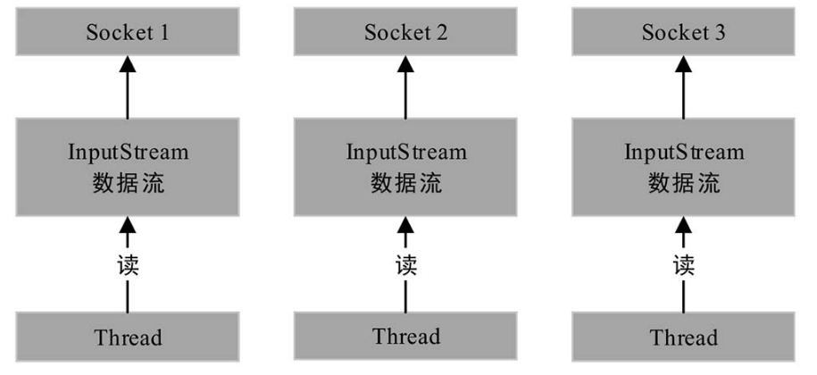
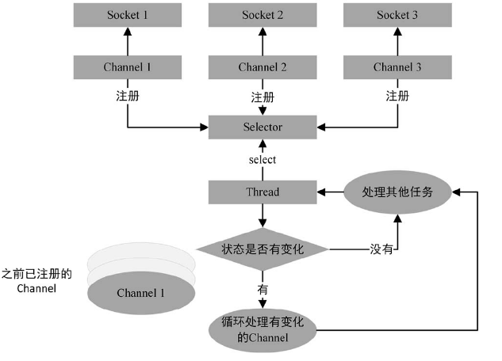
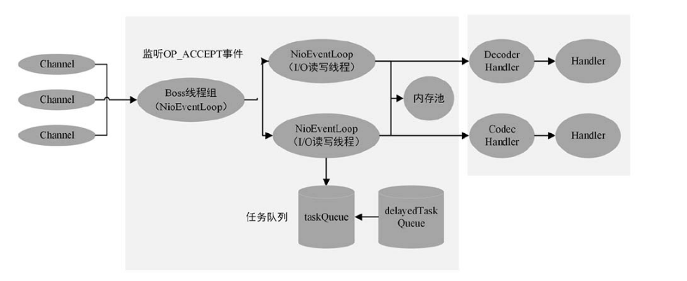

#### NIO与BIO的区别

BIO: 阻塞式IO，必须等待上次IO完成才能进行下一次IO操作.

NIO: 非阻塞式IO，缓冲区数据可以多次进行读取，不必阻塞用户线程。

NIO相比较BIO来说多了一个通道选择器，这个通道选择器Selector可以监听多个通道，当运行select方法的时候，会循环检测是否有可用的channel。只需要一条线程就可以管理多个channel，且channel的读写都是非阻塞式IO。

#### 多路复用器的实现

##### select模型

select模型只有一个select函数，选择的时候需要所有的文件描述符从用户态拷贝到内核态，且需要进行这些文件描述符的遍历工作，由于要拷贝到内核态，所以文件描述符其实是有数量上限的。

##### epoll模型

1. 当文件描述符状态发生改变的时候，会被发送到就绪队列中，通过调用epoch_wait函数获取就绪的文件描述符，需要变量的描述符较少，速度较快。
2. 由于是在用户态，没有文件描述符数量的限制。
3. 采样了内存映射机制，内核直接将就绪队列 通过 mmap的方式映射到用户态，避免数据向内核态的拷贝。

#### Netty线程模型

1. 从内存池中申请内存，读取IO数据流
2. 读取ByteBuffer中的数据，通过解码器将数据传递给Handler进行业务逻辑处理
3. 将处理后的结果经过编码写入到缓存
4. 由worker线程将数据传输到网络中

#### 编解码

由于TCP协议是面向字节流的，所以TCP是不知道传输消息的语义的，这样就会造成粘包或者拆包的问题。所以Netty需要对字节流做出语义上的划分。可以使用下面3中拆包方式。

1. 定长划分

   假定消息长度都是一致的,当然使用范围很窄.

2. 使用header头标识长度信息

   使用int类型header标识消息的长度, 从而界定消息的范围.

3. 使用特殊分隔符

   使用业务中不可能出现的标识符,来分割消息，当然序列化的时候需要单独对这个分隔符进行序列化。

#### 常用的序列化器

1. ProtoBuf
2. Kryo
3. JSON

#### 零拷贝技术

1. 使用堆外的直接内存，不需要将数据拷贝到内核，再由内核拷贝出来，少了一次拷贝。
2. 在网络传输中，只有所有数据包都接收到了，才能开始解码。Netty将这些数据包进行逻辑上的组合，而不是将数据包一起发送的方式进行整合。详情参考`CompositeByteBuf`
3. 使用Java NIO提供的FileChannel.transfer 方法，将文件缓冲区的数据直接发送到目标Channel中，不需要经过CPU的处理(DMA方式).

#### 背压机制

##### 背压机制的实现原理

背压机制的实现主要是通过TCP的滑动窗口来实现的，通过接收方当前的状态动态调整发送方需要发送数据窗口的大小。用于解决生产者生产速度大于消费者消费速度的问题。

每次一个窗口的数据发送完毕之后，接收方都需要指定ACK以及下次发送窗口大小的信息，用于控制流量大小。

