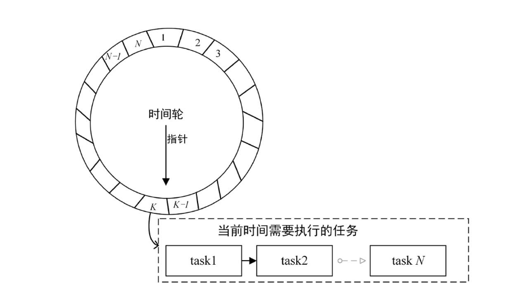

#### 时间轮介绍

时钟主要有时分秒这样的刻度单位以及度量值组成，Netty中的时间轮也是由度量单位和度量值组成的，指示度量单位只有一种，叫做tick.



每个度量值下维护了一个链表，链表中装载的是当前时刻需要执行的任务列表。

#### 时间轮的初始化过程

Netty关于时间轮的描述如下:

```java
private static final AtomicInteger INSTANCE_COUNTER = new AtomicInteger();
private static final AtomicBoolean WARNED_TOO_MANY_INSTANCES = new AtomicBoolean();
private static final int INSTANCE_COUNT_LIMIT = 64;
private static final long MILLISECOND_NANOS = TimeUnit.MILLISECONDS.toNanos(1);
private static final ResourceLeakDetector<HashedWheelTimer> leakDetector = ResourceLeakDetectorFactory.instance()
    .newResourceLeakDetector(HashedWheelTimer.class, 1);

private static final AtomicIntegerFieldUpdater<HashedWheelTimer> WORKER_STATE_UPDATER =
    AtomicIntegerFieldUpdater.newUpdater(HashedWheelTimer.class, "workerState");

private final ResourceLeakTracker<HashedWheelTimer> leak; //内存泄漏检测器
private final Worker worker = new Worker();
private final Thread workerThread;

/**
worker状态机信息
*/
public static final int WORKER_STATE_INIT = 0;
public static final int WORKER_STATE_STARTED = 1;
public static final int WORKER_STATE_SHUTDOWN = 2;
@SuppressWarnings({"unused", "FieldMayBeFinal"})
private volatile int workerState; // 0 - init, 1 - started, 2 - shut down

private final long tickDuration; //刻度单位
private final HashedWheelBucket[] wheel;//时间轮存储bucket
private final int mask;

private final CountDownLatch startTimeInitialized = new CountDownLatch(1);
// 超时任务表
private final Queue<HashedWheelTimeout> timeouts = PlatformDependent.newMpscQueue();
// 放弃任务队列
private final Queue<HashedWheelTimeout> cancelledTimeouts = PlatformDependent.newMpscQueue();
private final AtomicLong pendingTimeouts = new AtomicLong(0);
private final long maxPendingTimeouts;
//任务执行器
private final Executor taskExecutor;

private volatile long startTime;
```

任务添加的过程

```java
public Timeout newTimeout(TimerTask task, long delay, TimeUnit unit) {
    checkNotNull(task, "task");
    checkNotNull(unit, "unit");

    long pendingTimeoutsCount = pendingTimeouts.incrementAndGet();

    if (maxPendingTimeouts > 0 && pendingTimeoutsCount > maxPendingTimeouts) {
        pendingTimeouts.decrementAndGet();
        throw new RejectedExecutionException("Number of pending timeouts ("
                                             + pendingTimeoutsCount + ") is greater than or equal to maximum allowed pending "
                                             + "timeouts (" + maxPendingTimeouts + ")");
    }

    start();
	// 添加下一个时刻需要被执行的任务, 处理期间HashedWheelTimeout会被添加到对应的bucket
    long deadline = System.nanoTime() + unit.toNanos(delay) - startTime;

    if (delay > 0 && deadline < 0) {
        deadline = Long.MAX_VALUE;
    }
    // 创建超时任务并添加
    HashedWheelTimeout timeout = new HashedWheelTimeout(this, task, deadline);
    timeouts.add(timeout);
    return timeout;
}
```

#### Worker启动线程的过程

worker是时间轮设计的核心，其中重要的参数为tick，每经过一个刻度，tick会自增。在Worker线程中，tick主要做如下几件事情:

1. 等待下一个刻度时刻到来
2. 从取消任务队列中获取取消的任务并处理
3. 从任务队列中获取需要执行的定时任务，将其放入对应的bucket
4. 从当前刻度链表中取出需要执行的定时任务，并循环执行定时检测任务的run方法