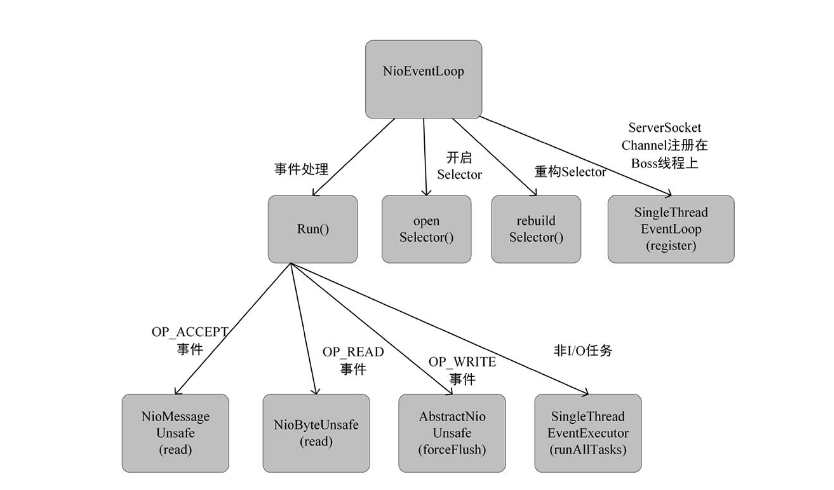
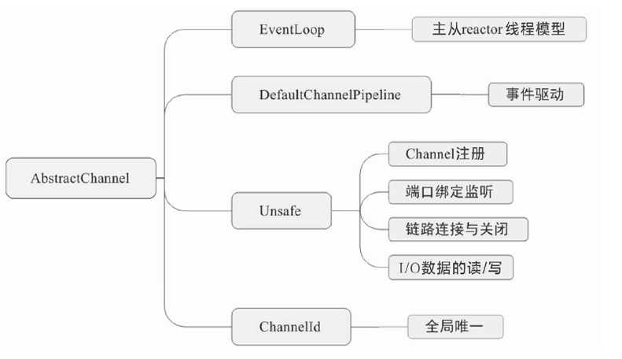
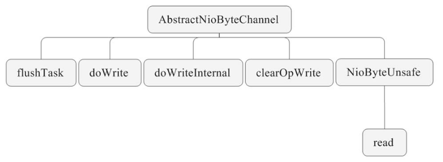
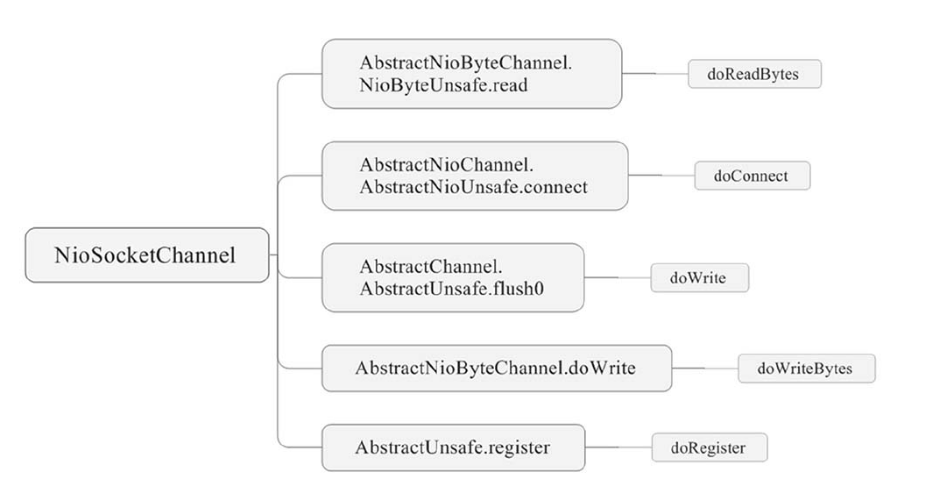
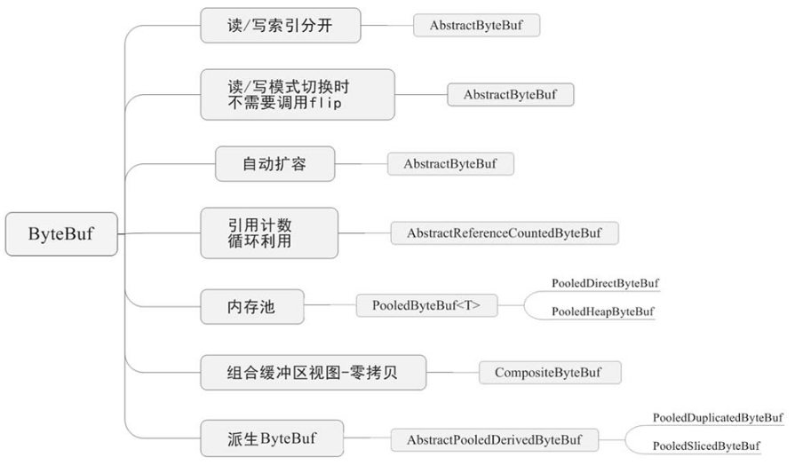

#### 基于NIO的事件循环检测

##### 线程组

Netty处理事件循环处理的类为`MultiThreadEventLoopGroup`,这个类中包含有若干个线程组成的线程组。其中关于NIO的实现叫做`NioEventLoopGroup`，多路复用器选择的是select模式。`epoll`模式的实现为`EpollEventLoopGroup`.

其中每个线程的执行体叫做`EventExecutor`.

下面使用代码描述，创建线程组的过程.

```java
protected EventLoop newChild(Executor executor, Object... args) throws Exception {
    // 从给入参数获取多路复用器相关信息 以及 线程池拒绝策略
    SelectorProvider selectorProvider = (SelectorProvider) args[0];
    SelectStrategyFactory selectStrategyFactory = (SelectStrategyFactory) args[1];
    // 这里的线程池拒绝策略与juc一致
    RejectedExecutionHandler rejectedExecutionHandler = (RejectedExecutionHandler) args[2];
    /**
    	任务队列和队尾任务队列的设计:
    	
    	taskQueueFactory 在SingleThreadExectorLoop中是一个Queue<Task>类型的任务队列，这个队列在SingleThreadEventExecutor(用于在单线程模式下执行提交的任务)中进行判空
    	
    	tailTaskQueueFactory 在SingleThreadExectorLoop中进行赋值和判空，如果为空则抛出异常
    */
    EventLoopTaskQueueFactory taskQueueFactory = null;
    EventLoopTaskQueueFactory tailTaskQueueFactory = null;
	
    int argsLength = args.length;
    if (argsLength > 3) {
        taskQueueFactory = (EventLoopTaskQueueFactory) args[3];
    }
    if (argsLength > 4) {
        tailTaskQueueFactory = (EventLoopTaskQueueFactory) args[4];
    }
    return new NioEventLoop(this, executor, selectorProvider,
                            selectStrategyFactory.newSelectStrategy(),
                            rejectedExecutionHandler, taskQueueFactory, tailTaskQueueFactory);
}
```

对于`NioEventLoop`的初始化

```java

/**
@params parent 线程组
@params executor 线程的执行器，用于执行线程任务
@params selectorProvider 多路复用器提供者
@params strategy 多路复用规则
@params rejectedExecutionHandler 线程池拒绝策略
@params taskQueueFactory 任务队列工厂
@params tailTaskQueueFactory 末尾任务工厂
*/
public NioEventLoop(NioEventLoopGroup parent, Executor executor, SelectorProvider selectorProvider,
             SelectStrategy strategy, RejectedExecutionHandler rejectedExecutionHandler,
             EventLoopTaskQueueFactory taskQueueFactory, EventLoopTaskQueueFactory tailTaskQueueFactory) {
    super(parent, executor, false, newTaskQueue(taskQueueFactory), newTaskQueue(tailTaskQueueFactory),
          rejectedExecutionHandler);
    this.provider = ObjectUtil.checkNotNull(selectorProvider, "selectorProvider");
    this.selectStrategy = ObjectUtil.checkNotNull(strategy, "selectStrategy");
    final SelectorTuple selectorTuple = openSelector();
    this.selector = selectorTuple.selector;
    this.unwrappedSelector = selectorTuple.unwrappedSelector;
}
```

`NioEventLoopGroup`通过方法`next()`获取`NioEventLoop`线程，它会调用父类的next方法，委托给父类的选择器`EventExecutorChooser`.

选择器的实现包含：

1. 通用选择器`GenericEventExecutorChooser`

   使用取余数的方式获取round-robin中的index

2. 平方选择器`PowerOfTwoEventExecutorChooser`

   使用掩码的方式获取round-robin中的index

##### 执行线程`NioEventLoop`

`NioEventLoop`需要管理成千上万条IO链路，主要包括如下核心功能:

1. 启用Selector并且初始化
2. 将`ServerSocketChannel`注册到selector上
3. 处理各种IO事件，如OP_ACCEPT,OP_CONNECT,OP_READ,OP_WRITE
4. 执行定时调度任务
5. 解决空轮询问题

`NioEventLoop`本身只实现了数据流接入的功能，其他功能交由其他组件实现.

链路注册的功能交由Unsafe类实现，所以注册方法在父类`SingleThreadEventLoop`中实现.



##### 多路复用器的开启

```java
private SelectorTuple openSelector() {
    final Selector unwrappedSelector;
    try {
        unwrappedSelector = provider.openSelector();
    } catch (IOException e) {
        throw new ChannelException("failed to open a new selector", e);
    }

    if (DISABLE_KEY_SET_OPTIMIZATION) {
        return new SelectorTuple(unwrappedSelector);
    }
	
    // 加载用户自定义的selector类型
    Object maybeSelectorImplClass = AccessController.doPrivileged(new PrivilegedAction<Object>() {
        @Override
        public Object run() {
            try {
                return Class.forName(
                    "sun.nio.ch.SelectorImpl",
                    false,
                    PlatformDependent.getSystemClassLoader());
            } catch (Throwable cause) {
                return cause;
            }
        }
    });
	
    // 检查自定义的selector类型是否合法，如果没有自定义的selector，则对原始的selector进行封装返回
    if (!(maybeSelectorImplClass instanceof Class) ||
        // ensure the current selector implementation is what we can instrument.
        !((Class<?>) maybeSelectorImplClass).isAssignableFrom(unwrappedSelector.getClass())) {
        if (maybeSelectorImplClass instanceof Throwable) {
            Throwable t = (Throwable) maybeSelectorImplClass;
            logger.trace("failed to instrument a special java.util.Set into: {}", unwrappedSelector, t);
        }
        return new SelectorTuple(unwrappedSelector);
    }
	
    // 处理自定义的selector
    final Class<?> selectorImplClass = (Class<?>) maybeSelectorImplClass;
    final SelectedSelectionKeySet selectedKeySet = new SelectedSelectionKeySet();
	
    // 使用unsafe类添加selectedkeys和publicSelectedKeys两个字段，如果找不到则抛出异常
    Object maybeException = AccessController.doPrivileged(new PrivilegedAction<Object>() {
        @Override
        public Object run() {
            try {
                Field selectedKeysField = selectorImplClass.getDeclaredField("selectedKeys");
                Field publicSelectedKeysField = selectorImplClass.getDeclaredField("publicSelectedKeys");

                if (PlatformDependent.javaVersion() >= 9 && PlatformDependent.hasUnsafe()) {
                    // Let us try to use sun.misc.Unsafe to replace the SelectionKeySet.
                    // This allows us to also do this in Java9+ without any extra flags.
                    long selectedKeysFieldOffset = PlatformDependent.objectFieldOffset(selectedKeysField);
                    long publicSelectedKeysFieldOffset =
                        PlatformDependent.objectFieldOffset(publicSelectedKeysField);

                    if (selectedKeysFieldOffset != -1 && publicSelectedKeysFieldOffset != -1) {
                        PlatformDependent.putObject(
                            unwrappedSelector, selectedKeysFieldOffset, selectedKeySet);
                        PlatformDependent.putObject(
                            unwrappedSelector, publicSelectedKeysFieldOffset, selectedKeySet);
                        return null;
                    }
                    // We could not retrieve the offset, lets try reflection as last-resort.
                }

                Throwable cause = ReflectionUtil.trySetAccessible(selectedKeysField, true);
                if (cause != null) {
                    return cause;
                }
                cause = ReflectionUtil.trySetAccessible(publicSelectedKeysField, true);
                if (cause != null) {
                    return cause;
                }

                selectedKeysField.set(unwrappedSelector, selectedKeySet);
                publicSelectedKeysField.set(unwrappedSelector, selectedKeySet);
                return null;
            } catch (NoSuchFieldException e) {
                return e;
            } catch (IllegalAccessException e) {
                return e;
            }
        }
    });
	
    // 如果selector key信息查找错误，则返回异常信息
    if (maybeException instanceof Exception) {
        selectedKeys = null;
        Exception e = (Exception) maybeException;
        logger.trace("failed to instrument a special java.util.Set into: {}", unwrappedSelector, e);
        return new SelectorTuple(unwrappedSelector);
    }
    // 查找成功 将selector key封装返回
    // SelectedSelectionKeySet底层是一个数组，而不是原始的set结构 重写了iterator和add方法
    selectedKeys = selectedKeySet;
    logger.trace("instrumented a special java.util.Set into: {}", unwrappedSelector);
    return new SelectorTuple(unwrappedSelector,
                             new SelectedSelectionKeySetSelector(unwrappedSelector, selectedKeySet));
}
```

##### 线程执行逻辑

run方法主要包含三个部分

1. select ：轮询就绪的channel

   轮询过程中会调用NIO的`selectNow`或者select方法. 

   + 当定时任务需要触发之前没有被轮询过，会调用`selectNow`立即返回
   + 当定时任务需要触发，且之前轮询过。直接返回不需要调用`selectNow`
   + 如果`taskQueue`中有任务, 且从`EventLoop`线程进入select方法后，一直无其他线程触发唤醒动作，需要调用`selectNow`方法立即返回.
   + 当select方法阻塞运行的时候，其他线程的唤醒信号，检测到就绪key，遇上空轮询，超时会解除线程的阻塞状态。

   select逻辑如下:

   ```java
   /**
        * Selects a set of keys whose corresponding channels are ready for I/O
        * operations.
        *
        * <p> This method performs a blocking <a href="#selop">selection
        * operation</a>.  It returns only after at least one channel is selected,
        * this selector's {@link #wakeup wakeup} method is invoked, or the current
        * thread is interrupted, whichever comes first.  </p>
        *
        * @return  The number of keys, possibly zero,
        *          whose ready-operation sets were updated
        *
        * @throws  IOException
        *          If an I/O error occurs
        *
        * @throws  ClosedSelectorException
        *          If this selector is closed
        */
   public abstract int select() throws IOException;
   ```

2. process `SelectKeys`: 用于处理轮询获得的`SelectKey`

   处理第一部分轮询遇到的key, 取出`SelectionKey`以及相关attachment. 这种附带类型主要包括`AbstractNioChannel`和`NioTask`. 根据key的不同事件触发不同类型的unsafe方法，来执行读写逻辑。

3. `runAllTasks`: 执行任务

   执行`taskQueue`任务队列和定时任务队列中的任务，首先会根据`ioRate`参数计算任务执行时长，每执行64个任务后，会检查任务时间是否用完，如果用完，就不会再执行后续任务了。

总体而言，调用select方法轮询就绪的channel，然后使用`processSelectKeys`的方式处理IO事件，最后运行`runAllTasks`处理任务队列中的任务。

##### 多路复用器的重构

当空轮询的次数大于阈值的时候，多路复用器selector需要进行重构，重新新建一个新的selector，将旧的selector中key和attachment复制过去，同时关闭旧的selector。

在Netty的工作流程中，有两个地方会涉及到通道的注册:

1. 端口绑定之前，将`NioServerSocketChannel`注册到多路复用器上
2. `NioEventLoop`检测到有链路接入的时候，把链路`SocketChannel`包装成`NioSocketChannel`，注册代worker线程中.

#### 通道

Netty的Channel与NIO的Channel很相似, 用于抽象对网络IO的相关接口. 其实现类为`AbstractChannel`. 主要功能有网络IO，客户端发起连接，主动关闭连接，关闭链路，获取双方通信地址。

`AbstactChannel`使用了Netty的线程模型，事件驱动模型，支持多种网络协议的阻塞和非阻塞方式。

`AbstarctChannel`包含如下几个重要的属性:

+ `EventLoop`: 每个Channel对应一条`EventLoop`线程
+ `DefaultChannelPipeline`: handler链，用于对接收到的事件的处理逻辑
+ `unsafe`: 控制网络IO,链路关闭(只是不对外使用，不是不安全)



##### `AbstractNioChannel`

`AbstractNioChannel`是NIO关于`AbstractChannel`的实现，其中包含三个主要参数

```java
// nio通道
private final SelectableChannel ch;
// channel监听的事件类型
protected final int readInterestOp;
// SeletableChannel注册到Selector中的返回值
volatile SelectionKey selectionKey;
```

通道注册逻辑:

```java
protected void doRegister() throws Exception {
    boolean selected = false;
    for (;;) {
        try {
            // 将当前通道注册到多路复用器中，如果成功则返回
            selectionKey = javaChannel().register(eventLoop().unwrappedSelector(), 0, this);
            return;
        } catch (CancelledKeyException e) {
            if (!selected) {
                // 强制调用selectNow，将selectKey从selector上删除
                eventLoop().selectNow();
                selected = true;
            } else {
                throw e;
            }
        }
    }
}
```

##### `AbstractNioByteChannel`

`AbstractNioChannel`提供了对于`ByteBuf`和`FileRegion`的实现。对于`ByteBuf`，提供了`AbstractNioByteChannel`, 其包含如下操作:



1. `flushTask`

   发送缓存链表中的数据，由于write方法是将数据写入到`ChannelOutboundBuffer`中，所以调用flush方法的时候，会将buffer中的数据写入socket发送。当buffer中的数据没有发送完成的时候，会把这个任务加入到`EventLoop`中，等到再有IO事件的时候，继续发送。

2. `doWrite`，`doWriteInternal`

   在`AbstractChannel`中的`flush0`中被调用，主要是从buffer中获取数据，并进行循环发送到socket中。

   根据发送结果分为如下三类：

   + 发送成功，直接返回
   + 由于TCP缓存满，写入字节数为0，将当前写操作事件写入select key感兴趣事件集合中。
   + 写入16次仍然没有完成的时候，会从感兴趣事件集合中移除，并新建一个`flushTask`(处理当前没有做完的发送任务)，先处理其他任务，当检测到这个任务时再发送.

3. Unsafe中read方法的执行逻辑

   + 获取channel的配置对象，内存分配器`ByteBufAllocator`,并计算内存分配器
   + 循环从内存分配器中获取ByteBuf,将数据读取到buffer中，一直到没有数据或者连接断开为止。
   + 跳出循环，本次读取完成

##### `AbstractNioMessageChannel` 

`AbstractNioMessageChannel` 读取和写入的类型都是Object类型，不是字节流，所以不会出现粘包问题。因此`AbstractNioMessageChannel`中，循环读取数据包，再触发`channelRead`逻辑。把缓存中`OutboundBuffer`中的数据包写入Channel中，如果channel写满了，则在channel的select key上设置IO事件，并退出。

##### `NioSocketChannel`

`NioSocketChannel`是`AbstractNioByteChannel`和`SocketChannel`的实现，Netty的每个socket连接都会生成一个`NioSocketChannel`.



+ `doReadBytes`: 从socket channel中读取数据
+ `doWrite`: 写入数据到socket
+ `doConnect`: 连接客户端逻辑

##### `NioServerSocketChannel`

只关心socket的接入，不处理实际的IO请求. 它是对NIO中`ServerSocketChannel`的封装, 通过`newSocket()`方法打开`ServerSocketChannel`, 它的多路复用器与`NioSocketChannel`的多路复用器一样，由父类实现。

#### 缓冲区

Netty写了一套自己的ByteBuf代替了NIO的`ByteBuffer`。下面是Netty中部分ByteBuf的实现。



为什么要自己写一套缓冲区?

NIO `ByteBuffer`只有一个位置指针position，在切换读/写状态时，需要手动调用flip()方法或rewind()方法，以改变position的值. 所以`ByteBuffer`长度是固定的，分配之后就不能改变。当需要放入或存储的对象大于`ByteBuffer`的容量时会发生异常。每次编码时都要进行可写空间校验


Netty的`AbstractByteBuf`将读/写指针分离，同时在写操作时进行了自动扩容。

NIO `ByteBuffer`的duplicate()方法可以复制对象，复制后的对象与原对象共享缓冲区的内存，但其位置指针独立维护。Netty的ByteBuf也采用了这功能，并设计了内存池。内存池是由一定大小和数量的内存块ByteBuf组成的，这些内存块的大小默认为16 MB。当从Channel中读取数据时，无须每次都分配新的ByteBuf，只需从大的内存块中共享一份内存，并初始化其大小及独立维护读/写指针即可。所以Netty特征是可以复用内存池中的内存块，不需要额外自己分配内存。

Netty采用对象引用计数，需要手动回收。每复制一份ByteBuf或派生出新的ByteBuf，其引用值都需要增加。

##### `AbstractByteBuf`

`AbstractByteBuf`是`ByteBuf`的子类，定义了一些公共属性，如读索引，写索引，mark，容量等。与NIO实现的不同就是读写指针分离了。

```java
int readerIndex;
int writerIndex;

int markedReaderIndex;
int markedWriterIndex;

int maxCapacity;
```

**扩容机制**

```java
 final void ensureWritable0(int minWritableBytes) {
     final int writerIndex = writerIndex();
     final int targetCapacity = writerIndex + minWritableBytes;
     // using non-short-circuit & to reduce branching - this is a hot path and targetCapacity should rarely overflow
     if (targetCapacity >= 0 & targetCapacity <= capacity()) {
         ensureAccessible();
         return;
     }
     if (checkBounds && (targetCapacity < 0 || targetCapacity > maxCapacity)) {
         ensureAccessible();
         throw new IndexOutOfBoundsException(String.format(
             "writerIndex(%d) + minWritableBytes(%d) exceeds maxCapacity(%d): %s",
             writerIndex, minWritableBytes, maxCapacity, this));
     }
	
     // 将目标的容量规则化为2的幂次方
     final int fastWritable = maxFastWritableBytes();
     int newCapacity = fastWritable >= minWritableBytes ? writerIndex + fastWritable
         : alloc().calculateNewCapacity(targetCapacity, maxCapacity);

     // 调整到新容量
     capacity(newCapacity);
 }
```

##### `AbstractReferenceCountedByteBuf`

运用到引用计数法的ByteBuf大部分都需要继承`AbstractReferenceCountedByteBuf`类。该类有个引用值属性——`refCnt`

由于ByteBuf的操作可能存在多线程并发使用的情况，其`refCnt`属性的操作必须是线程安全的，因此采用了volatile来修饰，以保证其多线程可见。在Netty中，ByteBuf会被大量地创建，为了节省内存开销，通过`AtomicIntegerFieldUpdater`来更新`refCnt`的值，而没有采用`AtomicInteger`类型

`AbstractReferenceCountedByteBuf`的大部分功能都是由updater属性完成的.

`refCnt`引用计数的值每次加1或减1，默认为1，大于0表示可用，等于0表示已释放。新版本默认值为2。

##### `ReferenceCountUpdater`

`ReferenceCountUpdater`是`AbstractReferenceCountedByteBuf`的辅助类，用于完成对引用计数值的具体操作.

Netty `v4.1.38.Final`版本采用了乐观锁方式来修改`refCnt`，并在修改后进行校验, 如果出现了溢出，则回滚并抛异常。

旧版本中，采用的是原子性操作，不断地提前判断，并尝试调用CAS。

##### `CompositeByteBuf`

`CompositeByteBuf`的主要功能是组合多个ByteBuf，对外提供统一的`readerIndex`和`writerIndex`。由于它只是将多个ByteBuf的实例组装到一起形成了一个统一的视图，并没有对ByteBuf中的数据进行拷贝，因此也属于Netty零拷贝的一种，主要应用于编码和解码

`CompositeByteBuf`可以看做是读个ByteBuf的逻辑组合，在进行编码的时候可以省去长度信息的编码的拷贝。

##### `PooledByteBuf`

`PooledByteBuf`类继承于`AbstractReference CountedByteBuf`。对象主要由内存池分配器`PooledByteBufAllocator`创建。

一种是基于堆外直接内存池构建的`PooledDirectByteBuf`，是Netty在进行I/O的读/写时的内存分配的默认方式，堆外直接内存可以减少内存数据拷贝的次数。另一种是基于堆内内存池构建的`PooledHeapByteBuf`。

除了上述两种实现类，Netty还使用Java的后门类`sun.misc.Unsafe`实现了两个缓冲区，即`PooledUnsafeDirectByteBuf`和`PooledUnsafeHeapByteBuf`。这个强大的后门类会暴露对象的底层地址。

为了降低系统开销，Netty对Buffer对象进行了池化，缓存了Buffer对象，使对此类型的Buffer可进行重复利用。`PooledByteBuf`是从内存池中分配出来的Buffer，因此它需要包含内存池的相关信息，如内存块Chunk、`PooledByteBuf`在内存块中的位置及其本身所占空间的大小等。

#### 内存泄漏检测机制

##### 池化缓冲区会出现的内存泄漏问题

Netty在默认情况下采用的是池化的PooledByteBuf，以提高程序性能。但是PooledByteBuf在使用完毕后需要手动释放，否则会因PooledByteBuf申请的内存空间没有归还导致内存泄漏，最终使内存溢出。

Netty运用JDK的弱引用和引用队列设计了一套专门的内存泄漏检测机制，用于实现对需要手动释放的ByteBuf对象的监控。

> 引用队列:
>
> 与虚引用或弱引用配合使用，当普通对象被垃圾回收器回收时，会将对象的弱引用和虚引用加入引用队列中。

##### 内存泄漏检测原理

1. 采集ByteBuf对象。

2. 记录ByteBuf的最新调用轨迹信息，方便溯源。

   采集入口在内存分配器`PooledByteBufAllocator`的`newDirectBuffer`与`newHeapBuffer`方法中，对返回的ByteBuf对象做一层包装，包装类分两种：`SimpleLeakAwareByteBuf`与`AdvancedLeakAwareByteBuf`。

   上述两个类记录了ByteBuf调用的堆栈信息。

3. 检查是否有泄漏，并进行日志输出。

   Netty先把所有弱引用缓存起来，在ByteBuf被销毁后，再从缓存中移除对应的弱引用，当遍历到此弱引用时，若发现它已从缓存中移除，则表示ByteBuf无内存泄漏。