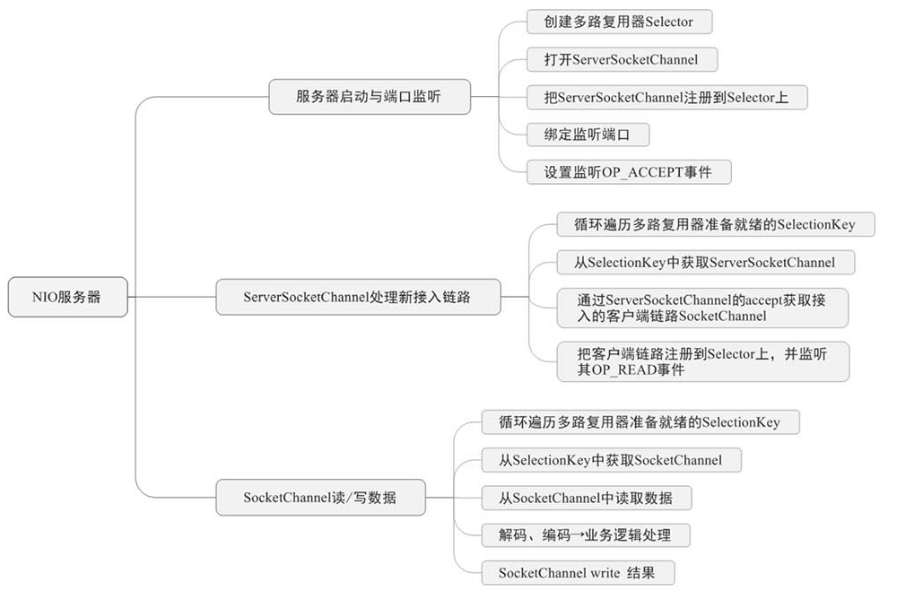

#### ServerBootstrap启动流程

NIO服务器需要完成如下三个步骤：

1. 服务器监听指定端口
2. `ServerSocketChannel`接入新的链路
3. `SocketChannel`读取数据

##### Netty服务启动过程

1. 创建两个线程组，并调用父类MultithreadEventExecutorGroup的构造方法实例化每个线程组的子线程数组。在NioEventLoop线程创建的同时多路复用器Selector被开启。
2. 在AbstractBootstrap的initAndRegister中，通过ReflectiveChannelFactory.newChannel()来反射创建NioServerSocketChannel对象。
3. 初始化NioServerSocketChannel、设置属性attr和参数option，并把Handler预添加到NioServerSocketChannel的Pipeline管道中。
4. NioEventLoop线程调用AbstractUnsafe.register0()方法，底层调用ServerSocketChannel的register()方法把Channel注册到Selector上。
5. 注册成功后会触发ChannelFutureListener的operationComplete()方法，此方法会带上主线程的ChannelPromise参数，然后调用AbstractChannel.bind()方法；再执行NioServerSocketChannel的doBind()方法绑定端口；当绑定成功后，会触发active事件，为注册到Selector上的ServerSocket Channel加上监听OP_ACCEPT事件

#### IO就绪事件处理

1. OP_ACCEPT监听事件处理
   + 当NioEventLoop中的多路复用器Selector轮询到就绪的SelectionKey时，判断Key的readyOps类型是否为OP_ACCEPT。如果是，则获取select key的attachment，即NioSocketChannel，调用unsafe的读写方法进行处理。
   + 调用NioMessageUnsafe的read方法，执行doReadMessages。调用子类NioServerSocketChannel的doReadMessages方法，这个方法的子类是ServerSocketChannel的accept方法，获取对应的SocketChannel进行处理。构建好NioSocketChannel之后，触发管道的fireChannelRead方法，进而触发read事件，最后调用Handler的channelRead方法。
   + 在ServerBootstrapAcceptor的channelRead方法中，将NioSocketChannel注册到worker线程上，同时绑定channel的handler链。
   + NioByteUnsafe不断循环调用read方法，将数据从channel中读取到管道中，触发一系列ChannelInboxHandler的channelRead方法。
   + channelRead方法对输入的ByteBuf类型进行解码，并写入到半包字节容器中。
   + 写入半包容器后，会一直递归调用解码函数进行解码。 
   + 解码完成，回收半包容器，如果数据没有处理完毕，则需要对之前处理的数据进行压缩。
   + 当Netty处理写出任务的时候，会生成一个输出任务的handler链表，依次执行链表中的handler逻辑，将数据写入到ChannelOutboxBuffer中，再由发送线程发送到网络中。同时根据网络的流量控制发送的流量大小(背压机制).