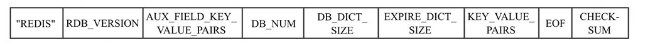
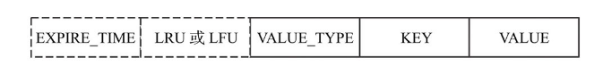

### RDB执行流程

Redis通过`bgsave`指令进行RDB快照的触发.  同时也支持使用配置参数进行触发.

### RDB文件格式

+ REDIS: RDB文件标识符
+ RDB_VERSION: RDB 版本信息
+ AUX_FIELD_KEY_VALUE_PAIRS: 保留字段
+ DB_NUM: 数据存储的数据库
+ DB_DICT_SIZE: 数据库字典的大小
+ EXPIRE_DICT_SIZE: 过期字典的大小
+ KEY_VALUE_PAIRS: 存储的kv信息
+ EOF: 文件结束标识符

​	RDB文件中一个kv的结构如上图所示:

+ EXPIRE_TIME：过期时间
+ LRU/LFU: 缓存淘汰标志位
+ VALUE_TYPE: value类型
+ KEY: KEY
+ VALUE: VALUE

#### key的保存形式

key通常情况下是字符串，字符串通常使用长度以及字符数组的方式进行存储。

当然为了节省存储空间，可以按照int类型数据的方式存储。或者使用LZF压缩方式进行压缩存储。

#### value的保持形式

1. 列表存储

   存储结构为quicklist的双向链表，链表元素为ziplist, 可以选择是否使用LZF压缩.

2. 集合存储

   集合存储分为intset或者hash的方式，其中intset使用连续内存存储

3. 有序集合存储

   存储方式为ziplist或者skiplist，如果使用ziplist，则将ziplist作为一个字符串存储。如果是skiplist，则将元素和元素的分值依次保存(字符串和double类型).

4. 散列存储

   散列存储为hash或者ziplist