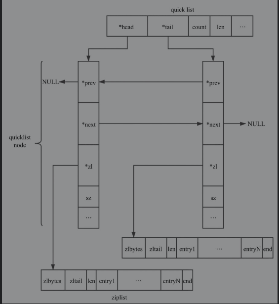

### QuickList

`QuickList`(下面简称快表, 注意不是操作系统中的TAB), 是`Redis 3.2`版本中新提出来的, 用于对链表和压缩列表的折中方案. 快表是一个双向的链表, 其中每个节点是一个压缩列表.

#### 数据存储

快表的存储结构:



从总体上来看是一个双向链表的存储结构.

具体描述如下:

```c++
typedef struct quicklist {
    quicklistNode *head; // 头结点
    quicklistNode *tail; // 尾结点 
    unsigned long count; // 元素数量
    unsigned long len; // 节点数量
    int fill; // quicklistNode 中ziplist的长度 
    unsigned int compress; // 压缩参数
} quicklist;
```

对于每个节点来说, 其中存储的数据内容是`ziplist`, 节点`quicklistNode`描述如下:

```c++
typedef struct quicklistNode {
    struct quicklistNode *prev;
    struct quicklistNode *next;
    
    unsigned char *zl;
    unsigned int sz;// ziplist长度
    unsigned int count; // ziplist 中存储元素数量
    unsigned int encoding; // 编码格式raw=1,lzf=2
    unsigned int container; // 是否为ziplist,none=1,ziplist=2
    unsigned int recompress; 
    unsigned int attempted_compress;
    
    unsigned int extra; // 保留参数
}
```

当使用`LZF`压缩快表的时候, `quicklistNode`指向结构为`quicklistLZF`. 结构如下所示:

```c++
typedef struct quicklistLZF {
    unsigned int sz; // lzf 压缩模式下的大小
    char compressed[];
} quicklistLZF;
```

当使用快表中`ziplist`中某个节点的时候,提供`quicklistEntry`来快速获取.

#### 数据压缩

`Redis`允许使用`LZF`算法对`ziplist`进行进一步的压缩. 压缩后的数据可以分成多个片段, 每个片段具有两个部分, 解释字段和数据字段. 

##### 片段格式


解释字段具有如下三种类型:

1. 字面型

   解释字段占用1个字节, 数据字段长度由后面5位来决定. 

2. 简短重复型

   解释字段占用两个字节,没有数据字段, 数据内容与前面内容重复

3. 批量重复型

   解释字段占用三个字节, 没有数据字段, 数据内容与前面内容重复.

