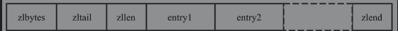
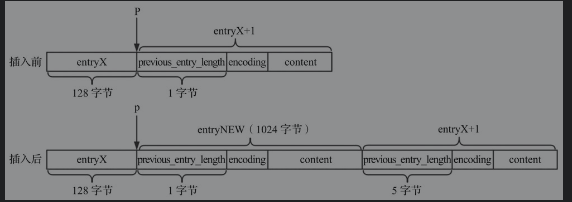
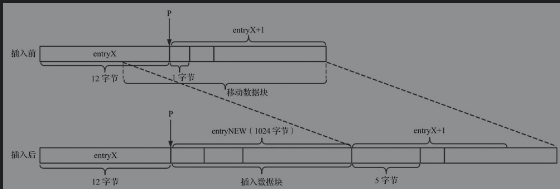
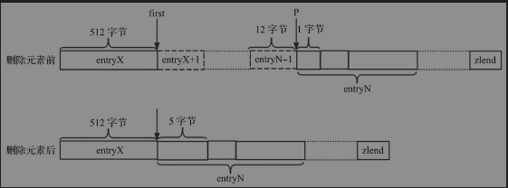
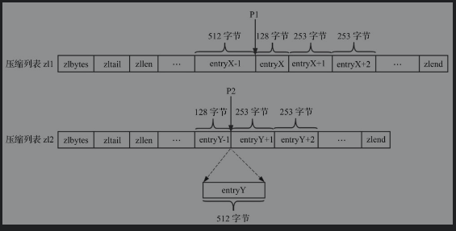

### 压缩列表

#### 压缩列表结构



上述为压缩列表的结构, 其中:

`zlbytes`: 压缩列表的字节长度, 4字节.

`zltail`: 压缩列表尾部元素与起始地址的偏移量,4字节

`zllen`: 压缩列表元素个数

`entryx`: 压缩列表元素

`zlend`: 压缩列表结束符号

那么现在如何实现压缩列表的遍历呢？ 下面是压缩列表元素的编码格式(也就是`entryx`).


其中`previous_entry_length`表示上一个entry的长度. 

`encoding`表示编码方式, 即`content`的数据类型(整数或者字节数组). 

**解码优化**

对于压缩列表中的任意元素, 获取其前一个元素的起始地址, 编码方式即可通过解码获取数据内容, 频繁解码可以通过缓存来进行优化. 这里定义了`zlentry`用于表示解码后的压缩列表内容.

```c++
typedef struct zlentry{
    // prev 字段长度与内容
    unsigned int prevrawlensize;
    unsigned int prerawlen;
    
    // len字段长度与内容
    unsigned int lensize;
    unsigned int len;
    
    unsigned char encoding;
    unsigned int headersize; // previous_entry_length和encoding字段长度总和
    unsigned char *p;
} zlentry;
```

分别使用`previous_entry_length`和`encoding`字段解码逻辑进行解码, 得到`zlentry`.

#### 基本操作

##### 插入元素

1. 编码

   就是计算`previous_entry_length,encoding,content`字段的内容

   很显然

   + 当压缩列表为空值时候, 上一条记录长度为0
   + 其他位置, 需要计算`previous_entry_length`位置处记录的长度

2. 重新分配空间

   由于新插入了元素, 所以需要分配空间给新插入的元素, 但是这个新的空间大小不一定等于新旧空间的总和.

   例如:

   

   可以看出`entryX+1`位置处,头部信息的长度是可以变化的, 可以是1字节或者5字节. 这样就会有空间的浮动问题.

   

   由于重新分配了空间, 所以插入的P位置也就失效, 所以需要先确定P相对于压缩列表首地址的偏移量, 待分配空间之后进行偏移就行. 

3. 数据复制

   重新分配空间之后, 插入点P之后的数据都需要进行移动,移动的偏移量为插入记录的长度.

   

##### 删除元素

删除操作主要分为三个步骤:

1. 计算待删除元素的总长度

   ```c++
   //解码第一个删除的元素
   zipEntry(p,&first);
   
   // 遍历所有待删除的元素, 指针p向后移动
   for(i=0;p[0]!=ZIP_END && i<num;i++){
       p+=zipRawEntryLength(p);
       deleted++;
   }
   
   // 设置待删除总长度
   total=p-first.p;
   ```

   删除逻辑示意图:

   

2. 数据复制

   删除元素时候空间减小量也是不一定等于删除记录总长的. 总体逻辑是将P之后的数据复制到first之后.

3. 重新分配空间

   在数据复制完成之后, 重新分配空间.

#### 连锁更新

连锁更新的示例:



如上图所示，假设在压缩列表`zl1`中`P1`位置删除一条记录`entryX`.可以看出这些记录的`preview_entry_length`都是1字节.	`entryX+1`的前驱节点为`entryX-1`,长度为512字节. 所以`entryX+1`需要5个字节的`preview_entry_length`才能完成存储, 这就导致`entryX+1`记录长度变成257, 从而`entryX+2`也需要变化, 以此类推.


解决连锁更新的方法:

`Redis`仅仅在插入或者删除操作的末尾, 调用函数去检查是否需要更新后续元素的previous_entry_length字段.