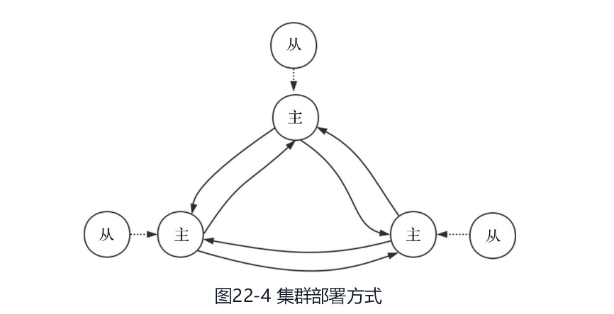
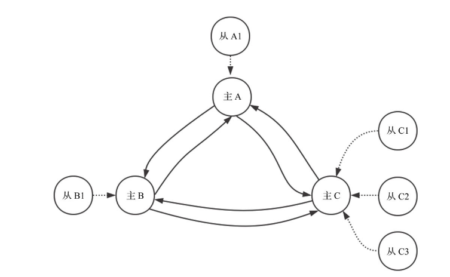
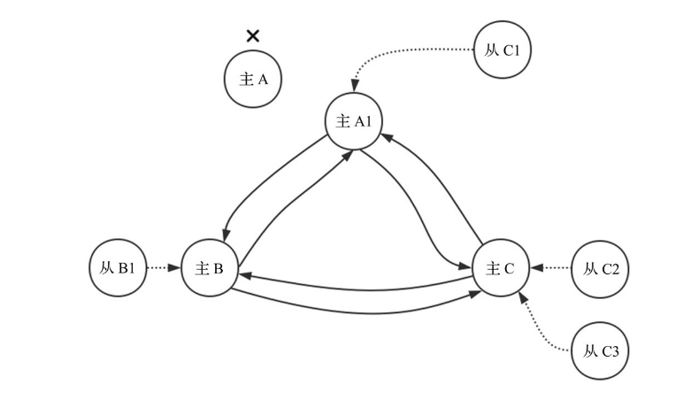

### Sential的实现

哨兵通过与Master与Slave通信，能够清楚的直到Redis服务的健康信息。

当Master发生故障的时候，哨兵通过对slave列表中的slave进行选择，选择出一个slave作为新的master。

哨兵需要选择出一个leader作为操作对象，leader选举的时候，参加选举的必须是奇数，否则可能会出现脑裂的情况。

#### 主观下线与客观下线

主观下线：哨兵监视下的master处于下线状态，标记redis状态为S_DOWN，即主观下线。\

客观下线:  当哨兵中的大多数赞同master处于下线状态，则会标记master处于客观下线(类似zk的提议,可以看做是两段式提交的延伸)

#### 哨兵的工作流程

哨兵启动之后会先与配置文件中监控的Master建立两条连接，一条称为命令连接，另一条称为消息连接。哨兵就是通过如上两条连接发现其他哨兵和RedisSlave服务器，并且与每个Redis Slave也建立同样的两条连接。

哨兵中每次执行serverCron时，都会调用sentinelTimer()函数。该函数会建立连接，并且定时发送心跳包并采集信息。该函数主要功能包括:

1. 建立命令连接和消息连接
2. 在控制线上定期进行信息采集和ping的动作，在数据线上传输数据
3. 检测服务是否处于下线状态
4. 检测服务是否客观下线，并且进行主从切换

#### 主从切换

当Redis哨兵方案中的Master处于客观下线状态，为了保证Redis的高可用性，此时需要执行主从切换。即将其中一个Slave提升为Master，其他Slave从该提升的Slave继续同步数据。

1. 新的master选取规则

   + 如果该Slave处于主观下线状态，则不能被选中。
   + 如果该Slave 5s之内没有有效回复ping命令或者与主服务器断开时间过长，则不能被选中。
   + 如果slave-priority为0，则不能被选中。
   + 在剩余Slave中比较优先级，优先级高的被选中；如果优先级相同，则有较大复制偏移量的被选中；否则按字母序选择排名靠前的Slave。

   当选中从服务器之后，将当前切换状态更改为SENTINEL_FAILOVER_STATE_SEND_SLAVEOF_NOONE，并且在下一次时间任务调度时执行该步骤。

### 集群

图中有3个Redis Master，每个Redis Master挂载一个Redis Slave，共6个Redis实例。集群用来提供横向扩展能力, 用于降低单个节点的负载压力。

理论思想是将数据通过某种算法分布到不同的服务节点，这样当节点越多，单台节点所需提供服务的数据就越少。

这里的算法叫做**一致性哈希算法**。

Redis客户端可以通过向集群请求slot和节点的映射关系并缓存，然后通过本地计算要操作的key所属的slot，查询映射关系，直接向正确的节点发起请求，这样可以获得几乎等价于单节点部署的性能。

#### 主从分布

集群中节点有两种失败状态：pfail和fail。当集群中节点通过错误检测机制发现某个节点处于fail状态时，会自动执行主从切换。

切换方式包括主动切换和被动切换。

1. 主动切换

   + S声明自己为master，将S从M中移除
   + 清除S相关的同步数据，因为已经是master了
   + 将M提供的服务slot声明到S中
   + 发送一个PONG包，通知集群中的节点更新状态

2. 被动切换

   + 该从节点首先向对应的主节点发送一个mfstart包。通知主节点从节点要开始进行手动切换。
   + 主节点会阻塞所有客户端命令的执行。之后主节点在周期性函数clusterCron中发送ping包时会在包头部分做特殊标记。
   + 当从节点收到主节点的ping包并且检测到特殊标记之后，会从包头中获取主节点的复制偏移量。
   + 从节点在周期性函数clusterCron中检测当前处理的偏移量与主节点复制偏移量是否相等，当相等时开始执行切换流程。
   + 从节点在周期性函数clusterCron中检测当前处理的偏移量与主节点复制偏移量是否相等，当相等时开始执行切换流程。

   手动执行主从切换时不会丢失任何数据，也不会丢失任何执行命令，只在切换过程中会有暂时的停顿。

#### 副本漂移

漂移前

漂移后

在周期性调度函数clusterCron中会定期检测如下条件：

1. 是否存在单点的主节点，即主节点没有任何一台可用的从节点
2. 是否存在有两台及以上可用从节点的主节点

漂移过程只是更改一些节点所记录的信息，之后会通过心跳包将该信息同步到所有的集群节点

#### 分片迁移

有很多情况下需要进行分片的迁移，例如增加一个新节点之后需要把一些分片迁移到新节点，或者当删除一个节点之后，需要将该节点提供服务的分片迁移到其他节点，甚至有些时候需要根据负载重新配置分片的分布。

Redis集群中分片的迁移，即slot的迁移，需要将一个slot中所有的key从一个节点迁移到另一个节点。

