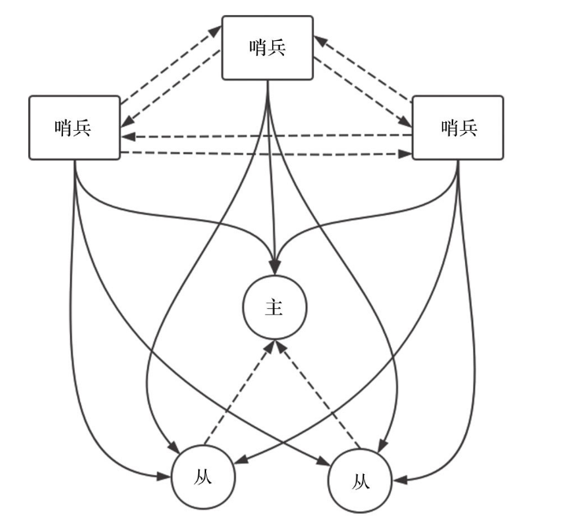

### Sential的实现

哨兵通过与Master与Slave通信，能够清楚的直到Redis服务的健康信息。

当Master发生故障的时候，哨兵通过对slave列表中的slave进行选择，选择出一个slave作为新的master。

哨兵需要选择出一个leader作为操作对象，leader选举的时候，参加选举的必须是奇数，否则可能会出现脑裂的情况。

#### 主观下线与客观下线

主观下线：哨兵监视下的master处于下线状态，标记redis状态为S_DOWN，即主观下线。\

客观下线:  当哨兵中的大多数赞同master处于下线状态，则会标记master处于客观下线(类似zk的提议,可以看做是两段式提交的延伸)

#### 哨兵的工作流程

哨兵启动之后会先与配置文件中监控的Master建立两条连接，一条称为命令连接，另一条称为消息连接。哨兵就是通过如上两条连接发现其他哨兵和RedisSlave服务器，并且与每个Redis Slave也建立同样的两条连接。

哨兵中每次执行serverCron时，都会调用sentinelTimer()函数。该函数会建立连接，并且定时发送心跳包并采集信息。该函数主要功能包括:

1. 建立命令连接和消息连接
2. 在控制线上定期进行信息采集和ping的动作，在数据线上传输数据
3. 检测服务是否处于下线状态
4. 检测服务是否客观下线，并且进行主从切换

#### 主从切换

当Redis哨兵方案中的Master处于客观下线状态，为了保证Redis的高可用性，此时需要执行主从切换。即将其中一个Slave提升为Master，其他Slave从该提升的Slave继续同步数据。

1. 新的master选取规则

   + 如果该Slave处于主观下线状态，则不能被选中。
   + 如果该Slave 5s之内没有有效回复ping命令或者与主服务器断开时间过长，则不能被选中。
   + 如果slave-priority为0，则不能被选中。
   + 在剩余Slave中比较优先级，优先级高的被选中；如果优先级相同，则有较大复制偏移量的被选中；否则按字母序选择排名靠前的Slave。

   当选中从服务器之后，将当前切换状态更改为SENTINEL_FAILOVER_STATE_SEND_SLAVEOF_NOONE，并且在下一次时间任务调度时执行该步骤。

