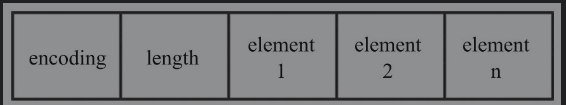

### 整数集合

##### 整数集合存储格式



`encoding`为编码方式, 决定了之后存储元素占用几个字节的大小，实际取值为2,4,8的元素存储长度

`length`长度指示符, 用于界定元素的数量

`contents[]`变长数组, 用于实际存储数据

描述形式如下:

```c++
typedef struct intset{
    uint32_t encoding; //编码类型
    uint32_t length; //长度指示符
    int8_t contents[]; //存储数据
} intset;
```

##### 扩容的处理

假设encoding决定了存储元素大小为2字节, 此时插入了一个257的元素, 那么这个时候就需要进行扩容. 将encoding字段修改为符合4字节的存储, 然后再去调节变长数组的存储大小, 并重新对值进行复制.

##### 整数集合的查找

整数集合是一个有序的数组, 查找时使用二分查找.