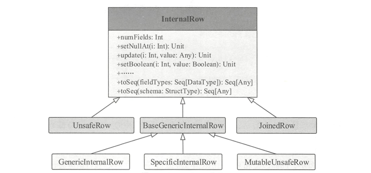
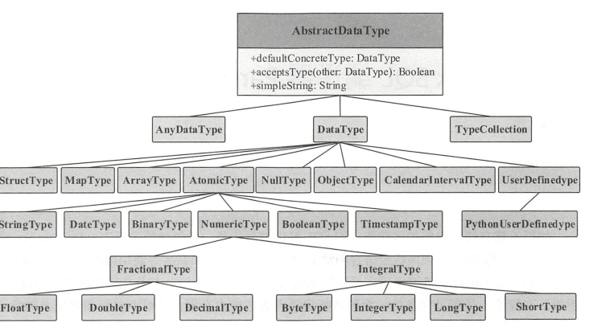

#### 执行过程

一般来说，SQL到转换为RDD执行需要进行两个步骤，即逻辑计划和物理计划。

逻辑计划阶段会将用户写的SQL转换成树形数据结构(逻辑算子树)，作为中间结果，逻辑算子树并不会去执行。分别对应未解析的逻辑算子树、解析后的逻辑算子树和优化后的逻辑算子树 。

物理计划阶段将上一步逻辑计划阶段生成 逻辑算子树 进一步转换而成，生成物理算子树。物理算子树的节点会直接生成RDD或者对RDD进行转换操作。

同样地，物理计划包含3个子阶段:

1. 根据逻辑算子树，计算出物理算子树列表`Iterator[PhysicalPlan]`
2. 按照一定规则选取最优的物理算子树(`SparkPlan`)
3. 对提交的物理算子树进行提交前的准备工作

从 SQL 语句的解析一直到提交之前，上述整个转换过程都在 Spark 集群的 Driver 端进行，
不涉及分布式环境 。 `SparkSession` 类的 `sql`方法调用 `SessionState` 中的各种对象 ，包括上述不同
阶段对应的 `SparkSqlParser` 类、 Analyzer 类、 Optimizer 类和 `SparkPlanner` 类等，最后封装成一个
`QueryExecution` 对象 。  

生成的物理算子树根节点是 `ProjectExec`，每个物理节点中的 execute 函数都是执行调用接口，由根节点开始递归调用，从叶子节点开始执行 。 

#### 行数据存储

Spark SQL 内部实现上述流程中平台无关部分的基础框架称为 Catalyst ，Spark SQL对于行数据存储设计的是`InternalRow`。

对于关系表来讲，通常操作的数据都是以“行”为单位的 。 在 `SparkSQL` 内部实现中， `InternalRow` 就是用来表示一行行数据的类 。`InternalRow` 中的每一列都是 Catalyst 内部定义的数据类型 。 

`InternalRow`的架构如下:

主要介绍`InternalRow`的实现:

1. `UnsafeRow`:不采用Java对象存储的方式，不需要进行`GC`
2. `BaseGenericinternalRow`：
   + `MutableUnsafeRow`: 用于支持对特定的列的修改
   + `GenericlnternalRow`: 采用`Array[Any]`类型，对对象数组进行底层存储
   + `SpecificinternalRow`: 采用`Array[MutableValue]`类型，允许set进行修改
3. `JoinRow`: 用于Join操作，生成join后的数据行，与join的顺序有关

#### TreeNode

无论是逻辑计划还是物理计划，都离不开中间数据结构，在Catalyst中对应于TreeNode体系。

TreeNode中包含一个`Seq[BaseType]`类型的变量children来表示孩子节点。TreeNode定义了`foreach`，`map`,`collect`针对节点的操作方法，以及`transformUp`和`transforDown`等遍历节点对匹配节点进行转换的方法。

同时TreeNode只是一种抽象实现，其主要的实现类有`Expression`和`QueryPlan`.`QueryPlan`下有两个实现子类`LogicPlan`(逻辑算子树)和`SparkPlan`(物理执行算子树)。

逻辑算子树在Catalyst中实现，可以剥离出来直接使用到其他系统中。物理算子树与底层存储引擎相关，需要进行相应的修改。

#### Expression

表达式是不需要触发执行引擎就可以直接进行计算的单元，例如四则运算，逻辑操作，转换操作，过滤操作等。

在`Expression`类中，主要定义了五个部分的操作，分别是 基本属性，核心操作，输入输出，字符串表示和等价性判断。

其中核心操作有`eval`函数实现对表达式的计算, `genCode`和`doGenCode`用于生成表达式对应的Java代码。下面是一些表达式相关的参数:

1. `foldable`: 标记在查询执行之前，是否可以直接进行静态计算
2. `determinstic`：表达式是否是确定的，由于shuffle或者随机函数会导致不确定性值的存在
3. `nullable`：是否可为空
4. `references`: Expression中的属性值
5. `canonicalized`: 经过规范化后的表达式
6. `semanticEquals`: 判断两个表达式语义上是否相等

#### 内部数据类型

