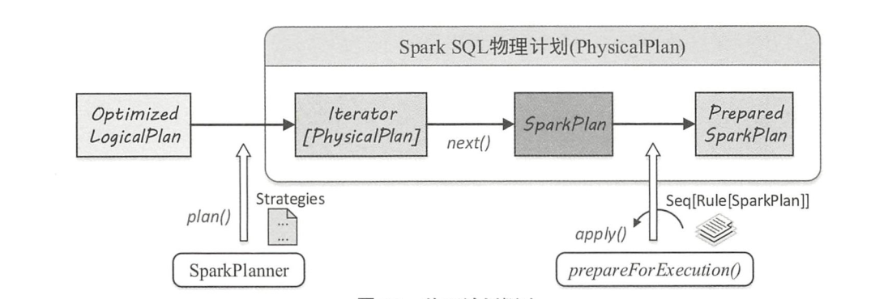
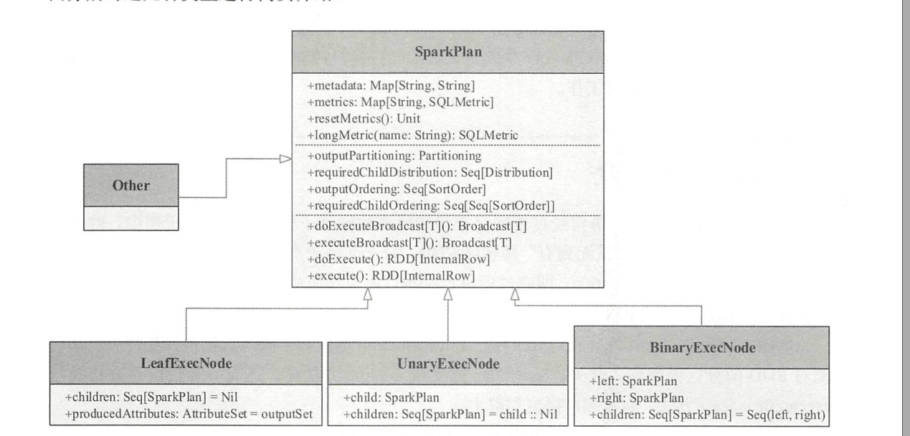
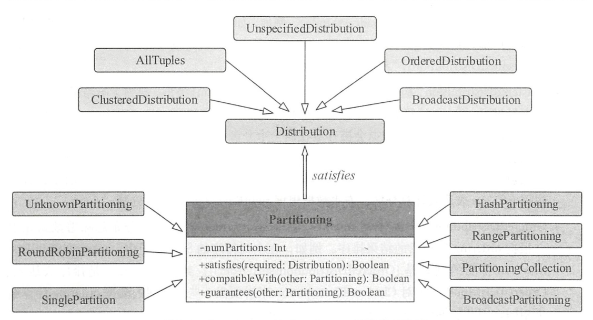

#### 物理执行计划概述

物理计划用 `SparkPlan`表示，从 `OptimizedLogicalPlan`传入到 `SparkSQL`物理计划提交并执行 .

物理执行计划的执行流程如下图所示:

这 3 个阶段分别产生 `Iterator[PhysicalPlan]`,`SparkPlan`和`PreparedSparkPlan`，其中`PreparedSparkPlan` 可以直接提交并执行.

这三个阶段的工作流程如下:

1. 由 `SparkPlanner` 将各种物理计划策略作用于对应的 `LogicalPlan` 节点上，生成 `SparkPlan` 列表
2. 选择一个最佳的执行计划，在Spark 2.1版本中，选择的是候选列表中的第一个执行计划
3. 进行提交前准备工作，进行一些分区排序方面的处理，确保`SparkPlan`能够正确执行, 这一步通过`prepareForExecution`方法调用若干规则进行转换.

#### `SparkPlan`简介

Spark SQL将SQL由逻辑算子树转换为物理算子树，在物理算子树中，叶子节点表示从无到有的创建RDD. 而非叶子节点由叶子节点转换而来, 即通过执行`execute()`函数转换成新的RDD. 最终执行`collect`操作触发计算.

`SparkPlan` 不仅仅可以执行`execute`函数, 而且可以执行`executeBroadcast`方法, 将数据广播到集群上.

`SparkPlan`主要包含三大块，必不可少的要包含`Metadata`,`Metric`两部分，这些数据是用于提供优化依据的。这些信息以哈希表的形式存储在`SparkPlan`中。其次，对RDD进行转换操作的时候，会涉及到数据的分区和排序操作。

`SparkPlan`作为物理执行计划，支持提交到`Spark Core`中去执行，主要以`execute`和`executeBroadcast`方法为主. 

Spark SQL提供了多种`SparkPlan`的实现，主要包含如下几类:

1.  叶子执行节点
2. 一元执行节点
3. 二元执行节点
4. 其他类型执行节点

其结构如下所示:

##### 叶子执行节点

叶子节点类型的物理执行计划不存在子节点。物理执行计划中与数据源相关的节点都属于该类型 。 

`LeafExecNode` 类型的 `SparkPlan` 负责对初始 RDD 的创建 。 

> 例如: 
>
> `RangeExec` 会利用 `SparkContext` 中的 parallelize 方法生成给定范围内的 64 位数据的 RDD, `HiveTableScanExec` 会根据 Hive数据表存储的 `HDFS` 信息直接生成 `HadoopRDD`, 
> `FileSourceScanExec` 根据数据表所在的源文件生成 `FileScanRDD` 。

##### 一元执行节点

`UnaryExecNode`类型的物理执行计划的节点是一元的, 意味着只包含1个子节点 。 

`UnaryExecNode` 节点的作用主要是对 RDD 进行转换操作.

> 例如:
>
> 1. `ProjectExec` 和 `FilterExec` 分别对子节点产生的 RDD 进行列剪裁与行过滤操作 。
> 2. Exchange用于进行重分区
> 3. `SampleExec`用于采样
> 4. `SortExec`用于排序 

##### 二元执行节点

`BinaryExecNode`类型的 `SparkPlan`具有两个子节点, 这种二元类型的物理执行计划在 `SparkSQL`中共定义了6种,这些 `SparkPlan` 中除 `CoGroupExec`外，其余的 5种都是不同类型的 Join 执行计划 。

> 其处理逻辑类似 Spark Core 中的 `CoGroup` 操作，将两个要进行合并的左、右子 `SparkPlan` 所产生的 RDD ，按照相同的 key 值组合到一起，返回的结果中包含两个iterator，分别代表左子树中 的值与右子树中的值 。 

##### 其他类型执行节点

除上述 3 种类型的 `SparkPlan` 外， `SparkSQL` 中还有 11 个其他类型的物理执行计划 

这 10 种 `SparkPlan` 中除 `CodeGenSupport` 和 `UnionExec` 外，其他几种用到的场景并不多见 .

#### 元数据与度量信息

元数据和指标信息是性能优化的基础， SparkPlan 提供了 Map 类型的数据结构来存储相关信息, 元数据信息 `Metadata` 对应 Map 中的 key 和 value 都为字符串类型, 度量信息key是字符串名称（表示度量指标），value是`SQLMetrics`类型的数据。

#### 分区和排序

分区和排序实际上是一种承前启后的操作，承前体现在对输入数据的特征要求上，参数`requiredChildDistribution `和`requiredChildOrdering `规定了当前SparkPlan所需数据分布和数据排序方式列表。启后 体现在对输出类型的限定上，规定了SparkPlan输出RDD的分区操作。

##### 分区和分布

在 SparkPlan 分区体系实现中, Partitioning 表示对数据进行分区的操作, Distribution则表示数据的分布。  

对应UML图如下:

1. 数据分布

   Distribution 定义了查询执行时，同一个表达式下的不同数据元组在集群各个节点上的分布情况。

   主要可以被描述为如下五类:

   1. `UnspecifiedDistribution`: 未指定分布，无需确定数据和元组之间的关系
   2. `AllTuples`：只有一个分区，所有数据元组放在一起  
   3. `BroadcastDistribution`: 数据会被广播到所有节点上
   4. `ClusteredDistribution`: 聚集分布，通过计算哈希值，将哈希值相等的元组存放在一起。如果存在有分区，则相同的数据会存储在一起，如果是单分区，相同数据会连续存储。
   5. `OrderedDistribution`: 排序分布, 该分布意味着数据元组会根据 ordering 计算后的结果排序 ,类似于`range`分桶的原则

2. 分区

   Partitioning 定义了一个物理算子输出数据的分区方式，具体包算子Partitioning之间, 目标 Partitioning 和 Distribution 之间的关系 。 

   Partitioning 描述了 SparkPlan 中进行分区的操作，类似直接采用 API进行 RDD的 repartition 操作 

3. 常用分区排序操作

   + 数据文件扫描执行算子(`FileSourceScanExec `)

     作为物理执行树中的叶子节点, `FileSourceScanExec`中的分区排序信息会根据数据文件构造的初始RDD进行设置. 如果没有 bucket 信息，则分区与排序操作将分别为最简单的`UnknownPartitioning` 与 `Nil`

   + 过滤执行算子 （ `FilterExec` ）与列剪裁执行算子 （ `ProjectExec`) 

     在过滤执行算子与列剪裁执行算子中 ，分区与排序的方式仍然沿用其子节点的方式，即不对 RDD 的分区与排序进行任何的重新操作 。 

#### SparkPlan生成

在 Spark SQL 中，当逻辑计划处理完毕后，会构造 SparkPlanner并执行 plan（） 方法对LogicalPlan 进行处理，得到对应的物理计划. 实际上, 一个逻辑计划可能会对应多个物理计划. 因此, SparkPlanner 得到的是一个物理计划的列表.

SparkPlanner 继承自 SparkStrategies 类，而 SparkStrategies 类则继承自 Planner基类，重要的 plan()
方法实现就在 QueryPlanner 类中. 

SparkStrategies 类本身不提供任何方法，而是在内部提供一批SparkPlanner会用到的各种策略实现. 最后, 在 SparkPlanner 层面将这些策略整合在一起，通过 plan方法进行逐个应用. 

SparkPlanner 本身只是一个逻辑的驱动, 各种策略的apply方法把逻辑执行计划算子映射成物理执行计划算子 .

在SparkPlanner的调用逻辑中，经常出现`PlanLater`, `PlanLater`是`SparkPlan`的一种，区别在于`doExecute`方法没有实现，表示不支持运行，仅仅作为占位的作用，等待后续步骤处理。

`SparkSQL` 在物理计划生成方面还有很多工作要做，例如，对生成的物理计划列表进行过滤筛选. 当前版本并没有进行处理，同时选择第一个执行计划作为最优执行计划，也没有达到最终需求。

#### 物理执行计划的Strategy

所有的策略都继承自 `GenericStrategy` 类, 其中定义了 `planLater` 和 apply 方法. `SparkStrategy` 继承自 `GenericStrategy` 类，对其中的 `planLater`进行了实现，根据传入的 LogicalPlan 直接生成前述提到的`PlanLater`节点 。

各种具体的 Strategy 都实现了 apply 方法，将传入的 LogicalPlan 转换为 SparkPlan 的列表。  

实现上，各种 Strategy 会匹配传入的 LogicalPlan 节点，根据节点或节点组合的不同情形, 实行一对一 的映射或多对一的映射. 目前版本的Spark SQL中，逻辑算子树的节点有4种模式:

1. `ExtractEquiJoinKeys`

   针对具有相等条件的 Join 操作的算子集合，提取出其中的 Join 条件、左子节点和右子节点等信息 。 

2. `ExtractFiltersAndinnerJoins`

   收集 Inner 类型 Join 操作中的过滤条件，目前仅支持对左子树进行处理 。 

3. `PhysicalAggregation`

   针对聚合操作，提取出聚合算子中的各个部分，并对一些表达式进行初步的转换 。 

4. `PhysicalOperation`

   匹配逻辑算子树中的Project和Filter等节点，返回投影列、过滤条件集合和子节点 。 

如果匹配到 Project、 Filter 或 `BroadcastHint` 3 种类型之一的 LogicalPlan 时，就会递归查找子节点 。 

##### 常见的Strategy模式

1. `FileSourceStrategy`: 文件数据源策略, `FileSourceStrategy` 面向的是来自文件的数据源.

   执行策略: 能够匹配 `PhysicalOperation` 的节点集合加上 `LogicalRelation` 节点, 该策略会根
   据数据文件信息构建`FileSourceScanExec`这样的物理执行计划.

2. `InMemoryScans` : 内存扫描主要针对的是内存关系`InMemoryRelation` 的逻辑计划. 其逻辑同样是匹配 `PhysicalOperation` 这个模式，最终生成 `InMemoryTableScanExec`，并调用 SparkPlanner 中的 `pruneFilterProject` 方法对其进行过滤和列剪裁 

3. DDL策略: 主要是针对视图和表创建的节点，直接生成`ExecutedCommandExec` 物理计划.

4. 基本操作策略: `BasicOperators` 是专门针对各种基本操作类型的LogicalPlan 节点, 例如排序, 过滤等,这种情况下,一般一对一地进行映射即可 

#### 执行前准备

物理计划的生成意味着用户的 SQL 语句已经成功转换为 SparkPlan 物理算子树 。应用提交前有必要从 Spark 系统本身的角度来考虑代码的正确性和高效性 。得到 SparkPlan 之后，还需要完成若干的准备工作，对树型结构的物理计划进行全局的整合处理或优化 。

在 `QueryExection` 中，最后阶段由 `prepareforExecution` 方法对传入的 SparkPlan 进行处理而生成 `executedPlan`.

##### 子查询的处理规则

子查询是指嵌套在一个查询内部的完整查询，常见的子查询通常作为数据源出现在 SQL 的From 关键字之后。 高版本之后提供了Scalar 类型和Predicate 类型 。 

Scalar类型的子查询返回单个值, 具体又分为相关的类型和不相关的. 

Uncorrelated 意味着子查询和主查询不存在相关性, Uncorrelated类型的 Scalar 子查询对于所有的数据行都返回相同的值 。在主查询执行之前, Uncorrelated子查询会首先执行.   

Correlated 类型的 Scalar 子查询意味着该子查询中包含了外层主查询中的相关属性，在Spark SQL 中会等价转换为 Left Join 算子。 

`PlanSubqueries` 规则就是处理物理计划中的 `ScalarSubquery` 和 `PredicateSubquery` 这两种特殊的子查询. 

碰到 `ScalarSubquery`或 `PredicateSubquery`表达式时，进入子查询中的逻辑，递归得到子查询的物理执行计划，然后封装为 `ScalarSubquery` 和 `InSubquery` 表达式.

##### `EnsureRequirements` 规则  

`EnsureRequirements`用来确保物理计划能够执行所需要的前提条件，包括对分区和排序逻辑的处理. 

在特定情形下, SparkPlan 对输入数据的分布情况和排序特性有着一定的要求. 

如果输入数据的分布或有序性无法满足当前节点的处理逻辑，则 `EnsureRequirements` 规则会在物理计划中添加一些 Shuffle 操作或排序操作来达到要求，体现在物理算子树上就是加入Exchange 节点或 `SortExec` 节点. 该过程还涉及依赖信息（ `ShuffleDependcency`）的创建、`ShuffledRowRDD` 的构造 .

从`EnsureRequirements`规则的apply方法可知, 在遍历 SparkPlan 的过程中, 当匹配到 Exchange 节点且其子节点也是 Exchange 类型时, 会检查两者的 Partitioning 方式, 判断能否消除多余的Exchange节点 。 

`EnsureRequirements`规则的核心逻辑体现在`ensureDistributionAndOrdering`方法中,可以将其大致过程分为以下 3 步：

1. 添加`Exchange`节点

2. 应用 `ExchangeCoordinator` 协调分区 
3. 添加`SortExec`节点