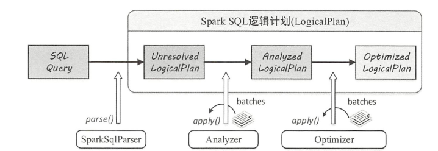
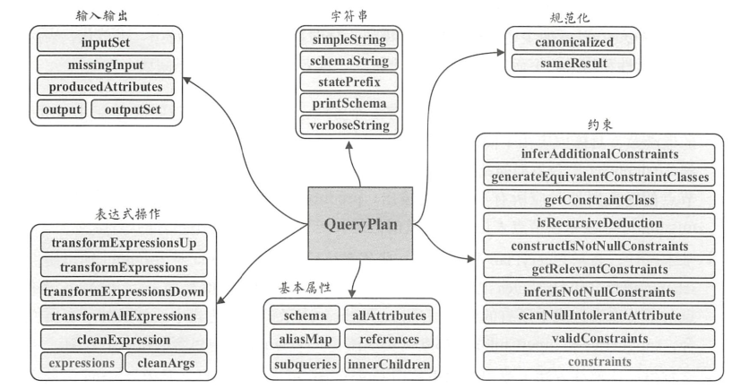

#### Spark SQL逻辑计划

Spark SQL逻辑计划在实现层面被定义成LogicPlan类，从SQL语句经过SparkSqlParser解析成`UnresolvedLogicPlan`,最终优化成`OptimizedLogicalPlan`, 主要流程分为三个阶段，分别是`UnresolvedLogicPlan`,`AnalyzedLogicPlan`和`OptimizedLogicPlan`,其中`OptimizedLogicPlan`用于传递到下一个阶段，用于物理计划的生成。

三个阶段完成的工作分别如下:

1. 由 `SparkSq!Parser` 中的 `AstBuilder` 执行节点访问，将语法树的各种 `Context` 节点转换成对应的 `LogicalPlan` 节点，从而成为一棵未解析的逻辑算子树 ,此时树逻辑算子树最初形态，不包含数据信息和列信息。
2. 由 Analyzer 将一系列的规则作用在 Unresolved LogicalPlan 上，对树上的节点绑定各种数据信息，生成解析后的逻辑算子树。
3. 由 Spark SQL 中的优化器将一系列优化规则作用到上一步生成的逻辑算子树中，在确保结果正确的前提下改写其中的低效结构，生成优化后的逻辑算子树 。

#### LogicPlan简介

LogicPlan的父类是QueryPlan, QueryPlan主要包含六个部分组成，分别是输入输出，字符串，规范化，表达式操作，基本属性和约束。

1. 输入输出

   outputSet 是将 output 的返回值进行封装，得到 AttributeSet 集合类型的结果 。 获取输入属性的方法 inputSet 的返回值也是 AttributeSet .

2. 字符串

   主要用于输出打印 QueryPlan 树型结构信息，其中 schema 信息也会以树状展示 。 

3. 规范化

   类似 Expression 中的方法定义，对 QueryPlan 节点类型也有规范化的概念。  

4. 表达式操作

   而在 QueryPlan 各个节点中，包含了各种表达式对象，各种逻辑操作一般也都是通过表达式来执行的 。 

5. 基本属性

   表示 QueryPlan 节点中的一些基本信息，其中 schema 对应 output 输出属性的schema 信息， allAttributes 记录节点所涉及的所有属性列表， aliasMap 记录节点与子节点表达式中所有的别名信息， references 表示节点表达式中所涉及的所有属性集合， subqueries 和 innerChildren 都默认实现该 QueryPlan 节点中包含的所有子查询 。 

6. 约束

   本质上也属于数据过滤条件的一种，同样是表达式类型 。 

##### 逻辑计划基本操作

LogicalPlan 继承 自 QueryPlan ，包含了两个成员变量和 17 个方法 。 两个成员变量:

1. 一个是 resolved，用来标记该 Logica!Plan 是否为经过 了解析的布尔类型值
2. 另一个是canonicalized ，重载了 QueryPlan 中的对应赋值，默认实现消除了子查询别名之后的 LogicalPlan 

LogicalPlan 仍然是抽象类, 根据子节点数目, 绝大部分的 LogicalPlan可以分为 3类, 即叶子节点 LeafNode 类型, 一元节点 UnaryNode 类型和二元节点 BinaryNode 类型.

##### LeafNode

LeafNode类型的Logica!Plan节点对应数据表和命令Command相 关的逻辑, 因此这些LeafNode子类中有很大一部分都属于 datasources 包和command包. 

##### 一元操作符UnaryNode

在 LogicalPlan所有类型的节点中, UnaryNode类型的节点应用非常广泛, 共有34种, 常见于对数据的逻辑转换操作, 包括过滤等. 

主要可以分为如下几类

1. 用来进行重分区
2. 处理脚本相关操作，使用脚本处理输入输出数据
3. Object相关操作
4. 基本操作算子

##### 二元操作符BinaryNode

二元操作符逻辑算子树主要包括连接，集合操作，CoGroup三种类型。集合操作包括Except和Interset两种类型。

##### 其他类型操作符

除上述 3 种类型的 LogicalPlan外, 在Spark SQL中还有3种直接继承自LogicalPlan的逻辑算子节点. 

这3种类型的LogicalPlan分别是ObjectProducer, Union和EventTimeWatermark逻辑算子.

1. EventTimeWatermark 主要针对 Spark Streaming 中的 watermark 机制
2. ObjectProducer为特质,与前面的ObjectConsumer相对应, 用于产生只包含Object列的行数据
3. Union 算子的使用场景比较多, 其子节点数目不限, 是一系列LogicalPlan的列表

#### AstBuilder机制

AstBuilder主要负责UnresolvedLogicalPlan的生成。

Spark SQL首先会在 ParserDriver 中通过调用语法分析器中的 singleStatement方法构建整棵语法树, 然后通过 AstBuilder 访问者类对语法树进行访问.

从逻辑上来看, 对根节点的访问操作会递归访问其子节点. 这样逐步向下递归调用, 直到访问某个子节点时能够构造LogicalPlan, 然后传递给父节点, 因此返回的结果可以转换为LogicalPlan类型. 

生成UnresolvedLogicPlan的过程如下:

1. 生成数据表对应的LogicalPlan: 

   访问FromClauseContext并递归访问, 一直到匹配TableNameContext节点时, 直接根据TableNameContext中的数据信息生成UnresolvedRelation, 此时不再继续递归访问子节点, 构造名为from的LogicalPlan并返回. 

2. 生成加入过滤逻辑的LogicPlan:

   过滤逻辑对应SQL中的where语句, 在QuerySpecificationContext中包含了名称为where的BooleanExpressionContext类型.  AstBuilder会对该子树进行递归访问, 生成expression并返回作为过滤条件, 然后基于此过滤条件表达式生成FilterLogicalPlan节点. 

3. 生成加入列裁剪之后的LogicPlan:

   列剪裁逻辑对应SQL中select语句对name列的选择操作, AstBuilder 在访问过程中会获取 Queq句ecificationContext 节
   点所包含的 NamedExpressionSeqContext成员, 并对其所有子节点对应的表达式进行转换, 生成NameExpression 列表然后, 基于namedExpressions生成ProjectLogica!Plan.

#### Analyzer机制

经过上一个阶段AstBuilder的处理, 已经得到了UnresolvedLogicalPlan. 该逻辑算子树中未被解析的有UnresolvedRelatio和UnresolvedAttribute两种对象.

Analyzer 所起到的主要作用就是将这两种节点或表达式解析成有类型的对象.在此过程中, 需要用到Catalog的相关信息. 

##### 数据字典Catalog

在关系数据库中, Catalog是一个宽泛的概念, 通常可以理解为一个容器或数据库对象命名空间中的一个层. 主要用来解决命名冲突等问题. Catalog 主要用于各种函数资源信息和元数据信息 (数据库, 数据表, 数据视图, 数据分区与函数等) 的统一管理. 

Spark SQL中的Catalog体系实现以SessionCatalog为主体, SessionCatalog起到了一个代理的作用, 对底层的元数据信息,临时表信息, 视图信息和函数信息进行了封装. SessionCatalog处理CatalystConf和Configuration之外,还包括下面4个方面:

+ GlobalTempViewManager : 全局临时视图管理器,在 GlobalTempViewManager内部实现中, 主要功能依赖一个 mutable类型的HashMap来对视图名和数据源进行映射, 其中的key是视图名的字符串, value是视图所对应的 LogicalPlan.

+ FunctionResourceLoader: 函数资源加载器

  在SparkSQL中除内置实现的各种函数外, 还支持用户自定义的函数和 Hive 中的各种函数. 这些函数往往通过Jar包或文件类型提供, FunctionResourceLoader主要就是用来加载这两种类型的资源以提供函数的调用.

+ FunctionRegistry: 函数注册接口

  用来实现对函数的注册, 查找和删除等功能.

+ ExternalCatalog: 外部系统Catalog

  用来管理数据库, 数据表, 数据分区和函数的接口, 在Spark SQL中, 具体实现有InMemoryCatalog和 HiveExternalCatalog两种.前者将上述信息存储在内存中, 一般用于测试或比较简单的 SQL 处理.后者利用 Hive 原数据库来实现持久化的管理，在生产环境中广泛应用.

##### 规则Rule

在`UnresolvedLogicalPlan`逻辑算子树的操作中, 主要方法都是基于规则的. 通过 `Scala` 语言模式匹配机制进行树结构的转换或节点改写.  `Rule`是一个抽象类, 子类需要复写 `apply(plan: TreeType)`方法来制定特定的处理逻辑.

有了各种具体规则后, 还需要驱动程序来调用这些规则, 在`Catalyst`中这个功能由`RuleExecutor`提供. `RuleExecutor`内部提供了一个`Seq[Batch]`, 里面定义的是该`RuleExecutor`的处理步骤. 

每个`Batch`代表一套规则, 配备一个策略, 该策略说明了迭代次数. `RuleExecutor`的`apply(plan: TreeType): TreeType` 方法会按照batches顺序和batch内的`Rules`顺序, 对传入的plan里的节点进行迭代处理. 

##### AnalyzedLogicalPlan生成过程

因为继承自`RuleExecutor`类,所以`Analyzer`执行过程会调用其父类`RuleExecutor`中实现的run方法,主要的不同之处是`Analyzer` 中重新定义了一系列规则，即 `RuleExecutor`类中的成员变量batches.

`Analyzer`默认定义了6个 `Batch` ,共有34条内置的规则外加额外实现的扩展规则.

1. Batch Substitution

   + CTESubstitution: 在遍历逻辑算子树的过程中,当匹配到 With(child, relations)节点时,将子LogicalPlan替换成解析后的CTE.
   + WindowsSubstitution: 对当前的逻辑算子树进行查找, 当匹配到WithWindowDefinition(windowDefinitions, child)表达式时, 将其子节点中未解析的窗口函数表达式(UnresolvedWindowExpression)转换成窗口函数表达式 
   + EliminateUnions: 在Union算子节点只有一个子节点时,Union操作实际上并没有起到作用,这种情况下需要消除该Union节点.
   + SubstituteUnresolvedOrdinals: 将order by或者group by中的常数字段看成列的编号进行替换处理

2. Batch Resolution

   该Batch中包含了Analyzer中最多同时也最常用的解析规则, 这些规则涉及了常见的数据源, 数据类型, 数据转换和处理操作. 

3. Batch Nondeterministic -> PullOutNondeterministic 

   Batch中仅包含PullOutNondeterministic这一条规则, 主要用来将LogicalPlan中非Project或非Filter算子的nondeterministic表达式提取出来, 然后将这些表达式放在内层的Project算子中或最终的Project算子中.

4. Batch UDF -> HandleNulllnputsForUDF 

   HandleNullinputsForUDF规则用来处理输入数据为Null的情形,其主要思想是从上至下进行表达式的遍历,当匹配到 ScalaUDF类型的表达式时,会创建If表达式来进行Null值的检查.

5. Batch FixNullability -> FixNullability 

   该Batch中仅包含FixNullability这一条规则, 用来统一设定LogicalPlan中表达式的nullable属性. 

6. Batch Cleanup -> CleanupAliases 

   该 Batch 中仅包含 CleanupAliases 这一条规则，用来删除 LogicalPlan 中无用的别名信息 。 

#### 优化器Optimizer

经过上一个阶段 Analyzer 的处理, UnresolvedLogicalPlan已经解析成为AnalyzedLogicalPlan. AnalyzedLogicalPlan 中自底向上节点分别对应 Relation, Subquery, Filter和Project算子.

##### 优化器概述

Optimizer同样继承自 RuleExecutor 类, 本身没有重载RuleExecutor中的execute方法,因此其执行过程仍然是调用其父类RuleExecutor中实现的execute方法. 在QueryExecution中, Optimizer会对传入的AnalyzedLogicalPlan执行execute方法, 启动优化过程. 

Optimizer的主要机制也依赖重新定义的一系列规则, 同样对应RuleExecutor类中的成员变量 batches, 因此在RuleExecutor执行execute方法时会直接利用这些规则 Batch. 

##### 优化器规则

1. Batch Finish Analysis 

   + EliminateSubqueryAliases：消除子查询别名，对应逻辑算子树中的 SubqueryAlias 节点.
   + ReplaceExpressions: 在逻辑算子树中查找RuntimeReplaceable的表达式并将其替换为能够执行的正常表达式 
   + ComputeCurrentTime: 对逻辑算子树中的时间函数计算一次后，将其他同样的函数替换成该计算结果
   + GetCurrentDatabase: GetCurrentDatabase规则执行CurrentDatabase并得到结果, 然后用此结果替换所有的 CurrentDatabase表达式
   + RewriteDistinctAggregates: 重写 Distinct 聚合操作,对于包含 Distinct 算子的聚合语句,这条规则将其转换为两个常规的聚合表达式 

2. Batch Union -> CombineUnions 

   针对Union操作的规则Batch,中间包含一条CombineUnions优化规则.

   在逻辑算子树中, 当相邻的节点都是Union算子时, 可以将这些相邻的`Union`节点合并为一个Union节点. 在该规则中, `flattenUnion`是核心方法, 用栈实现了节点的合并.  后续的优化操作可能会将原来不相邻的Union节点变得相邻, 因此在后面的规则Batch中又加入了CombineUnions这条规则.

3. Batch Subquery -> OptimizeSubqueries 

   该 Batch 目前只包含 OptimizeSubqueries 这一条优化规则.

   当 SQL 语句包含子查询时, 会在逻辑算子树上生成 SubqueryExpression表达式 . OptimizeSubqueries优化规则在遇到 SubqueryExpression表达式时，进一步递归调用Optimizer对该表达式的子计划并进行优化.

4. Batch Replace Operators 

   该 Batch 中的优化规则主要用来执行算子的替换操作. 主要包含如下几种类型:

   + ReplacelntersectWithSemiJoin：将Intersect操作算子替换为LeftSemi Join操作算子,从逻辑上来看,这两种算子是等价的  
   + ReplaceExceptWithAntiJoin: 将Except操作算子替换为LeftAnti Join 操作算子,从逻辑上来看, 这两种算子是等价的
   + ReplaceDistinctWithAggregate : 该优化规则会将Distinct算子转换为Aggregate语句. 在某些 SQL 语句中, Select 直接进行 Distinct 操作，这种情况下可以将其直接转换为聚合操作。 

5. Batch Aggregate 

   该 Batch 主要用来处理聚合算子中的逻辑 ，包含两类优化:

   + RemoveLiteralFromGroupExpressions:删除GroupBy语句中的常数,这些常数对结果无影响,会导致分组数目变多  
   + RemoveRepetitionFromGroupExpressions : 将重复的表达式从 Group By 话句中删除 

6. Batch Operator Optimizations 

   类似 Analyzer 中的 Operator 解析规则，该 Batch 包含了 Optimizer 中数量最多同时也是最常用的各种优化规则 

   主要包括下述三个类型:

   + 算子下推:

     算子下推所执行的优化操作主要是将逻辑算子树中上层的算子节点尽量下推 ，使其靠近叶子节点，这样能够在不同程度上减少后续处理的数据量甚至简化后续的处理逻辑  

   + 算子组合:

     算子组合类型的优化规则将逻辑算子树中能够进行组合的算子尽量整合在一起，避免多次计算，以提高性能 。 

     这些规则主要针对的是重分区（ repartition）算子,投影(Project ） 算子、过滤（ Filter ）算子、 Window 算子、 Limit 算子和 Union 算子.

   + 常量折叠和长度缩减:

     对于逻辑算子树中涉及某些常量的节点，可以在实际执行之前就完成静态处理 。 

     在 ConstantFolding 规则中，对于能够 foldable的表达式会直接在 EmptyRow 上执行 evaluate 操作，从而构造新的 Literal 表达式.

7. Batch Check Cartesian Products -> CheckCartesianProducts 

   用来检测逻辑算子树中是否存在笛卡儿积类型的 Join 操作, 

8. Batch Decimal Optimizations -> DecimalAggregates 

   用于处理聚合操作中与 Decimal 类型相关的问题. 主要是使用Decimal类型计算带来的精度误差问题. 

9. Batch Typed Filter Optimization -> CombineTypedFilters 

   当逻辑算子树中存在两个TypedFilter过滤条件且针对同类型的对象条件时, CombineTypedFilters优化规则会将它们合并到同一个过滤函数中。 

10. Batch LocalRelation -> ConvertToLocalRelation IPropagateEmptyRelation 

    该 Batch 主要优化LocalRelation相关的逻辑算子树,包含ConvertToLocalRelation和PropagateEmptyRelation 两条优化规则. 

    + ConvertToLocalRelation: 将LocalRelation上的本地操作转换为另一个Loca!Relation 
    + PropagateEmptyRelation: 将包含空的 LocalRelation 进行折叠 

11. Batch OptimizeCodegen -> OptimizeCodegen 

    用来对生成的代码进行优化 ,主要是针对于case when表达式进行优化。

12. Batch RewriteSubquery -> RewritePredicateSubquery I CollapseProject 

    该 Batch 主要用来优化子查询 ，主要包含下述两类优化方式:

    + RewritePredicateSubquery :

      将特定的子查询谓词逻辑转换为 left-semi/anti-join 操作 

    + CollapseProject :

      会将两个相邻的Project算子组合在一起并执行别名替换, 整合成一个统一表达式 

13. Batch Optimize Metadata Only Query -> OptimizeMetadataOnlyQuery 

    只有 OptimizeMetadataOnlyQuery 这一条规则，用来优化执行过程中只需查找分区级别元数据的语句  

14. Batch Extract Python UDF from Aggregate -> Extract PythonUDFFromAggregate 

    用于提取聚合函数中的python udf函数

15. Batch Prune File Source Table Partitions -> PruneFileSourcePartitions 

    用来对数据文件中的分区进行剪裁操作, 当数据文件中定义了分区信息且逻辑算子树中的 LogicalRelation 节点上方存
    在过滤算子时, PruneFileSourcePartitions 优化规则会尽可能地将过滤算子下推到存储层，这样可以避免读入无关的数据分区.

16. Batch User Provided Optimizers -> ExperimentalMethods.extraOptimizations 

    用户自定义的优化规则 

