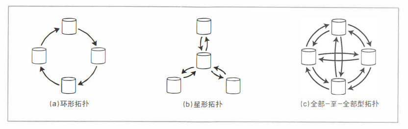

#### 基础概念

##### 主节点与从节点

每个保存数据库完整数据集的节点称作副本。 如果引入了多个副本，那么必须要明确，如何保证副本之间数据是一致的。

对于每一笔数据的写入，所有副本都需要随之更新。否则，会出现副本不一致的问题。

常见的解决方案是 基于主节点复制的方式，这种复制方式称作**主从复制**。

1. 指定一个副本为主副本，当客户端写入数据的时候，必须将写请求路由给主副本，主副本首先将数据写入到本地副本中。
2. 其他副本称作从副本，主副本在将数据写入到本地存储之后，会发送更新日志的消息给从副本，从副本接收到消息之后，将数据写入到本地存储中，且写入顺序保证与主副本一致。
3. 客户端从数据库中读取数据的时候，可以在主副本或者从副本上进行读取。从副本是只读的，如果可写，会破坏副本的一致性。

##### 同步复制和异步复制

1. 同步复制

   客户端需要等待从副本完全同步主副本之后，才可以进行下一步动作，不会存在有数据一致性问题(只要不宕机). 但是当从副本较多的时候，等待的时间也是非常长。

2. 异步复制

   主副本发送同步消息后会立刻返回，不需要等待从副本的确认。这样执行速度非常快，但是从副本不能和主副本保持强一致性，只会达到最终一致性。即最终会达到主从副本的一致。

   一旦从副本宕机，那么主从副本会有一段日志的差距需要去追赶。

##### 失效节点的处理

假定系统中任何一个节点都可能存在宕机失效的问题。如何做到在系统不停机的情况下，实现节点的重启是一个问题。

1. 从节点的恢复

   从副本会与主副本进行同步，首先会将从副本的LEO发送给主节点，主节点查找到对应的位置的记录，从这个位置开始，将后续的记录发送到从节点

2. 主节点的恢复

   首先将选择一个从节点升级到主节点，然后从副本会向新的主副本同步数据，旧的主节点重新连接的时候是按照新的主节点副本进行同步的。所以可能会出现日志截断的问题。

   

   那么首先需要确认，在何种情况下，主节点视为失效：

   大多数系统是基于超时机制实现，节点之间需要互相发送心跳信息用于声明当前自己还是处于存活状态。 如果超出这个时间，则认为对应节点宕机。需要执行对应的切换机制。

   

   如何选举新的主节点：

   通过仲裁方案选取新的主节点，或者使用控制节点来指定新的主节点。选用主节点时候，需要注意的是，选取的主节点需要保证数据恢复时间最短。也就是说LEO尽可能大，同时需要在最近一次选举的基础上进行处理，即选取的纪元epoch最大。同时旧的主节点进入系统时候会标记为从节点。

#### 日志复制的实现

##### 基于语句的复制

主节点记录每个写操作，并将该操作作为记录发送给从节点。 这就意味着`Insert,Update,Delete`语句会被写入到日志中。每个从节点会分析这些指令并执行，从而达到主节点的状态。

但是这种方式对于确定函数或者指令有效，对于非确定函数或者指令会使得日志不一致。例如：

1. 使用Now的时间函数或者Rand算法生成随机数
2. 使用了自增列或者依赖于数据库现有数据(`update... where ...`)
3. 有副作用的语句(例如，触发器，存储过程等)

部分情境下，例如1情景，可以将非确定值转换为确定值进行处理。但是有些情景不适用，对于不确定的情景，就需要基于行的日志复制。

##### 基于WAL的复制

对于磁盘存储结构来说，顺序写的性能要快于随机写入，所以日志通常情况下只支持追加到日志末尾的方式。

1. 对于日志结构的存储引擎，例如`SSTable`或者`LSM-Tree`, 日志是主要的存储手段，在后台支持日志的合并压缩，以及垃圾回收功能。
2. 对于采用覆盖写入的存储结构(B+树)，每次修改之前会预先写入到日志中，如果系统崩溃，会通过索引更新的方式迅速恢复到此前的一致状态。

日志处理可以写入到磁盘之外，还可以通过网络发送到其他节点上。

通常情况下，WAL记录了磁盘上哪些数据块发生了哪些改变。因此复制方案与存储引擎细节相关，当切换存储方式的时候，新版本通常无法正常加载旧版本的数据。

##### 基于行的逻辑日志复制

复制和存储引擎采用不同的日志格式，这样复制和存储逻辑就可以剥离。这种日志复制称作逻辑日志，用于区别物理存储引擎的数据表示。

关系型数据库的逻辑日志通常指的是 一系列描述 数据表行级别的写请求。

+ 对于行的插入，日志中包含相关列的新值
+ 对于行的删除，需要唯一标识删除的行，通常是按照主键标识，如果没有，则需要记录所有列的旧值，然后比较进行标记
+ 对于行的更新，需要唯一标识行的同时，需要记录相关列的新值

如果一个事务设计到多个行数据的修改，则会产生多个这样的行逻辑日志，同时需要标识事务的开始和事务结束，这样才能确定一个事务。

对于应用程序来说，逻辑日志更加容易理解。

##### 基于触发器的复制

如果需要提供复制的灵活性，例如，只想复制数据的一部分， 或者想从一种数据库复制到另一种数据库 。

这个时候就需要自己订制，管理复制冲突解决逻辑了，需要将复制控制权交给用户程序，数据库中最方便实现这种功能的是触发器。

常用的工具包括Oracle 的`GoldenGate`以及MySQL的 `canal`. 

通过触发器技术，可以将变更数据同步到一个单独的表中，然后外部逻辑访问该表，实施必要的应用层逻辑。类似的还有`Flink`的CDC功能。

#### 单主节点复制

常规的主从复制方式，包括一个主副本和多个从副本，主副本用于处理写请求，当然读请求也是可以接受的。从副本只读。主副本写入完成之后，会将同步消息通过RPC发送给从副本，从副本按照主副本的消息进行更新。

当然这个消息既可以是操作语句，也可以是逻辑记录。由于网络传输和IO的问题，主从副本不可能达到强一致性，但是可以达到最终一致性。

#### 复制滞后问题

在一般的单主节点机制中，所有写请求都需要经过主节点，从节点只提供读取的功能。对于读取密集型负载来说，这个架构是合适的，可以满足数据就近获取。

这种方式在副本众多的情况下，更加满足数据就地获取的可能，但是这样使用同步复制就变成了不可能。所以正常情况下，单主节点架构使用的都是异步复制。

##### 写后读出现的数据不一致问题

既然是异步复制，那么主副本和从副本就不能保障强一致性，也就是说，一般情况下，从副本都会稍微落后于主副本的。那么在从副本追赶主副本的这段时间。对从副本进行读取，就会导致数据的不一致性。

那么如何解决读取时候的不一致问题呢？ 数据不一致主要发生在写入后的一段时间，在这个时间间隔内，我们需要将读请求路由给主节点进行处理，在这个节点之外，仍然可以使用从节点进行读取。这样就可以解决写后读数据不一致的问题了。

##### 读取数据时候出现数据回滚的问题

在异步复制的情况下，用户从不同副本进行了多次读取，由于各个副本同步的进度不一致，可能首次读取的同步进度大于第二次读取的同步进度。那么第二次读取的时候，就会读取到"过去"的数据，也就是出现了数据回滚的问题。

对于数据回滚，该去怎么解决?

使用单调读取 一致性来保证不会出现数据回滚的问题，这是一种比强一致性弱，比最终一致性强的保证。当读取到数据的时候，单调读保证在多次读取的时候，不会读取到过去的数据。

那么如何实现单调读呢？

确保每个用户从固定的副本中执行读取操作，这样就不会读取到过去的数据了。

##### 读取乱序问题

> 例: `Poons`先生与`Cake`夫人之间的以下对话 
>
> `Poons`先生
> Cake夫人， 您能看到多远的未来？ 
>
> Cake夫人
> 通常约10s, `Poons`先生。 

正常情况下，`Poons`的逻辑应答优先执行与`Cake`才能保证逻辑的正常执行。

但是假设有一个新的节点监视这个两个人的对话，由于发送到这个节点的延迟问题，会导致`cake`的逻辑线性执行，就将造成了逻辑的混乱。

如何这种逻辑混乱的问题？

使用前缀一致性读，对于一系列按照某种顺序发送的写请求，读取的时候也会按照写入时候的顺序进行读取。

这个是分区数据库常常出现的问题。在许多分布式数据库中，不同分区独立运行，因此不存在全局写入顺序。这就导致读取的时候会看到一部分新值和一部分旧值。

一个解决方案就是将任何具有因果关系的写入都交给一个分区进行处理，这样就保证了Happen-Before的原则。

#### 多主节点复制

主从复制存在一个明显的缺点： 系统只有一个主节点， 而所有写入都必须经由主节点。 如果由千某种原因， 例如与主节点之间的网络中断而导致主节点无法连接， 主从复制方案就会影响所有的写入操作。 

那么可以对主从复制进行横向扩展，就演化成了多主节点的主从复制。主节点接受写请求，从节点复制流程类似。

处理写请求的主节点，需要将数据变更的消息发送给其他的主节点，这个发送的过程是异步的。称作多主节点的主从复制机制。

主要适用于多数据中心的主从复制，因为一个数据中心，使用单节点的主从复制就足够了。

##### 多数据中心

在每个数据中心内部，使用的是常规的单节点主从复制方式，在数据中心之间，各个数据中心的主节点负责与其他数据中心的主节点交换数据。相比较单节点的主从复制，有这如下特点

1. 性能

   对于单节点的注册复制，如果主节点的网络距离很远，那么会带来很高的延迟。我们希望能够就近接受写请求，以降低网络传输损耗，所以可以通过划分数据中心，并在数据中心中设置主节点，从而达到请求就近访问的要求。

2. 容忍数据中心失效

   对于单主节点的主从复制，主节点宕机，则需要再选择一个主节点，来处理写请求。对于多主节点主从复制来说，各个数据中心是相互独立的，A数据中心宕机，可以使用B数据中心提供服务。

3. 容忍网络问题

   对于单节点主从复制，主节点的写操作是同步的，必须要保证从副本同步完成(异步模式下会产生数据一致性问题)。多主节点主从复制，由于数据中心的独立性，主节点直接的数据交互过程是异步的。

但是，如果不同数据中心接受不同请求，那么就可能操作写入冲突的问题。我们需要采用一些方法避免写入冲突问题。

> 场景1: 两个用户同时编辑`Wiki`页面， 用户1将页面的标题从A更改为B, 与此同时用户2却将标题从A改为C。 
>
> 当修改异步传送到对方的时候，发现出现了数据冲突问题。

对于上述场景，对于主从复制的情景来说，第二个请求必须阻塞到第一个请求执行完毕，或者直接放弃执行。

在多主节点情境下，这两个操作都会成功(因为第一个操作的结果没有反映到 另一个数据中心)。也就是说本地应用必定成功，导致了错误的执行结果。这个时候，就需要指定一个主节点 来作为仲裁者，即将这两个请求路由到同一个主节点上，通过这个主节点来对数据冲突进行处理。

##### 收敛于一致状态

对于主从复制模型来说，数据更新更加符合顺序性原则，如果同一个字段有多次更新，则最后会反应最后一次写操作的结果。

由于多主节点主从复制不同数据中心的独立性，这种写入的顺序性是无法保证的(同一个数据中心是可以保证)。

如果每个副本都是基于自己所处的状态来进行顺序执行，数据库最终会处于不一致性状态。从节点1 看到的是B，从节点2 看到的是C，这个是不可接受的。

数据库必须按照某种收敛趋同的方式来解决冲突，这也意味着当前所有修改最终被复制，同步后，所有副本最终值相等。

可以使用如下方式解决收敛趋同:

1. 给每个写入分配全局唯一的ID, 挑选ID最高的写入作为胜利者，将其他写入丢弃。这种方式只会存储最终结果，会丢失中间状态。
2. 为每个副本分配唯一ID，制定类似1的规则，存储最终结果，也会造成中间结果丢失。
3. 值合并: 按照某种方式，将中间结果合并起来
4. 按照预定义的格式存储冲突相关信息，在应用层决定使用的版本信息。

##### 复制拓扑结构

复制拓扑结构反应了一个写请求 从一个节点传播到另一个节点的路径问题。常用的拓扑结构有三种。

1. 全部 - 全部: 这种方式到达节点的方式最多，所以当一个节点宕机的时候，这种拓扑的容错性最高。但是不同路径的日志会相互覆盖。
2. 星型和环形拓扑: 者两种拓扑需要经过多个节点才能到达目标节点，如果中间节点宕机，则必须要经过恢复，才能进行传递写请求。

#### 无主节点复制

主从复制是以主节点为标准，在多个节点上获取一致性副本的技术。但是部分存储系统放弃了主节点的设计允许任何副本接受来自客户端的请求，叫做无主节点复制。例如，Cassandra, Dynamo .

客户端直接将其写请求发送到多副本， 而在其他一些实现中， 由一个协调者节点代表客户端进行写入， 但与主节点的数据库不同， 协调者并不负责写入顺序的维护。 

> 假设一个三副本数据库， 其中一个副本当前不可用 

对于主从复制来说:

​	在基于主节点复制模型下， 如果要继续处理写操作， 则需要执行切换操作.

对于无主节点复制来说:

​	如果假定三个副本中有两个成功确认写操作， 用户1234收到两个确认的回复之后， 即可认为写入成功。 客户完全可以忽略其中一个副本无法写入的情况 

但是失效节点恢复上限之后，副本要落后于正常副本很多，因此从这个副本上会读取到过期数据。

为了解决这个问题，当一个客户端从数据库读取数据的时候，它不就是向一个副本发送请求，而是并行发送给多个副本。根据版本号判断使用哪个副本的数据。

##### 读修复和反熵

复制模型应确保所有数据最终复制到所有的副本。 当一个失效的节点重新上线之后，它如何赶上中间错过的那些写请求呢？ 

1. 读修复

   当客户端并行读取多个副本时， 可以检测到过期的返回值 . 客户端通过将新值写入到过期副本日志中，实现数据一致的保证。这个过程适合频繁读取的场景。但是如果版本号落后太多，中间过程的数据就会丢失，只保留了最终版本数据。所以必须配合反熵来使用。

2. 反熵

   一些数据存储有后台进程不断查找副本之间数据的差异， 将任何缺少的数据从一个副本复制到另 一个副本。 反墒过
   程并不保证以特定的顺序复制写入， 并且会引入明显的同步滞后 。

##### 读写仲裁

> 问题: 三个副本中如果有两个以上完成处理， 写入即可认为成功。 如果三个副本中只有一个完成了写请求， 会怎样呢？依次类推， 究竟多少个副本完成才可以认为写成功？ 
>
> 成功的写操作要求三个副本中至少两个完成， 这意味着至多有一个副本可能包含旧值。 因此， 在读取时需要至少向两个副本发起读请求， 通过版本号可以确定一定至少有一个包含新值。  

如果有n个副本， 写入需要w个节点确认， 读取必须至少查询r个节点， 则只要 w + r > n, 读取的节点中一定会包含最新值。 

足上述这些r 、 w值的读／写操作称之为法定票数读（或仲裁读）或法定票数写（或仲裁写）。一个常见的选择是设置n
为某奇数， w=r= ( n+l) /2 。 

仲裁条件w+r>n定义了系统可容忍的失效节点数 

1. 当w < n, 如果一个节点不可用， 仍然可以处理写入
2. 当r < n, 如果一个节点不可用， 仍然可以处理读取 
3. 假定n=3, w=2, r=2, 则可以容忍一个不可用的节点 
4. 假定n=S, w=3, r=3, 则可以容忍两个不可用的节点 (这种情况出现在w/r仅有一个交叉的情况)
5. 读取和写入操作总是并行发送到所有的n个副本。 参数w和参数r只是决定要等待的节点数。 即有多 少个节点需要返回结果， 我们才能判断出结果的正确性。 

#### 分布式系统仲裁机制

##### 局限性 

如果有n个副本， 并且配置w和r, 使得w + r> n, 可以预期可以读取到一个最新值。 之所以这样， 是因为成功写人的节点集合和读取的节点集合必然有重合， 这样读取的节点中至少有一个具有最新值 。这样就一定会拿到最新的副本。

通常， 设定r和w为简单多数（多于n I 2)节点， 即可确保w + r > n, 且同时容忍多达n / 2个节点故障。quorum不一定非得是多数， 读和写的节点集中有一个重叠的节点才是最关键的。  

> 由千w和r配置的节点数较小， 读取请求当中可能恰好没有包含新值的节点， 因此最终
> 可能会返回一个过期的旧值。  

即使在w + r> n的情况下， 也可能存在 返回旧值的边界条件。 这主要取决于具体实现 :

1. 如果采用了sloppy quorum(使用候补节点, 即使满足了仲裁条件，但是读写区域不一定重合，也不能保证一定会是新值)
2. 如果两个写操作同时发生， 则无法明确先后顺序。 这种情况下， 唯一安全的解决方案是合并并发写入 (如果根据时间戳（最后写入获胜）挑选胜者， 则由于时钟偏差问题135), 某些写入可能会被错误地抛弃).
3. 如果写操作与读操作同时发生， 写操作可能仅在一部分副本上完成。 此时， 读取时返回旧值还是新值存在不确定性 
4. 如果具有新值的节点后来发生失效， 但恢复数据来自某个旧值， 则总的新值副本数会低于w, 这就打破了之前的判定条件。 
5. 如果某些副本上已经写入成功， 而其他一些副本发生写入失败（例如磁盘已满）， 且总的成功副本数少于w, 那些已成功的副本上不会做回滚。 这意味着尽管这样的写操作被视为失败， 后续的读操作仍可能返回新值 

##### 宽泛的仲裁方式与数据回传

配置适当quorum的数据库系统可以容忍某些节点故障，也不需要执行故障切换。 

它们还可以容忍某些节点变慢，这是因为请求并不需要等待所有n个节点的响应，只需w或r节点响应即可。 

quorum并不总如期待的那样提供高容错能力, 

> 问题:  一个网络中断可以很容易切断一个客户端到多数数据库节点的链接。 尽管这些集群节点是活着的，而且其他客户端也确实可以正常链接，但是对于断掉链接的客户端来讲，情况无疑等价千集群整体失效。 这种情况下，很可能无法满足最低的w和r所要求的节点数，因此导致客户端无法满足quorum要求.
>
> 在一个大规模集群中（节点数远大于n个），客户可能在网络中断期间还能连接到某些数据库节点，但这些节点又不是能够满足数据仲裁的那些节点 .

这时候我们面临如下两种选择:

1. 如果无法达到w或r所要求quorum, 将错误明确地返回给客户端 
2. 我们是否应该接受该写请求，只是将它们暂时写入一些可访问的节点中 

第二种方式就是宽松仲裁的方式, 一旦网络问题解决了，就会将数据从临时节点回传给主节点。

#### 并发写检测

Dynamo风格的数据库允许多个客户端对相同的主键同时发起写操作, 一个核心问题是，由于网络延迟不稳定或者局部失效，请求在不同的节点上可能会产生不一致的效果，这就导致了副本的不一致问题。

如果新到达的请求仅仅简单的覆盖了旧值，那么很可能会一直达不到一致的状态。我们可以采用多主节点复制中介绍的冲突处理方案来解决此类问题

1. 最后写入获胜(丢失中间值)

   一种实现最终收敛的方法是， 每个副本总是保存最新值， 允许覆盖并丢弃旧值。  假定每个写请求都最终同步到所有副本， 只要我们有一个明确的方法来确定哪一个写入是最新的， 则副本可以最终收敛到相同的值。

   要确保`LWW`安全无副作用的唯一方法是， 只写入一次然后写入值视为不可变， 这样就避免了对同一个主键的并发（覆盖）写。Cassandra的一个推荐使用方法就是采用`UUID`作为主键， 这样每个写操作都针对的不同的、 系统唯一的主键 。

2. 合并同时写入的值 

   客户端需要做一些额外的工作：即如果多个操作并发发生， 则客户端必须通过合并并发写入的值来继承旧值。

   一个简单的方法是基千版本号或时间戳（即最后写入获胜）来选择其中的一个值， 但这意味着会丢失部分数据。  