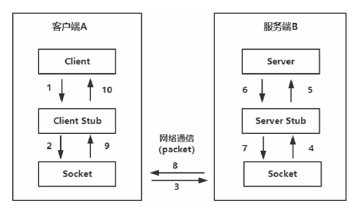
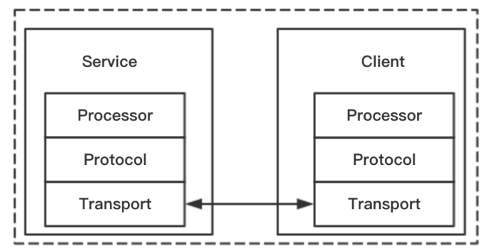

#### RPC定义

RPC是一种进程间的通信方式。它允许程序调用另一个地址空间（通常是共享网络的另一台机器上）的过程或函数，而不用程序员显式地编码远程调用的细节，即程序员无论是调用本地的还是远程的函数，本质上编写的调用代码基本相同。

#### RPC工作流程

1. 客户端以本地调用方式调用服务
2. 客户端存根接收到调用请求后，负责将方法、参数等组装成能够进行网络传输的**消息体**
3. 客户端通过Socket将消息发送到服务端
4. 服务端存根收到消息后对消息进行解码
5. 服务端存根根据解码结果调用本地的服务
6. 本地服务执行并将结果返回给服务端存根
7. 服务端存根将返回结果打包成消息
8. 服务端通过Socket将消息发送到客户端
9. 客户端存根接收到结果消息，并进行解码
10. 客户端得到最终结果

##### RPC调用方式

1. 同步调用

   客户端调用服务端方法，等待直到服务端返回结果或者超时，再继续自己的操作。

   > 雪崩效应:
   >
   > 整个调用链路上的同步调用等待的瓶颈会由最慢（或脆弱）的服务决定。比如A-B-C这样一个调用链路，A同步调用B并等待返回结果，B同步调用C并等待返回结果，以此类推，就像一组齿轮链，级级传动，这很容易产生雪崩效应。
   >
   > 若C服务挂了，则会导致前面的服务全部因为等待超时而占用大量不必要的线程资源。

   雪崩效应的解决方案:

   + 超时策略

     在一个服务调用链中，某个服务的故障可能会导致级联故障。调用服务的操作可以配置为执行超时，如果服务未能在这个时间内响应，就回复一个失败消息。

     在分布式微服务架构下，我们需要根据成功调用一个服务调用链的平均时间来合理配置服务接口超时时间。

   + 熔断器机制

     熔断器的模式**使用断路器来检测故障是否已得到解决**，防止请求反复尝试执行一个可能会失败的操作，从而减少等待纠正故障的时间，相对于超时策略更加灵活

2. 异步调用

   客户端调用服务端方法，不再等待服务端返回，直接继续自己的操作。

   > 使用场景:
   >
   > 游服务不会实时关注下游服务的调用结果，比如通过异步调用记录日志。

#### RPC 性能影响因素

1. 网络IO
2. 消息封装格式
3. 网络协议
4. 序列化

#### 常用的RPC框架

1. Thrift

   Thrift是一个跨语言的服务部署框架，采用二进制编码协议，传输协议使用`TCP/IP`。

   > 相对于HTTP协议，`TCP/IP`协议的性能更高

   Thrift根据接口定义文件，通过代码生成器生成服务器端和客户端代码, 从而实现服务端和客户端跨语言的支持.

   用户在Thrift描述文件中声明自己的服务，这些服务经过编译后会生成相应语言的代码文件，然后用户实现服务便可以了。Protocol是协议层，定义数据传输格式，可以为二进制或者XML等。Transport是传输层，定义数据传输方式，传输方式可以为`TCP/IP`传输、内存共享或者文件共享等。

   

2. Hessian

   Hessian是由`Caucho`提供的基于Binary-RPC协议的轻量级RPC框架。Hessian更简单、快捷。因为采用二进制RPC协议，所以很适合发送二进制数据。

   + Hessian基于Binary-RPC协议实现。
   + Hessian基于HTTP协议进行传输。
   + Hessian通过其自定义的串行化机制将请求信息进行序列化，产生二进制流。

3. `Avro-RPC`

   `Apache Avro`是一个数据序列化系统。它本身是一个序列化框架，同时实现了RPC的功能。

   + 使用快速的压缩二进制数据格式。
   + 提供容器文件用于持久化数据。
   + 提供远程过程调用RPC。
   + 简单的动态语言结合功能，Avro和动态语言结合后，读写数据文件和使用RPC协议
   + 都不需要生成代码。

4. `gRPC`

   gRPC是由Google开发的一款语言中立、平台中立、开源的远程过程调用（RPC）系统。

   在gRPC中，客户端应用可以像调用本地对象一样直接调用另一台不同的机器上服务端应用的方法，使得创建分布式应用和服务更为容易。

   gRPC特性:

   + 基于HTTP/2
   + 支持ProtoBuf
   + 多语言支持

5. `Dubbo`

6. `bRPC`

7. `RPCX`

