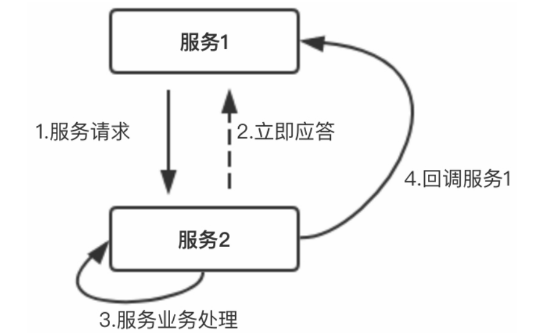

#### 微服务的三种调用方式

微服务包含三种调用方式

1. 单向调用模式

   单向操作没有返回值，客户端只管调用，不管结果, 适用于异步消息发送。

2. 请求应答模式

   请求应答模式是默认的操作模式。这与经典的C/S编程类似，客户端发送请求，阻塞客户端进程，服务端返回操作结果。适用于同步调用方式。

3. 回调模式

   

   服务1调用服务2，并立即收到响应。服务2处理服务1的业务请求，处理完成后调用服务1提供的回调接口

#### RPC的调用方式

##### 同步调用

需要等到服务端将结果传输给客户端，客户端才可以执行下一步操作。

##### 异步调用

客户端发送请求之后，即可以开始下一步操作，无需等待服务端响应，适合日志的写入之类的请求。

##### 并行调用

随着业务的增加，服务越来越多，服务之间的调用也越来越复杂，原本一个服务中一次请求就可以完成的工作，现在可能被分散在多个服务中，一次请求需要多个服务的响应。这样就会放大RPC调用延迟带来的副作用，影响系统的高性能需求。

1. 对于RPC接口调用，不需要关心接口的返回值，可以采用异步RPC调用
2. 如果依赖RPC接口返回值，并且连续调用的多个RPC接口之间没有依赖关系，执行先后顺序没有严格的要求，那么可以采用并行化处理。

并行调度原理:

一次同时发起多个服务调用，先做流程的Fork，再利用Future等主动等待获取结果，进行结果聚合.