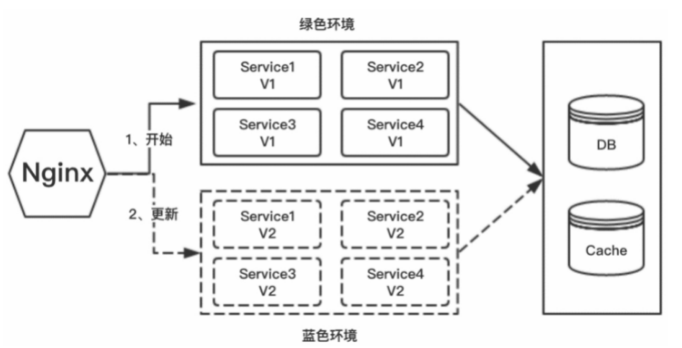
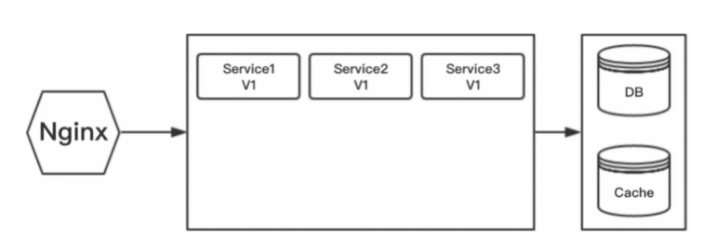
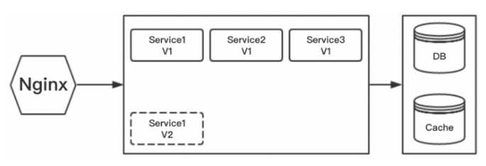
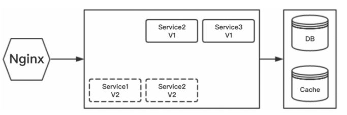
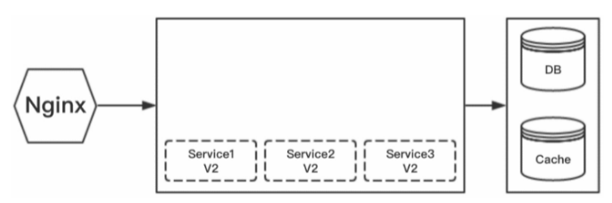
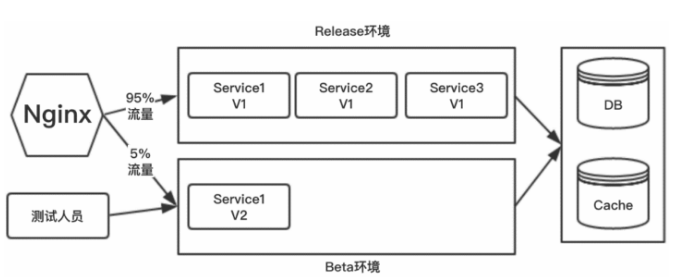

#### 蓝绿部署

不停老版本的前提下，部署新版本，然后进行测试。确认新版本没问题后，将流量切到新版本，然后老版本也升级到新版本。

整个部署过程中，用户感受不到任何宕机或者服务重启。蓝绿部署是一种常见的“0 downtime”（零停机）部署的方式，是一种以可预测的方式发布应用的技术，目的是减少发布过程中服务停止的时间.

蓝绿部署原理上很简单，就是通过冗余来解决问题。通常生产环境需要两组配置（蓝绿配置）；另一组是active的生产环境的配置（绿配置），一组是inactive的配置（蓝配置）。

用户访问的时候，只会让用户访问active的服务器集群。在绿色环境（active）运行当前生产环境中的应用，也就是旧版本应用Version 1。

当你想要升级到Version 2时，在蓝色环境（inactive）中进行操作，即部署新版本应用，并进行测试。如果测试没问题，就可以把负载均衡器／反向代理／路由指向蓝色环境。

随后需要监测新版本应用，也就是Version 2是否有故障和异常。如果运行良好，就可以删除Version 1使用的资源。如果运行出现了问题，就可以通过负载均衡器指向快速回滚到绿色环境。

蓝绿部署流程:

1. 开始状态：Service 1、Service 2、Service 3、Service 4集群服务一开始的版本为`V1`，部署在绿色环境。
2. 服务版本2开发了新功能，修复部分的Bug。
3. 在蓝色环境部署Service 1、Service 2、Service 3、Service 4集群服务，测试通过。
4. 通过Nginx将全部流量切到蓝色环境。
5. 删除绿色环境的4个实例：Service 1、Service 2、Service 3、Service 4。
6. 冗余产生的额外维护、配置的成本以及服务器本身运行的开销。

#### 滚动发布

一般是停止一个或者多个服务器，执行更新，并重新将其投入使用。周而复始，直到集群中所有的实例都更新成新版本。(也就是一块一块地更新)。

滚动发布流程:

1. 开始状态：Service 1、Service 2、Service 3集群服务一开始的版本为`V1`

   

2. 服务版本2开发了新功能，修复部分的Bug，先启动一台新版本服务`Service1 V2`，待服务`Service1 V2`启动完成后，再停止一台老版本服务`Service1` `V1`

   

3. 启动`Service2 V2`，待服务`Service2 V2`启动完成后，再停止一台老版本服务`Service2 V1`

   

4. 启动`Service3 V2`，待服务`Service3 V2`启动完成后，再停止一台老版本服务`Service3 V1`

   

#### 灰度发布

在灰度发布开始后，先启动一个新版本应用，但是并不直接将流量切过来，而是让测试人员对新版本进行线上测试.

如果没有问题，那么可以将少量的用户流量导入新版本上，然后对新版本进行运行状态观察，收集各种运行时数据, 如果此时对新旧版本做各种数据对比，就是所谓的A/B测试。

当确认新版本运行良好后，再逐步将更多的流量导入新版本上。在此期间，还可以不断地调整新旧两个版本运行的服务器副本数量，以使新版本能够承受越来越大的流量压力，直到将100%的流量都切换到新版本上。

最后关闭剩下的老版本服务，完成灰度发布。

如果在灰度发布过程中（灰度期）发现新版本有问题，就应该立即将流量切回老版本上，这样会将负面影响控制在最小范围内。

> AB测试就是一种灰度发布方式，让一部分用户继续用A，一部分用户开始用B，如果用户对B没有什么反对意见，那么逐步扩大范围，把所有用户都迁移到B上来。

