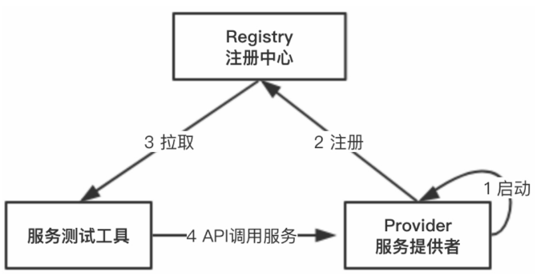

#### 微服务测试

软件测试种类很多，粗略的划分为：单元测试、集成测试、端到端测试。从其他的角度来说，还有回归测试、自动化测试、性能测试等。

微服务设计的项目一般都是基于分布式服务的注册和发现机制的，所有的服务都是在一个注册中心集中存储的。而且一般的分布式服务框架都支持丰富的服务调用方式，例如基于Spring XML配置、Spring注解以及API等调用方式，为我们编写公共的服务测试工具提供了便利的条件。

根据上述服务测试工具的定位，我们开始设计该测试工具，主要的宗旨是：简化测试人员的工作，简化服务开发人员的工作，保证测试质量。

微服务测试的宗旨是尽可能地简化服务测试过程。其中还有一些服务测试基础功能之外的拓展功能：

1. 请求参数的自动化生成，例如请求流水号、请求时间、手机号、身份证号等，减少测试人员填写参数的时间。
2. 后台保存服务测试的请求参数和响应参数，方便回归测试。
3. 实现回归测试，在服务代码有变动之后，可根据保存的请求参数进行回归测试，并且可以和之前的响应参数进行对比，以便验证是否影响当前测试服务接口。
4. 服务的并发测试，在提交测试请求的时候可以指定每个服务测试请求的测试次数，这时后台会模拟多线程调用服务，可实现对服务接口的并发测试。
5. 多个测试环境自由切换，通过选择不同环境的注册中心来实现其他环境的测试。
6. 服务测试出现异常的时候，将异常堆栈信息直接展示给测试人员，方便排查问题。
7. 实现定时回归测试，有时我们的测试环境需要保持一定的稳定性，因为经常会有别的系统发起联调测试。定时回归测试既能及时发现后端系统对服务的影响，又能保证服务持续稳定地对外提供服务。
8. 开发公共的Mock测试服务，避免后端未开发完成的服务耽误服务的测试。

#### Mockito测试

Mockito用于生成模拟对象，简单来说就是“假对象”的模拟工具。对于某些不容易构造 或者 不容易获取的复杂对象，用一个虚拟的对象（Mock对象）来创建以便完成测试。

Mock最大的功能是帮你把单元测试的耦合分解开，如果你的代码对另一个类或者接口有依赖，它能够帮你模拟这些依赖，并帮你验证所调用的依赖的行为。

> 当想要测试用户服务类`UserService`的某些接口时，需要依赖`UserDao`对象来完成相关测试，而`UserDao`对象还需要连接数据库。在某些情况下，我们无法连接数据库，比如无网络的情况下，测试用例就无法正常执行。
>
> 这是传统`JUnit`单元测试的缺陷，使用Mock可以规避这些问题。

##### `PowerMockito`

`EasyMock`和Mockito都因为可以极大地简化单元测试的书写过程而被许多人应用在自己的工作中，这两种Mock工具都不能够实现对静态函数、构造函数、私有函数、Final函数以及系统函数的模拟，但是这些方法往往是我们在大型系统中需要的功能。

`PowerMock`是在`EasyMock`和Mockito的基础上扩展来的，通过定制类加载器等技术，`PowerMock`实现了之前提到的所有模拟功能，使其成为分布式微服务架构必备的单元测试工具。

[Mockito教程](https://site.mockito.org/#how)

#### 性能测试

##### AB测试

ab是Apache自带的压力测试工具。ab非常实用，它不仅可以对Apache服务器进行网站访问压力测试，也可以对其他类型的服务器进行压力测试。

> 执行命令：ab --help，可以查看ab命令参数的详细信息
>
> -n：执行的请求个数，默认执行一个请求。
>
> -c：一次产生的请求个数（并发数），默认是一次一个。
>
> -t：测试所进行的最大秒数。

##### 性能测试工具

1. Apache JMeter

   Apache JMeter是Apache组织开发的基于Java的压力测试工具，用于对软件做压力测试，它最初被设计用于Web应用测试，后来扩展到其他测试领域。

   JMeter可以用于对服务器、网络或对象模拟巨大的负载，在不同压力类别下测试它们的强度和分析整体性能。

   JMeter能够对应用程序做功能／回归测试，通过创建带有断言的脚本来验证你的程序返回了期望的结果。

2. LoadRunner

   LoadRunner是一种预测系统行为和性能的负载测试工具。通过模拟上千万用户实施并发负载及实时性能监测的方式来确认和查找问题，LoadRunner能够对整个企业架构进行测试。

3. MySQLslap

   MySQLslap是MySQL自带的一款性能压测工具，通过模拟多个并发客户端访问MySQL来执行压力测试。

