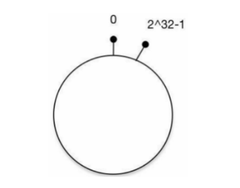

#### 服务路由

服务消费者通过服务名称，在众多服务中找到要调用的服务的地址列表，称为服务的路由。

> 透明路由
>
> 服务消费者只知道当前服务者提供了哪些方法，并不知道服务具体在什么位置，这就是透明化路由。(也就是客户端只需要直到服务的名称即可实现服务的调用)

##### 服务的存放方式

服务都是多实例部署的，每个部署实例都有对应的地址信息。

1. 硬编码

   将服务的地址信息存放在服务消费者一端，服务消费者发起调用时，读取服务地址配置进行调用。

   > 服务地址发生变化的时候，需要自己维护服务地址列表，比较麻烦。

2. 数据库存储

   将服务地址信息存放到数据库中，服务调用方通过查询数据库获取服务地址信息，避免使用硬编码地址方式。

   > 无法感知服务提供者列表的变化。

3. 服务注册中心

   服务注册中心可以用来保存服务提供者的地址信息，以及服务发布相关的属性信息。服务消费者无须知道服务提供者的地址信息，只需要知道当前系统发布了哪些服务。

   服务提供者将需要发布的服务地址信息和属性写入注册中心，服务消费者根据本地引用的接口名等信息，从服务注册中心获取服务提供者列表缓存到本地。

   当服务注册中心检测到服务提供者列表发生变化后，会主动将变更后的服务列表推送给消费者，消费者根据新的列表刷新本地缓存的服务提供者地址。

   

   服务消费者调用服务提供者时，不需要每次调用时都去服务注册中心查询服务提供者地址列表，消费者直接从本地缓存的服务提供者路由表中查询地址信息，根据路由策略进行服务选择。

   > 当注册中心全部宕机后，消费者可以通过缓存的地址信息和服务提供者之间进行通信，只是影响新服务的上线和老服务的下线，不影响已发布的和运行的服务。

#### 负载均衡

##### 软件级别的负载均衡

我们可以把Web服务配置到Nginx中，用户访问Nginx时，就会自动被分配到某个Web服务。

当网站业务规模变大时，通常将业务拆分为多个服务，每个服务独立部署，通过远程调用方式（RPC）协同工作. 为了保证稳定性，每个服务不会只使用一台服务器，会作为一个集群存在，子集群也可以使用Nginx负载均衡。

ZooKeeper是目前流行的注册中心，每个Web服务在其中注册登记，服务调用者到注册中心查找能提供所需服务的服务器列表，然后根据负载均衡算法从中选取一台服务器进行连接。

调用者获取到服务器列表后进行缓存，提高系统性能。当服务器列表发生变化时，例如某台服务器宕机下线或者新添加服务器，ZooKeeper会自动通知调用者重新获取服务器列表。

##### 常用的负载均衡算法

1. 轮询法

   轮询法是指将请求按顺序轮流地分配到后端服务器上，均衡地对待后端的每一台服务器，不关心服务器实际的连接数和当前系统负载。

2. 加权轮询法

   加权轮询法是指根据真实服务器的不同处理能力来调度访问请求，这样可以保证处理能力强的服务器处理更多的访问流量｡

   给性能高、负载低的机器配置较高的权重，让其处理较多的请求；给性能低、负载高的机器配置较低的权重，让其处理较少的请求。

3. 随机法

   随机选择一台后端服务器进行请求的处理。由于每次服务器被挑中的概率都一样，因此客户端的请求可以被均匀地分派到所有的后端服务器上。

4. 加权随机法

   加权随机法跟加权轮询法类似，根据后台服务器不同的配置和负载情况配置不同的权重。不同的是，它是按照权重来随机选取服务器的，而非顺序。

5. 源地址哈希法

   源地址哈希（Hash）是根据获取客户端的`IP`地址，通过哈希函数计算得到一个数值，用该数值对服务器列表的大小进行取模运算，得到的结果便是客服端要访问服务器的序号。

   > 源地址哈希法的缺点是，当后端服务器增加或者减少时，采用简单的哈希取模的方法会使得命中率大大降低，这个问题可以采用一致性哈希法来解决。

6. 一致性哈希

   一致性哈希（Hash）算法解决了分布式环境下机器增加或者减少时，简单的取模运算无法获取较高命中率的问题。

   通过虚拟节点的使用，一致性哈希算法可以均匀分担机器的负载，使得这一算法更具现实的意义。

   *环的起点是0，终点是2^32 - 1，并且起点与终点连接，哈希环中间的整数按逆时针分布.*

   

   假设有三台服务器`s1,s2,s3`, 计算后得到的哈希值分别是`h1,h2,h3`. 假设有5个请求，计算后的哈希值为`h1,h2,h3,h4,h5`. 在哈希环上的分布如下图所示:

   只需要按照顺时针的顺序，找到与当前请求最近的服务器即可，如图:

   

   假设增加了一台服务器`s4`, 位于`s2,s3`之前，需要把之前的请重新路由，将部分请求路由给`s4`，如图:

   

##### 硬件级别的负载均衡

硬件的负载均衡有`F5 Network Big-IP`，`F5`是一个网络设备，类似于网络交换机，完全通过硬件来抗压力. `F5`多用于大型互联网公司的流量入口最前端，以及政府、国企等不缺钱的企业.