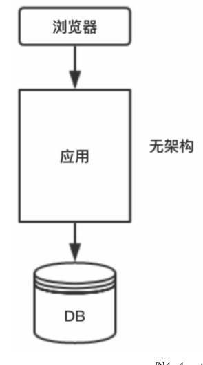
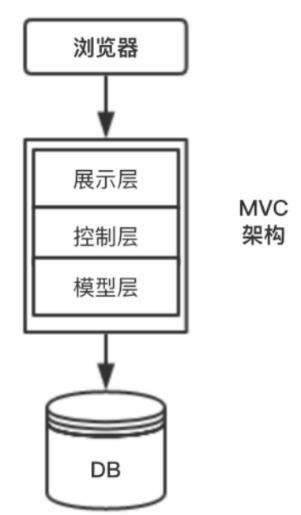
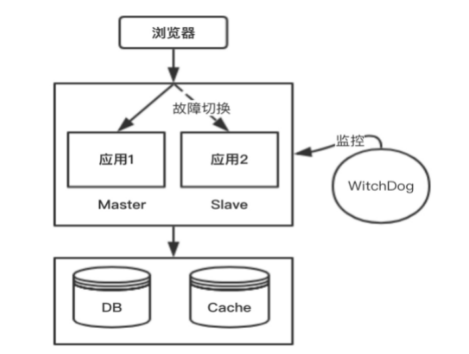
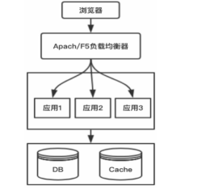
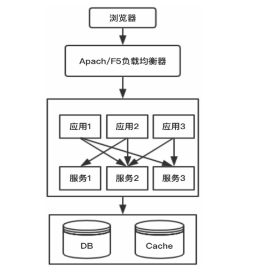
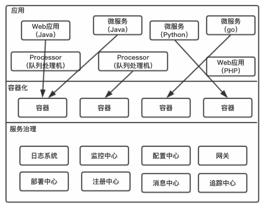

#### 无架构模式

最原始的情况下，系统架构如下所示:

随着业务的扩展，需要考虑架构的水平分层，即将展示，控制，数据获取三个层次。也就是下面介绍的MVC架构。

#### MVC模式- 水平分层

上图就是MVC水平分层的架构图，其中展示层，控制层和模型层负责独立的工作。

1. 展示层

   视图是用户看到并与之交互的界面。对老式的Web应用程序来说，视图就是由HTML+CSS元素组成的界面，在新式的Web应用程序中，HTML依旧在视图中扮演着重要的角色。

2. 控制层

   控制层接收用户的输入并调用模型和视图完成用户的需求，所以当单击Web页面中的超链接和发送HTML表单时，控制器本身不输出任何东西和做任何处理。

3. 模型层

   模型层是应用程序中用于处理应用程序数据逻辑的部分。通常模型对象负责在数据库中存取数据。一个模型可以同时为多个视图提供数据。

##### 高可用方案

传统应用架构一般采用热双机的模式。正常情况下，Master主机提供服务，当Master主机出现故障或者宕机的时候，切换到Slave从机。

我们可以通过Linux的WatchDog或者Keepalived检测服务器的状态，如果有一台Web服务器宕机或工作出现故障，Keepalived就会检测到，并将有故障的服务器从系统中剔除，同时使用其他服务器代替该服务器的工作，当服务器工作正常后，Keepalived自动将服务器加入服务器群中。

##### 高并发方案

对于高并发、大流量的场景，传统应用架构一般采用Apache（软负载）或者`F5`做负载均衡

#### SOA 服务化架构

当水平分层应用越来越多时，应用之间的交互不可避免，我们需要将核心业务抽取出来，作为独立的服务，逐渐形成稳定的服务中心。

同时将公共API抽取出来，作为独立的公共服务供其他调用者消费，以实现服务的共享和重用，降低开发和运维成本。

应用和服务之间的远程调用或者服务之间的远程调用通常有两种方式，即基于HTTP的远程调用和基于RPC的远程调用。

##### SOA 简介与特征

SOA（面向服务的架构）将应用程序的不同功能单元（称为服务）进行拆分，并通过这些服务之间定义良好的接口和契约联系起来。

SOA是一种粗粒度、松耦合的服务架构，服务之间通过简单、精确定义接口进行通信，不涉及底层编程接口和通信模型

随着业务的不断发展，服务数量越来越多，服务治理、服务运维、服务日志在线搜索查询、服务性能、面向服务后服务数量暴增对运维人员的挑战等一系列问题接踵而来。

#### 分布式微服务架构

微服务的核心思想是在应用开发领域，使用一系列微小服务来实现单个应用，或者说微服务的目的是有效地拆分应用，实现敏捷开发和部署。

##### SOA 与微服务的区别

1. 相比SOA，微服务框架将能够带来更大的敏捷性，并为构建应用提供更轻量级、更高效率的开发。
2. 从服务粒度来看，既然是微服务，必然更倡导服务的细粒度，重用组合，甚至是每个操作（或方法）都是独立开发的服务
3. 从部署方式来看，传统的SOA服务粒度比较大，多数会采用将多个服务合并打成War包的方案。而微服务则打开了这个黑盒子，把应用拆分成一个一个的单个服务，应用Docker技术，不依赖任何服务器和数据模型，是一个全栈应用。

##### 微服务特点

1. 单一职责

   与面向对象原则中的单一职责原则类似，需要确保每个微服务只做一件事情。

2. 支持异构/多种语言

   每个服务的实现细节都与其他服务无关，这使得服务之间能够解耦，团队可以针对每个服务选择最合适的开发语言、工具和方法。

3. 无状态服务

   所有的微服务都尽量保证无状态或者有状态的可以做状态转移，例如: session等数据，可以转移到Redis集群中.

4. 隔离化

   每个微服务相互隔离，互不影响。每个微服务运行在自己的进程中，某一个服务出现问题不会影响其他服务。

5. 自动化管理

   需要对微服务提供自动化部署和监控预警的能力，实现真正的`DevOps`。

##### 微服务架构

微服务架构组件如下:

1. 日志系统

   主要用于收集和管理微服务应用产生的日志，快速帮助开发人员定位异常，同时还可以在日志系统中搜索历史日志。

2. 监控中心

   主要用于实时监控微服务运行情况，比如CPU、内存、QPS、成功率等。

3. 部署中心

   主要用于编译并打包微服务源码并将其部署到Docker容器中，技术可以选择Jenkins（慢慢淘汰）和`GitHub CI`（主流）。

4. 注册中心

   主要用于管理微服务相关的配置信息，如服务提供者信息，常用的技术有`ZooKeeper`等。

5. 消息中心

   主要用于微服务之间相互解耦，常用的技术有Kafka、RabbitMQ等。

6. 追踪中心

   主要用于管理微服务的调用轨迹。

7. 容器化

   容器化技术促进微服务架构落地，目前流行的技术主要是Docker技术。

8. 应用层

   在应用层中主要相关的业务服务有用户服务、订单服务、产品服务等，各个微服务由不同的开发团队管理，每个团队可以选择适合自己业务开发的语言和技术框架

##### 微服务类型

我们根据服务的作用以及特点，将其分为4种类型：基础服务、业务服务、前置服务、组合服务。

1. 基础服务

   基础组件，与具体的业务无关，比如短信服务、邮件服务等。这种服务最容易拆出来做微服务，是第一优先级分离出来的服务。

2. 业务服务。

   一些垂直的业务系统，只处理单一的业务类型，比如评论服务、点赞服务、Feed服务等。

   这类服务职责比较单一，根据业务情况来选择是否迁移，是第二优先级分离出来的服务。

3. 前置服务

   前置服务一般为服务的接入或者输出服务。

   比如网站的前端服务、`App`的服务接口等，这是第三优先级分离出来的服务。

4. 组合服务

   组合服务涉及具体的业务，比如订单服务，需要调用很多垂直的业务服务，这类服务一般放到最后进行微服务化架构改造。

   因为这类服务最为复杂，除非涉及大的业务逻辑变更，否则不会轻易进行迁移。

##### 微服务拆分原则

1. 梳理业务

   梳理出业务模块以及模块之间的依赖关联关系。

2. 优先对公共业务进行服务化

   优先对公共业务进行服务化，如用户服务、邮箱服务、消息服务等。

3. 对业务服务进行服务化

   对业务服务进行服务化，切分的服务之间尽量不要有任何的关联。

   开始服务化时，先粗粒度地进行服务的划分，之后再慢慢根据业务的情况进行细粒度服务的切分，不必追求一步到位

4. 微服务的**领域模型设计**

   微服务拆分完成后，需要设计每个服务设计的数据库表、表与表之间的关系。

5. 定义微服务接口

   数据库表设计完成后，需要定义服务接口，让外部调用。