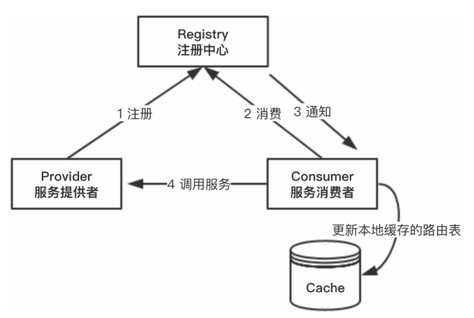

#### 注册中心

分布式微服务都是部署在不同的集群环境的，服务与服务之间需要相互调用。注册中心需要具备以下几个功能:

1. 服务提供者启动时，根据服务发布文件中配置的服务发布信息主动向服务注册中心注册自己的服务。
2. 服务消费者在启动时，将服务提供者信息从注册中心下拉到本地缓存。
3. 服务注册中心能够感知服务提供者集群中某一台机器下线，将该机器的服务提供者信息从注册服务中心删除。并主动通知服务消费者集群中的每一台机器，使得服务消费者不再调用该机器。
4. 服务消费者从本地缓存的服务提供者地址列表中，基于负载均衡算法选择一台服务提供者进行调用。

#### 使用Zookeeper实现注册中心

##### 实现注册中心的思路

ZooKeeper充当一个服务注册表，让多个服务提供者形成一个集群，让服务消费者通过服务注册表获取具体的服务访问地址（`IP`+端口）去访问具体的服务提供者。

ZooKeeper类似于分布式文件系统，当服务提供者部署后，将自己的服务注册到ZooKeeper的某一路径上：`/{service}/{version}/{ip:port}`. zookeeper通过watch这个节点来监控这一服务的状态，如果当前节点所对应服务宕机了，这个临时节点就会被删除，会通知到服务的消费者，当前节点服务不可用，从而选取另一个冗余的节点来服务。

具体工作流程如下:

1. ZooKeeper客户端通过创建ZooKeeper的一个实例对象连接ZooKeeper服务器，调用该类的接口与服务器交互。
2. 根据服务提供者发布的服务列表循环调用create接口，创建目录节点，同时将服务属性（服务名称和`IP`）写入目录节点的内容中。
3. 服务消费者同样通过ZooKeeper客户端创建ZooKeeper的一个实例对象，连接ZooKeeper服务器，调用该类的接口与服务器交互。
4. 服务消费者在第一次调用服务时，会通过注册中心找到相应的服务的`IP`地址列表，并缓存到本地，以供后续使用。当消费者调用服务时，不会再去请求注册中心，而是直接通过负载均衡算法从`IP`列表中获取一个服务提供者的服务器调用服务。
5. 当服务提供者的某台服务器宕机或下线时，相应的`IP`会被移除。注册中心会将新的服务`IP`地址列表发送给服务消费者机器，缓存在消费者本机。
6. 当某个服务的所有服务器都下线了，这个服务也就下线了。
7. 当服务提供者的某台服务器上线时，注册中心会将新的服务`IP`地址列表发送给服务消费者机器，缓存在消费者本机。
8. 服务提供方可以根据服务消费者的数量来作为服务下线的依据。

服务消费者会去监听相应路径，一旦路径上的数据有任何变化（增加或减少），ZooKeeper都会通知服务消费方，服务提供者地址列表已经发生改变，从而进行更新。