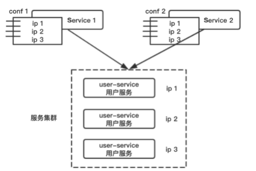
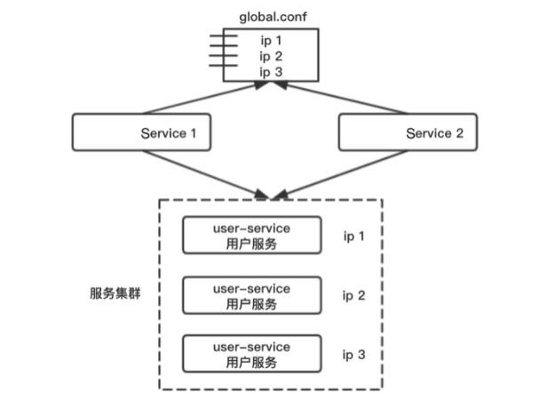
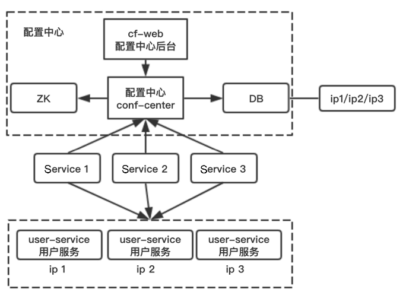

对于配置来说，由于我们需要对程序中的参数进行自定义配置，或者设置开关控制程序的执行，不想直接硬编码在代码中，使得系统具有良好的拓展性和灵活性，因此可以将一些信息写入配置文件中。

#### 配置中心的引入

微服务架构体系中，微服务众多（成百上千），服务之间又有互相调用关系，微服务怎么知道被调用微服务的地址呢？万一被调用的微服务地址变了怎么办？我们需要方便地进行修改且实时自动刷新，而不至于重启应用。

1. 配置集中管理：统一对应用中各个微服务配置进行管理。
2. 在系统运行期间可动态配置：在不停止服务的情况下，根据系统运行情况（微服务负载情况等）进行配置调整。
3. 配置修改自动刷新：当修改配置后，能够支持自动刷新。

##### 全局配置

在项目初期，每个应用或者服务都有自己的私有配置文件

> 用户服务共有3个节点，分别是`ip1/ip2/ip3`。Service 1调用用户服务user-service，它有自己的私有配置文件`conf` 1，`conf` 1配置了用户服务集群信息`ip1/ip2/ip3`。同理，Service 2也配置了用户服务的集群信息。大部分公司初期的服务配置都是这样的架构。
>
> 当项目发展到一定的阶段，由于项目的流量增大，因此需要增加用户服务节点`ip4/ip5`。
>
> 此时，需要用户服务的负责人通知所有上游调用者（Service 1和Service 2）修改配置并重启上游服务，连接到新的集群上去，以完成整个扩容过程。如果服务的依赖关系变得复杂，服务调用方太多，就会出现如下问题：
>
> 1. 用户服务调用方会很痛苦，容量变化的是下游的用户服务，凭什么修改配置重启的是我？
> 2. 服务提供方也会很痛苦，他不知道有多少个上游服务调用了自己，特别是底层基础服务，像用户服务这种，调用它的上游服务很多，往往只能通过这几种方式来定位上游

​	基于此，引入了全局配置的架构

​	

对于用户服务集群，建立全局配置文件`global.conf`，消除私有配置，对于服务调用方（Service 1和Service 2），禁止配置私藏，如果用户服务配置发生变化，就只需要修改配置`global.conf`，而不需要在各个上游修改配置。

唯一不足的是，如果调用方（Service 1和Service 2）一直不重启，就没有办法将流量迁移到新集群上去。当然可以设计监控来实现流量迁移的工作。

##### 配置中心

全局配置文件虽然能够快速落地，解决“修改配置重启”的问题，但它仍然解决不了服务提供方有多少上游服务调用了自己的问题。

如果服务提供方不知道有多少上游服务调用了自己，就没办法实现按照调用方限流，以及绘制全局架构依赖图。时，我们可以采用“配置中心”来解决。

整个配置中心系统由`zk、conf-center`服务，DB配置存储以及`conf-web`配置后台组成。所有下游服务的配置通过后台设置在配置中心里。

所有上游需要拉取配置，需要去配置中心注册，拉取下游服务配置信息。对比“全局配置”与“配置中心”的架构图，会发现配置由静态的文件升级为动态的服务。

当下游服务需要扩容的时候:

1. `conf-web`配置后台进行设置，新增`ip4/ip5`。
2. `conf-center`服务将变更的配置推送给已经注册关注相关配置的调用方。
3. 结合动态连接池组件完成自动的扩容。

配置中心的好处是调用方不需要再重启服务，服务方可以从配置中心很清楚地知道上游的依赖关系，从而实施按照调用方限流，很容易从配置中心得到全局架构依赖关系。