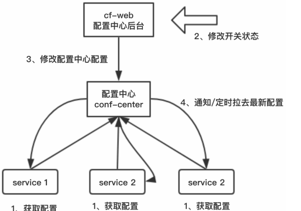

#### 服务降级

1. 为什么要服务降级?

   分布式微服务架构流量都非常庞大，业务高峰时，为了保证服务的高可用，往往需要服务或者页面有策略的不处理或换种简单的方式处理，从而释放服务器资源以保证核心交易正常运作或高效运作。

   这种技术在分布式微服务架构中称为服务降级。

   > 例如在线购物系统，整个购买流程是重点业务，比如支付功能，在流量高峰时，为了保证购买流程的正常运行，往往会关闭一些不太重要的业务，比如广告业务等。

#### 服务降级方式

##### 手动降级

工作中常用的降级方式是使用降级开关，降级开关属于人工降级，我们可以设置一个分布式降级开关，用于实现服务的降级，然后集中式管理开关配置信息即可。

降级过程如上图所示:

1. 服务启动时，从配置中心拉取配置，之后定时从配置中心拉取配置信息。
2. 流量高峰，为保证重要业务的高可用（`SLA`），开发人员通过配置中心后台修改非核心业务功能开关。
3. 在配置中心修改配置
4. 在配置中心通知服务或者服务定时拉取最新配置，修改内存配置信息，配置开关生效，非核心业务功能暂时关闭。(热加载机制)

##### 自动降级

人工降级需要人为干预，但是系统服务24小时在线运行，人的精力毕竟有限。因此，系统服务需要支持自动化降级。

自动化降级往往根据系统负载、资源使用情况、QPS、平均响应时间、`SLA`等指标进行降级。

降级的方式包括下述几类:

1. 超时降级

   访问的资源响应时间慢，超过定义的最大响应时间，且该服务不是系统的核心服务的时候，可以在超时后自动降级。

2. 失败次数降级

   当系统服务失败次数达到一定阈值时自动降级，可以使用异步线程探测服务是否恢复，恢复即取消降级。

3. 故障降级

   系统服务出现网络故障、DNS故障、HTTP服务返回错误的状态码、RPC服务抛出异常等，可以直接降级。

   降级后的处理方案有：返回默认值、兜底数据（提前准备好静态页面或者数据）、缓存数据等。

4. 限流降级

   系统服务因为访问量太大而导致系统崩溃，可以使用限流来限制访问量，当达到限流阈值时，后续请求会被降级。

   降级后的处理方案有：使用排队页面（导流到排队页面等一会重试）、错误页等。

#### 读取服务降级

对于非核心业务，服务读接口有问题的时候，可以暂时切换到缓存、走静态化、读取默认值，甚至直接返回友好的错误页面。

对于前端页面，可以将动态化的页面静态化，减少对核心资源的占用，提升性能。

#### 写入服务降级

对于写操作非常频繁的系统服务，比如淘宝“双十一”时，用户下单、加入购物车、结算等操作都涉及大量的写服务。

可以采取下述策略:

1. 同步写操作转异步写操作。
2. 先缓存，异步写数据到DB中。
3. 先缓存，在流量低峰，定时写数据到DB中。

> 例如购物“秒杀系统”，先扣减Redis库存，正常同步扣减DB库存，在流量高峰DB性能扛不住的时候，可以降级为发送一条扣减DB库存的信息，异步进行DB库存扣减，实现最终一致即可。

#### 服务容错措施

##### 失败转移

当服务出现失败时，服务框架重试其他服务，通常用于幂等性服务，例如读操作。

##### 失败自动恢复

服务消费者调用服务提供者失败时，通过对失败错误码等异常信息进行判断决定后续的执行策略。

对于Failback模式，如果服务提供者调用失败，就不会重试其他服务，而是服务消费者捕获异常后进行后续的处理。

##### 快速失败

服务调用失败后，服务框架不会发起重试机制，而是忽略失败，记录日志。快速失败是一种比较简单的策略，常用于一些非核心服务。

##### 失败缓存

服务调用失败后，服务框架可将消息临时缓存，等待周期T后重新发送，直到服务提供者能够正常处理消息。

#### 服务优先级的设计

对于分布式服务框架而言，当系统资源紧张时，服务框架需要能够支持设置服务发布时的优先级策略，按照用户设置的服务优先级策略调度执行服务。服务优先级调度是在系统资源非常有限的情况下触发的，这一点非常重要。

##### 服务实例数量的调整

我们可以通过调整服务运行的实例数来实现优先级调度

1. 系统出现服务资源紧张时，通过服务框架调整优先级低的服务的实例数，将实例从服务注册中心移除。
2. 由于部署的实例减少，优先级低的服务得到调度的机会相应地减低，释放的资源将被高优先级服务使用，通过资源的动态调配实现服务的优先级调度。
3. 系统资源不紧张的时候，可以重新调整服务的实例数。

##### 使用加权优先队列

加权优先级由一系列的普通队列组成，每个队列对应一个优先级。当服务接收到客户端的请求时，根据消息对应的服务优先级将消息写入不同的优先级队列中。没有设置优先级属性或者非法的消息写入默认的优先级队列中。

工作线程根据服务优先级的加权值，按照比例从优先级队列中获取消息，然后设置到工作线程的待处理消息数组中。

