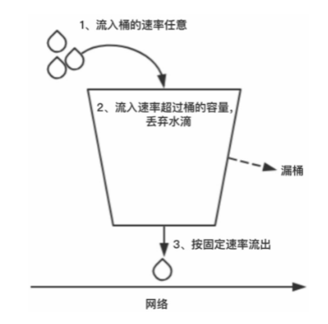

#### 限流算法

##### 计数器

采用计数器是一种比较简单的限流算法，一般我们会限制一秒钟能够通过的请求数。

比如限流QPS为100，算法的实现思路就是从第一个请求进来开始计时，在接下来的1秒内，每来一个请求，就把计数加1，如果累加的数字达到了100，后续的请求就会被全部拒绝。

> 如果在单位时间1秒内的前10毫秒处理了100个请求，那么后面的990毫秒会请求拒绝所有的请求，我们把这种现象称为“突刺现象”。

##### 漏桶算法

一个固定容量的漏桶按照常量固定速率流出水滴。如果桶是空的，就不需要流出水滴。我们可以按照任意速率流入水滴到漏桶。如果流入的水滴超出了桶的容量，流入的水滴就会溢出（被丢弃），而漏桶容量是不变的。

##### 令牌桶算法

令牌桶算法是比较常见的限流算法之一，可以使用它进行接口限流.

令牌按固定的速率被放入令牌桶中，例如tokens/秒。桶中最多存放b个令牌（Token），当桶装满时，新添加的令牌被丢弃或拒绝。

当请求到达时，将从桶中删除1个令牌。令牌桶中的令牌不仅可以被移除，还可以往里添加，所以为了保证接口随时有数据通过，必须不停地往桶里加令牌。

往桶里加令牌的速度就决定了数据通过接口的速度。我们通过控制往令牌桶里加令牌的速度从而控制接口的流量。

##### 漏桶算法和令牌桶算法的区别

漏桶算法是按照常量固定速率流出请求的，流入请求速率任意，当流入的请求数累积到漏桶容量时，新流入的请求被拒绝。

令牌桶算法是按照固定速率往桶中添加令牌的，请求是否被处理需要看桶中的令牌是否足够，当令牌数减为零时，拒绝新的请求。

#### 限流设计

##### 静态限流

静态限流相对比较简单，在服务启动之前，预先在配置中心配置总QPS阈值，根据集群节点的个数计算每个节点需要分摊的QPS。节点服务启动时，将节点的QPS阈值加载到内存中，当请求量达到阈值时，拒绝请求。

> 缺陷:
>
> 服务节点数发生变化，比如服务1宕机，需要实时手工调整配置中心预置的QPS阈值，非常不灵活。
>
> 服务节点无法根据业务量的变化动态调整。

工作中一般采用服务注册中心方式动态配置QPS阈值. 工作流程如下:

1. 服务节点在服务注册中心完成注册。
2. 服务注册中心根据服务节点的数量，预先拿出一定比例的配额做初始化分配，剩余的配额放在资源池中
3. 当某个服务节点配额使用完后，就主动向服务注册中心申请配额。
4. 当总QPS配额被用完后，就返回0配额给申请配额的服务节点，之后服务节点对新接入的请求信息进行流控。

##### 分级限流

资源可分为系统资源和应用资源两类，系统资源包括应用进程所在主机/`VM`的CPU使用率和内存利用率，应用资源包括JVM堆内存使用率、消息队列积压率等。系统CPU或者内存过载、应用内部的资源耗尽等都会触发限流。

触发限流的因素称为流控因子。流控是分级别的，不同的级别有不同的流控阈值，每个级别流控系数都不相同，也就是被拒绝的消息比例不同。

每个级别都有相应的流控阈值，该阈值支持在线动态调整。