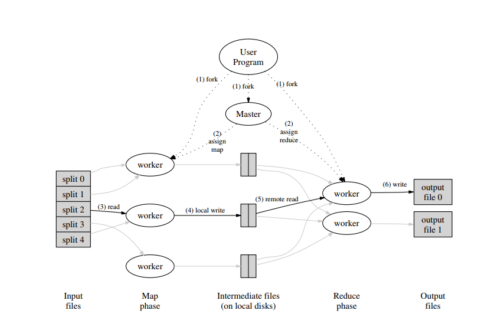

#### 运行流程

1. map和reduce函数的作用

   map函数主要用于处理kv对，生成一组kv对的中间结果
   reduce函数用于对相同key进行聚合

运行时系统需要注意输入数据的分区，任务调度，容错，以及集群内部通信的问题

执行流程图如下:

#### 实现

##### 整体流程

map函数首先会读取M个分片的数据进行处理，这些分片的数据在不同机器上进行处理，为了节省网络传输的消耗，尽量选择本地化的策略。reduce函数通过将中间结果分区成R块进行处理，每一块进行使用reduce函数进行聚合处理。

处理流程如下：

1. mapreduce客户端程序将输入分片成M块，每块大小在16 MB-64 MB之间
2. 选择一个节点作为master，其他的都是worker. M个map任务和R个reduce任务被分配在worker上执行，master负责任务的调度（寻找空闲的worker去执行任务）。
3. 接受到map任务的worker会读取分片数据，将kv数据传递到定义的map函数中进行运算，得到的结果存储到中间结果中，中间结果缓存在内存中。
4. 周期性的将中间结果刷写到本地磁盘中，这些数据根据分区函数分成R个分区，存储的位置信息会被汇报给master。
5. 当执行reduce任务的worker收到master关于中间结果数据位置的信息的时候，worker通过执行rpc调用，将map任务刷新到磁盘的数据缓存到本地内存中。数据读取完毕之后，需要根据中间结果的key值进行排序，这样方便支持之后的查找功能。如果内存无法存放这些数据，则使用外部排序进行排序。
6. reduce任务对每条记录使用reduce函数进行迭代处理，计算出的结果会被添加到最终输出中去。
7. 所有map任务和reduce任务执行完毕之后，master唤醒用户程序，并将结果返回给客户端。

##### 关于master的设计

master中会存储任务的状态信息，worker的名称信息等，此外master作为map任务与reduce任务直接中间结果的通信桥梁，需要记载中间结果的存储位置。每次map任务写入数据的时候，都需要更新中间结果的元数据信息。

##### 容错设计

1. worker容错

   master周期性的轮询worker，当某个worker没有响应，则将该worker标记为失效节点。分配给这个worker节点的任务会被master重新分配到其他worker上，同时这些任务会被设置为空闲状态，以备再次调度。同时这个worker节点也会被标记为空闲状态，以备恢复之后再次被调度。

   

   由于数据是被存储到失败节点的本地磁盘的，失效之后不能保证正常通行，所以新分配的worker节点是需要把之前执行的任务重新执行一遍的，这条是针对于map任务来说的。

   

   当reduce任务执行完毕的时候，就不需要再次执行了，因为reduce输出的最终结果对全局来说是可见的。

   

2. master容错

   master通过周期性使用checkpoint技术和日志来进行恢复。如果master是单点不进行副本日志处理的话，那么master失效，任务只能被放弃。

   

3. 失效的语义

   + 确定函数下的处理

   当用户指定的map，reduce函数是一个确定函数的时候（同样输入处理若干次，生成结果相同），计算出来的结果不会变化

   为了达到上述效果，map，reduce任务我们采取原子提交的方式进行处理。每个处理中的任务都会将输出写入到临时文件中，reduce有1个输出文件，map任务有r个临时文件。

   

   当map任务执行完毕的时候，会向master汇报写入的R个临时文件的元数据信息。如果map任务成功执行完毕，则master会忽略这条消息，否则将会记录这R哥临时文件的元数据信息。

   

   reduce任务执行完毕的时候，worker会原子性地将临时文件重命名为最终输出文件。如果同样的reduce任务执行在多个worker上，那么每个worker会对同一个输出文件进行操作。

   

   我们使用底层操作系统提供的原子性重命名的方法，这样可以保证最终系统状态时一次reduce任务执行的效果。

   + 不确定函数下的处理

     不确定函数下，我们减弱了这种确定性的语义。对于特定的reduce任务`R1`，等效于非确定程序中`R1`的串行执行。而对于reduce任务`R2`，则对应于`R2`的串行执行。函数的执行效果是不一样的。

     实际上 不仅对于reduce任务，对于同一个reduce任务，所依赖map生成的结果也是不确定的。(如果map也是不确定函数的情况下)

##### 本地化策略

本地化策略目的是减少网络传输的开销问题，如果输入数据与计算在一个节点上，那么网络传输的开销为零。正因为如此，master在给worker分配任务的时候，不仅要考虑worker上执行任务的负载问题，也要考虑网络传输开销的问题。如果在本地能够执行就选择本地执行，如果不能则选择较近的节点执行。也叫做**机架感知策略**。

##### 任务数量的设定

理想情况下，map任务的数量和reduce任务的数量需要远远大于worker的数量。
这样每个worker可以分配到大量任务，并进行动态的负载均衡。这样从失效中恢复的时间也会缩短。

##### 后备任务

问题情景：当剩余最后一两个任务的时候执行速度特别慢，拖慢了整体的执行速度

解决方案：为最后几个任务提供后备任务，后备任务执行相同的计算逻辑，主任务和后备任务有一个执行完毕就算执行完毕。

#### 常用的优化

##### 分区函数

中间结果中的数据通过分区函数分成R个分区，常用的分区函数为哈希取余的方式，当然也可以自定义分区函数，例如根据key的范围定义分区逻辑。

##### 预合并函数  -  Combiner函数

在map侧采用部分聚合的方式，减小中间结果的数据量，同时利用map任务的并发度提升执行效率，达到提升mapreduce执行速度的目的。

combiner函数执行在map发送数据到网络之前，combiner函数逻辑实际上是在worker本地执行的一组map任务，与reduce任务不同的是，combiner输出才是真正的中间结果，reduce生成的是最终结果。

##### 输入输出类型的定义

针对某个特定类型的数据，需要自定义输入输出kv对的形式，例如，对于文本数据，key就是行号，value就是行内容。